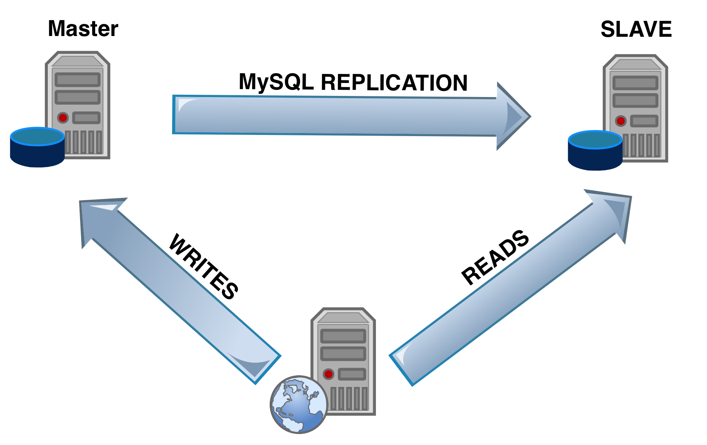

# MySQL 数据库

近几年，尽管"NOSQL"等新型数据库迅速崛起，但关系型数据库凭借着"ACID"特性，依然牢牢占据着软件存储的核心地位。

在本节中，我们首先将讨论MySQL数据库的基础运维，随后讨论"MySQL主从复制"。

## MySQL数据库的部署

我们的MySQL依然部署在Kubernetes上，首先创建挂载点：
```shell
sudo mkdir /data/mysql

sudo chmod -R 777 /data/mysql

```

如果是线上环境，可以将挂载点设定在SSD磁盘等IOPS较高的存储介质上。

看一下部署脚本:
```yaml
apiVersion: v1
kind: Service
metadata:
  name: mysql
spec:
  ports:
  - port: 3306
  selector:
    app: mysql
  clusterIP: None
---
apiVersion: apps/v1
kind: Deployment
metadata:
  name: mysql
spec:
  selector:
    matchLabels:
      app: mysql
  replicas: 1
  template:
    metadata:
      labels:
        app: mysql
    spec:
      nodeSelector:
        kubernetes.io/hostname: minikube
      restartPolicy: Always
      hostname: mysql
      containers:
      - name: mysql-ct
        image: mysql:8
        ports:
        - containerPort: 3306
        volumeMounts:
        - mountPath: "/var/lib/mysql"
          name: volume
        env:
        - name: "MYSQL_ROOT_PASSWORD"
          value: "root123"
      volumes:
      - name: volume
        hostPath:
          path: /data/mysql/

```

上面的部署yaml与之前的类似，只解释几点:
* clusterIP设置为None将不再启动单独的VIP，而是让dns直接解析到Pod的IP上
* MySQL的存储数据量较大，一般固定在某台物理机上，不会主动迁移。例如这里我们选择了minikube。
* MYSQL_ROOT_PASSWORD是root的管理员密码，但root默认只允许本机登录。

我们来尝试登录下，首先获取docker的容器id:
```shell
kubectl get pods

NAME                                                READY     STATUS    RESTARTS   AGE
mysql-7bf88bcfd-gljv7                               1/1       Running   1          4m

kubectl describe pod mysql-7bf88bcfd-gljv7 

...
Container ID:   docker://479a3b1d9e7b9f445f2cb8133e156de480337c23c6f27aa541ca4df8b3cf944d
...
```

然后尝试登录MySQL，是成功的:
```shell
minikube ssh

$docker exec -i -t 479a3b1d9e7b9f445f2cb8133e156de480337c23c6f27aa541ca4df8b3cf944d /bin/sh

$#mysql -h localhost -u root -proot123

mysql -h localhost -uroot -proot123

mysql: [Warning] Using a password on the command line interface can be insecure.
Welcome to the MySQL monitor.  Commands end with ; or \g.
Your MySQL connection id is 8
Server version: 8.0.11 MySQL Community Server - GPL

Copyright (c) 2000, 2018, Oracle and/or its affiliates. All rights reserved.

Oracle is a registered trademark of Oracle Corporation and/or its
affiliates. Other names may be trademarks of their respective
owners.

Type 'help;' or '\h' for help. Type '\c' to clear the current input statement.

mysql> 

```

至此，我们已经完成了MySQL数据库的基本搭建。

## MySQL数据库的日常运维

出于性能、安全性、可拓展性等考量，一般会为MySQL服务器建立多个库，并分配不同的帐号。在微服务架构下，不同的微服务应使用不同的库，尽量避免数据库层的耦合。

因此，新建数据库、分配帐号是MySQL日常运维工作最常见的事情。我们给出一个脚本：

```shell
if [ $# -ne 1 ]; then
    echo "Usage $0 <dbname>"
    exit -1
fi

DB_NAME=$1
DB_USER="lmsia"
DB_PASS="pass"

echo "CREATE DATABASE IF NOT EXISTS $DB_NAME DEFAULT CHARSET utf8 COLLATE utf8_general_ci;"
echo "CREATE USER $DB_USER IDENTIFIED by '$DB_PASS';"
echo "GRANT ALL PRIVILEGES ON $DB_NAME.* to $DB_USER;"
echo "FLUSH PRIVILEGES;"

```

在上述脚本中，会自动生成如下语句:
* 建库(编码utf8)
* 建用户，并分配到上述库

注意:脚本里的密码给的是固定的"pass"，在实际生产环境，应当使用随机密码。

我们可以执行上述脚本，然后将生成的语句粘帖到root登录的mysql客户端，即可完成数据库的添加工作。

## MySQL数据库的同步

随着业务逐渐发展，MySQL的性能逐渐不够用了，常见的优化手段有:
* 读写分离: 如果读多写少，可以MySQL端进行主从复制，微服务中读写分离。
* 分库: 某个库占用大量性能，可考虑将其拆分到单独的MySQL服务器上
* 分表: 单表行数超过1000万后，可考虑将表进行水平、垂直划分，拆分到不同MySQL服务器上。

在这里，我们主要介绍第一种手段。

先来看一下读写分离的原理:



如图所示，我们开启两个MySQL服务器:
* Master，主要承担写请求
* Slave，负责承担读请求

当写请求到达Master后，会通过住从复制机制(Replication)同步到Slave上，这个过程是异步的，会存在延迟。

若微服务的读请求都发往Slave，那么势必也会受到住从复制的延迟影响，特别是对于"写后读"这个场景，可能会导致一些Bug，感兴趣的朋友自行思考如何解决。

下面我们尝试来配置一套住从复制的MySQL。

首先创建master(写库)和slave(读库)的挂载点:
```shell
sudo mkdir /data/mysql_writer
sudo mkdir /data/mysql_reader

sudo chmod -R 777 /data/mysql_writer
sudo chmod -R 777 /data/mysql_reader
```

然后看一下master(写服务)的定义, mysql-writer-service.yaml:
```yaml
apiVersion: v1
kind: Service
metadata:
  name: mysql-writer
spec:
  ports:
  - port: 3306
  selector:
    app: mysql-writer
  clusterIP: None
---
apiVersion: apps/v1
kind: Deployment
metadata:
  name: mysql-writer
spec:
  selector:
    matchLabels:
      app: mysql-writer
  template:
    metadata:
      labels:
        app: mysql-writer
    spec:
      nodeSelector:
        kubernetes.io/hostname: minikube
      restartPolicy: Always
      hostname: mysql-writer
      containers:
      - name: mysql-writer-ct
        image: twang2218/mysql:5.7-replica
        ports:
        - containerPort: 3306
        volumeMounts:
        - mountPath: "/var/lib/mysql"
          name: volume
        env:
        - name: "MYSQL_ROOT_PASSWORD"
          value: "root123"
        - name: "MYSQL_REPLICA_USER"
          value: "replica"
        - name: "MYSQL_REPLICA_PASS"
          value: "replica123"
        args: ["--log-bin=mysql-bin", "--server-id=1"]
      volumes:
      - name: volume
        hostPath:
          path: /data/mysql_writer/
````

如上所述，配置基本与之前的单机MySQL类似，区别是:
* 换了一个支持主从同步的镜像，twang2218/mysql
* 主机名、dns配置为mysql-writer
* MySQL用于主从同步的用户名和密码分别是replica/replica123
* 服务id是1

应用一下，过一会可以看到启动成功:
```shell
kubectl apply -f ./mysql-writer-service.yaml
```

下面看下读库(slave结点), mysql-reader-service.yaml:
```yaml
apiVersion: v1
kind: Service
metadata:
  name: mysql-reader
spec:
  ports:
  - port: 3306
  selector:
    app: mysql-reader
  clusterIP: None
---
apiVersion: apps/v1
kind: Deployment
metadata:
  name: mysql-reader
spec:
  selector:
    matchLabels:
      app: mysql-reader
  template:
    metadata:
      labels:
        app: mysql-reader
    spec:
      nodeSelector:
        kubernetes.io/hostname: minikube
      restartPolicy: Always
      hostname: mysql-reader
      containers:
      - name: mysql-reader-ct
        image: twang2218/mysql:5.7-replica 
        ports:
        - containerPort: 3306
        volumeMounts:
        - mountPath: "/var/lib/mysql"
          name: volume
        env:
        - name: "MYSQL_ROOT_PASSWORD"
          value: "root123"
        - name: "MYSQL_REPLICA_USER"
          value: "replica"
        - name: "MYSQL_REPLICA_PASS"
          value: "replica123"
        - name: "MYSQL_MASTER_SERVER"
          value: "mysql-writer"
        - name: "MYSQL_MASTER_WAIT_TIME"
          value: "10"
        args: ["--log-bin=mysql-bin", "--read-only=1", "--server-id=2"]
      volumes:
      - name: volume
        hostPath:
          path: /data/mysql_reader/
```

除了与之前类似的配置，这些变化需要注意：
* 设置主结点（写库）为mysql-writer
* 用于主从同步的用户名密码同写库
* 只读，这主要是为了防止误删除数据，导致主从不一致
* 服务id是2

类似的，我们启动下从库:
```shell
kubectl apply -f ./mysql-reader-service.yaml
```

下面我们尝试在主库创建数据库，看看能否自动同步到从库:

(这里省略登录mysql-writer的过程，具体参照本节第一部分)
```sql
CREATE DATABASE IF NOT EXISTS lmsia_user DEFAULT CHARSET utf8 COLLATE utf8_general_ci;
CREATE USER lmsia IDENTIFIED by 'pass';
GRANT ALL PRIVILEGES ON lmsia_user.* to lmsia;
FLUSH PRIVILEGES;
```

然后登录mysql-reader看一下，发现可以成功登录:
```shell
mysql -hlocalhost -ulmsia -ppass lmsia_user
mysql: [Warning] Using a password on the command line interface can be insecure.
Welcome to the MySQL monitor.  Commands end with ; or \g.
Your MySQL connection id is 6
Server version: 5.7.14-log MySQL Community Server (GPL)

Copyright (c) 2000, 2016, Oracle and/or its affiliates. All rights reserved.

Oracle is a registered trademark of Oracle Corporation and/or its
affiliates. Other names may be trademarks of their respective
owners.

Type 'help;' or '\h' for help. Type '\c' to clear the current input statement.

mysql>

```

需要特别说明的是，在上述配置下mysql-reader只会同步启动后接收到的binlog，是不会主动启动之前发生的binlog的。

如果想实现到这一功能，可以手动执行mysqldump来完成。

至此，我们已经完成了MySQL的主从配置。
