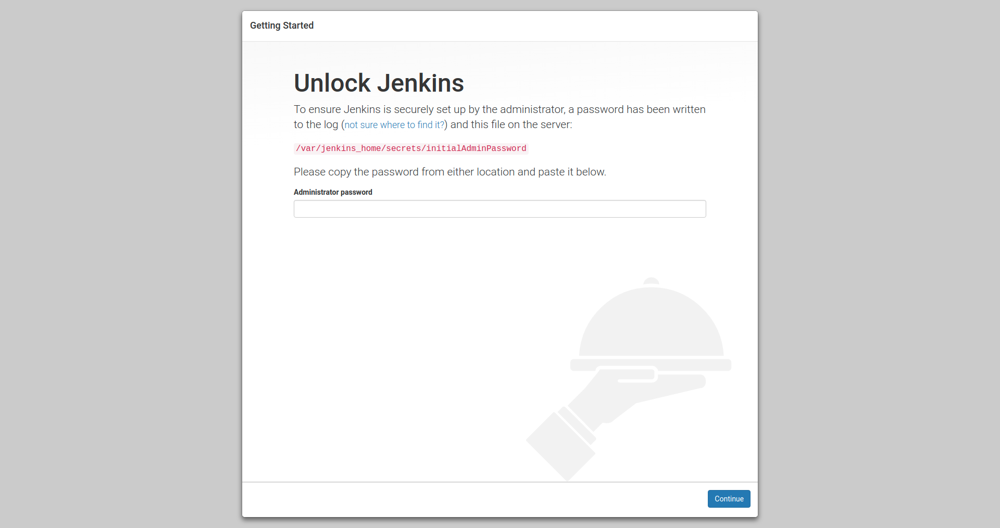
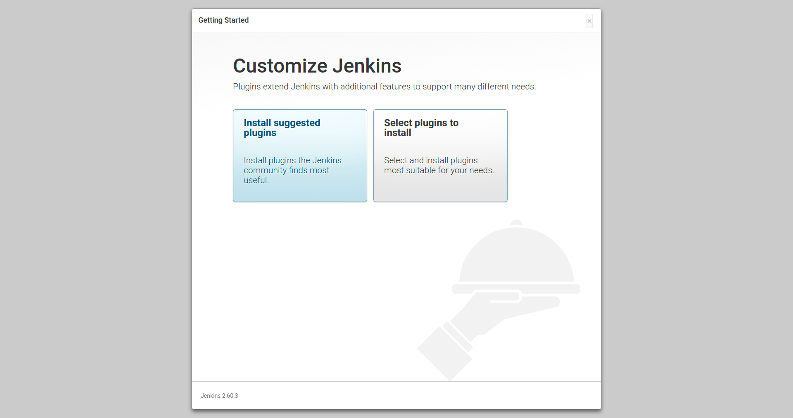
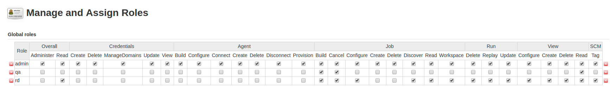
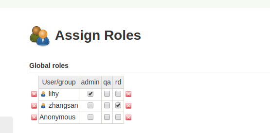

# Jenkins构建平台的运维

Jenkins是一款开源的持续构建工具，除了基础功能外，还有各种功能丰富的插件，可以实现各种高级功能。

Jenkins常见的应用场景是:
* 项目的自动构建(编译)，即持续集成
* 自动执行项目的单元/集成测试，即持续测试
* 实现项目的自动部署、上线，即持续部署

在本小节，我们首先探讨Jenkins系统的运维工作，并尝试将Jenkins与LDAP系统集成起来。

## Jenkins系统的搭建

对于Jenkins系统，我们将直接用Docker部署在物理机而不是k8s集群上，主要原因有:
* Jenkins的定位是持续集成、持续部署，需要作用在k8s集群上，故耦合不宜太紧密。
* 由于资源有限，我们的k8s集群主要运行微服务及相关后台组件。

我们先来看一下创建脚本
```shell
#!/bin/bash
NAME="jenkins"
VOLUME="$HOME/docker_data/jenkins"

# ensure volume ready
sudo mkdir -p $VOLUME
sudo chmod -R 777 $VOLUME

# submit to local docker node 
docker ps -q -a --filter "name=$NAME" | xargs -I {} docker rm -f {}
docker run \
    --name $NAME \
    -v $VOLUME:/var/jenkins_home \
    -p 9001:8080 \
    -p 50000:50000 \
    --detach \
    --restart always \
    jenkins/jenkins:2.60.3-alpine
```

如上所述:
* 我们使用了jenkins的官方镜像
* 映射默认端口到本地的9001，这个即web管理界面的端口
* 映射端口50000，这个是用于管理通信的端口
* volume映射了/var/jenkins_home文件夹

启动完毕后，需要进行Jenkins系统的初始化，如下图所示：



初始化需要输入初始化密码，存放在docker的/var/jenkins_home/secrets/initialAdminPassword目录下，可以通过docker exec -i -t 登录容器，然后cat查看。
```shell
docker exec -i -t ad74be122fcd /bin/sh

cat /var/jenkins_home/secrets/initialAdminPassword
0b7aee7513774800ac6cf1fdd41d0366
```

输入密码后，稍等一会儿，提示选择安装插件的模式，选择自定义插件：



针对本书架构，建议选择的插件为：
* Organization and Administration
 * Folder
* Build Features
 * Build Timeout
 * SSH Agent
 * Timestamper 
 * Workspace Cleanup 
* Build Tools
 * Gradle
* Pipelines and Continuous Delivery
 * Pipeline
 * Pipeline: Stage View
* Source Code Management
 * Git
* Distributed Builds 
 * SSH Slaves
* User Management and Security
 * LDAP
 * Role-based Authorization Strategy
* Notifications and Publishing
 * Publish Over SSH
 * SSH

选择好后进行安装，这一步会耗费的久一些，随后需要创建管理员帐号：


最后点击完成

经过上述配置后，我们已经构建了基本的Jenkins环境，并有了一个可以登录的系统管理员帐号。

## Jenkins系统接入LDAP系统

作为持续集成的核心，Jenkins系统的重要性毋庸置疑，有必要进行细粒度的权限控制与管理，例如：
* 开发用户可以修改、执行Job，但不能新建项目
* 测试用户只能运行Job
* 管理员可以进行任何操作

因此，我们需要给每个团队成员配置独立的帐号。面对这种需求，接入LDAP验证是一个很好的选择。

在[LDAP 内部账号管理系统](toolchain/ldap.md)一节中，我们介绍了LDAP的运维方案，本节假设你已经部署好了LDAP服务。

登录Jenkins后，在左侧菜单选择"Manage Jenkins"，随后选择"Configure Global Security"

在"Access Control"中选中"LDAP"，填写如下信息:
* Server: LDAP服务和端口号，例如 ldap.coder4.com:389
* Root DN: LDAP的根目录，例如 dc=coder4,dc=com
* User search base: 用户所在的子目录，例如 ou=users
* User search filter: 用户名的字段，例如cn={0}
* Manager DN: 可查询LDAP的额外帐号，例如一个只读帐号 cn=guest,dc=coder4,dc=com
* Manager Password: 上述帐号对应的密码
* Display Name LDAP attribute: 帐号名字段名，例如cn
* Email Address LDAP attribute: 邮箱字段名，例如mailk

上述都填写完毕后，可以点击底部的Test LDAP Settings

测试通过后，不要忘记点击页面最底部的保存按钮。

随后，我们尝试用LDAP帐号登录，可以发现登录成功。

## 设置基于角色的权限

团队成员有多种不同的角色，如前面提到的开发、测试、管理员。

在Jeknins中，可以设置不同的角色，并针对角色配置不同的权限。

点击"Manage Jenkins"，然后选择"Configure Global Security"，在"Authorization"中更改为"Role Based Strategy"。

不要退出Jenkins，选择"Manage and Assign Roles"，首先管理角色"Manage and Assign Roles"



如上图所示，新增2个角色：开发rd和测试qa，并设置对应的权限。

随后进入"Assign Roles"，将开发帐号赋给对应的角色，这里给lihy赋予admin角色、给zhangsan赋予rd角色，如图所示：



我们可以登录zhangsan，没有看到"Manage Jenkins"的菜单，角色配置成功。

