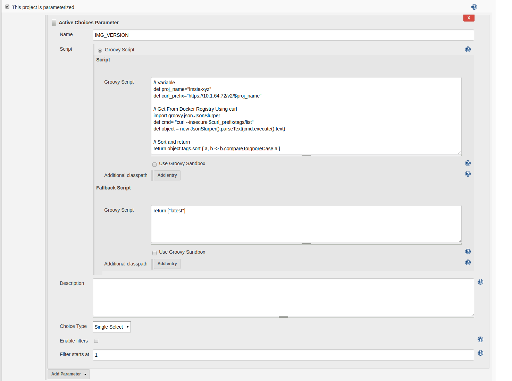
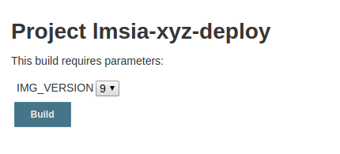

# Jenkins持续部署

在上一小节，我们完成了Jenkins的持续集成工作，经过持续集成，我们的代码已经编译成Docker镜像，并被Push到私有仓库中。

在本节，我们接着前一小节的成功，讨论部署问题。

这里的部署指的是将微服务真正地运行在k8s集群系统中，主要涉及如下步骤:
* 获取可部署的Docker镜像版本
* 获取k8s集群操作权限
* 服务操作: 部署服务、重启服务等

其中获取k8s集群的权限有多种方式:
* 通过REST API
* 远程登录k8s的master节点

其中通过REST API的方式更加可靠、易于编程，但在k8s 1.7版本后，新增了权限控制，使用起来较为复杂。

在这里，我们采用直接登录k8s节点的方式。

## 获取Docker镜像的版本列表

前面已经提到，在持续集成时，会打包好最新的镜像到仓库中，并且制定版本为Jenkins的版本。

对于部署环节，却不一定总是需要上线最新版本的镜像。例如，我们上线了一个新功能，半小时后发现有个Bug，需要回滚，此时就需要上线前一个版本的镜像。

如何获取镜像对应的版本呢？我们可以通过"Active Choices Plugin"插件来实现。

首先用管理员登录，Manage Jenkins -> Manage Plugins，安装"Active Choices Plugin"插件。

随后新建一个项目，例如"lmsia-xyz-deploy"，勾选"This project is parameterized"，然后新增一个"Active Choices Parameter"，进行如下配置:



其中的主要代码如下:
```groovy
// Variable
def proj_name="lmsia-xyz"
def curl_prefix="https://10.1.64.72/v2/$proj_name"

// Get From Docker Registry Using curl
import groovy.json.JsonSlurper
def cmd= "curl --insecure $curl_prefix/tags/list"
def object = new JsonSlurper().parseText(cmd.execute().text)

// Sort and return
return object.tags.sort { a, b -> b.compareToIgnoreCase a }
```

上述代码从Docker私有仓库获取"lmsia-xyz"这个镜像的所有版本，然后倒着排序后，返回给Jenkins插件。

点击底部保存，点击"lmsia-xyz-deploy"项目的"Build with Parameters"，可以发现正常显示了版本列表:



## 新增远程主机

前面已经提到，我们将直接登录到k8s的主节点来执行部署命令。

为了实现这一点，首先要将该机器添加到Jenkins的SSH Site中。

用管理员帐号登录 -> Manage Jenkins -> Configure System, 找到SSH Site添加如下:


除了配置主机名、端口外，记得选择一个已经配置好的SSH私钥，这需要提前到Jenkins的Credentials中配置好。

接着我们回到lmsia-xyz-deploy项目，在Build环节新建一个"Execute script on remote host using ssh"

* SSH Site选择刚才配置好的主机
* Command里设置为"/home/coder4/deploy2k8s.sh $JOB_NAME $IMG_VERSION"

其中deploy2k8s.sh需要部署在这台远程的/home/coder4目录下（根据你的情况可自行更改），内容为:
```bash
#!/bin/bash
set -e

if [ x"$#" != x"2" ];then
    echo "Usage $0 proj_name img_version"
    exit -1
fi

# Const
DOCKER_REGISTRY="10.1.64.72"
PROJECT_NAME=$1
IMAGE_NAME=$(echo $PROJECT_NAME | sed -r 's/-deploy$//g')
IMAGE_VERSION=$2

# Generate yaml 
cat > ./deployment.yaml <<EOF

apiVersion: apps/v1
kind: Deployment
metadata:
  name: $IMAGE_NAME-deployment
spec:
  selector:
    matchLabels:
      app: $IMAGE_NAME 
  replicas: 2
  template:
    metadata:
      labels:
        app: $IMAGE_NAME
    spec:
      containers:
      - name: $IMAGE_NAME-ct
        image: $DOCKER_REGISTRY/$IMAGE_NAME:$IMAGE_VERSION
        ports:
        - containerPort: 8080
        - containerPort: 3000

EOF

# Deploy 
kubectl apply -f ./deployment.yaml

```

上述代码完成如下功能:
* 获取镜像名称和本次要上线的镜像版本
* 生成deployment模板
* 调用kubectl 部署

至于重启服务和停止服务，我们作为思考题，交给读者来实现。

至此，我们完成了持续部署的工作。

## 拓展与思考
1. 微服务的持续部署，除了部署更新版本，还需要停止或者重启，如何实现这一点，请结合本书介绍的内容，结合网上的其他资料，自行实现。
1. 上述模板只是简单的部署，如果需要实践前面章节介绍的微服务发现模型，需要进行哪些修改呢？
