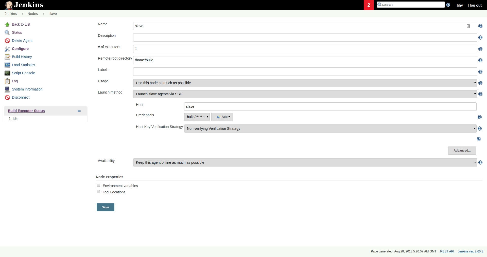
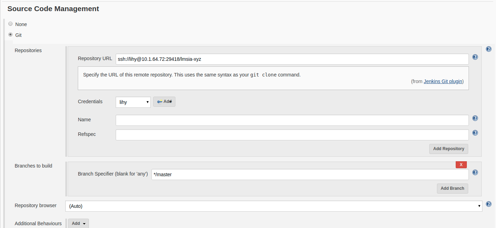

# Jenkins持续集成实战

在本小节中，我们将讨论持续集成。

持续集成指的是: 频繁地（一天多次）将代码集成到主干。这里的集成不止是代码合并，还要保证可以通过编译、单元测试、集成测试。

持续集成的主要优点是:
* 快速发现错误。即所谓的"早发现、早治疗"。
* 减少开发、主分支之间的冲突。更频繁的分支合并，可以降低分支冲突发生的概率。
* 为持续部署打下基础。代码先要能集成起来，才能够进一步地部署。

针对我们当前的架构，持续集成分为如下几个步骤:
* 从Gerrit上check out代码
* Gradle编译项目
* 打包Docker镜像

## 部署Salve打包机

在持续构建的过程中，需要迁出代码、编译、打Docker镜像等步骤，如果都放在Jenkins的容器内执行，存在一些缺点：
* 影响Jenkins主服务性能。编译、打镜像都是非常耗费系统资源的操作。如果放到Jenkins上执行，势必会影响服务的流畅性和稳定性。
* 耦合过紧，不方便升级维护。如果要Jenkins支持打包、编译，需要自己定制镜像，即在Jenkins基础上安装Gradle、Java等工具。如果将来任何一个工具或Jenkins需要升级版本，就需要重新开发镜像，非常繁琐。

因此，通常都会新建一个独立于Jenkins的打包机，里面集成编译打包工具。Jenkins将打包机作为Slave添加到系统中，在打包时将调用Slave机器执行打包任务。

Slave打包机可以采用物理机、虚拟机或者容器，这里我们选择容器的方式，主要优点有:
* 故障恢复，方便运维。编译、打包的复杂程度较高，经常会导致打包机挂起，采用容器的方式，可以快速恢复故障。
* 版本可控，方便升级。持续集成的工具链需要逐步升级。例如Java、Gradle版本，每年都会更新几次，采用容器的方式，可以更好地管理版本，更精细地控制打包流程。
* 资源使用可控。编译、打包耗费较大资源，有时候为了保证整个系统稳定性，要限制打包使用的CPU、内存资源，使用容器技术可以轻松地做到这一点。
* 启动快速，方便扩展。随着持续集成的规模逐渐扩大，要同时执行多个任务，甚至要在打包高峰期，动态启动若干Slave，以提升并行度。这类似于微服务的副本扩展，容器集群(如k8s)对这种副本拓展有很好地支持。

我们首先来构建一个打包机的镜像,Dockerfile如下:
```shell
FROM ubuntu:18.04

# Basic
RUN apt-get update
RUN apt-get install -y software-properties-common 

# Java
ENV JAVA_HOME /usr/lib/jvm/java-8-oracle
RUN \
  echo oracle-java8-installer shared/accepted-oracle-license-v1-1 select true | debconf-set-selections && \
  add-apt-repository -y ppa:webupd8team/java && \
  apt-get update && \
  apt-get install -y oracle-java8-installer

# SSH
RUN apt-get install -y openssh-server \
    && mkdir /var/run/sshd \
    && sed -ri 's/UsePAM yes/#UsePAM yes/g' /etc/ssh/sshd_config

# Unzip
RUN apt-get install -y unzip

# Gradle
ENV GRADLE_HOME /opt/gradle
ENV GRADLE_VERSION 4.10
ARG GRADLE_DOWNLOAD_SHA256=248cfd92104ce12c5431ddb8309cf713fe58de8e330c63176543320022f59f18
RUN set -o errexit -o nounset \
	&& echo "Downloading Gradle" \
	&& wget --no-verbose --output-document=gradle.zip "https://services.gradle.org/distributions/gradle-${GRADLE_VERSION}-bin.zip" \
	\
	&& echo "Checking download hash" \
	&& echo "${GRADLE_DOWNLOAD_SHA256} *gradle.zip" | sha256sum --check - \
	\
	&& echo "Installing Gradle" \
	&& unzip gradle.zip \
	&& rm gradle.zip \
	&& mv "gradle-${GRADLE_VERSION}" "${GRADLE_HOME}/" \
	&& ln --symbolic "${GRADLE_HOME}/bin/gradle" /usr/bin/gradle

# git
RUN apt-get install -y git

# Create User
RUN useradd -m build 
RUN echo "build:build123" | chpasswd

# Clean
RUN apt-get clean && \
    rm -rf /var/lib/apt/lists/* /tmp/* /var/tmp/* /var/cache/oracle-jdk8-installer

EXPOSE 22

CMD ["/usr/sbin/sshd", "-D"]

```

如上所示，上述镜像主要完成了以下功能:
* JDK 8的安装
* SSHD服务的安装
* Gradle 4.10的安装
* build用户(密码build123)的配置

有了上述镜像后，我们启动这个slave容器:
```shell
#!/bin/bash

# BUILD
docker build -t slave .

NAME="slave"

# submit to local docker node 
docker ps -q -a --filter "name=$NAME" | xargs -I {} docker rm -f {}
docker run \
    --name $NAME \
    -p 22 \
    --detach \
    --restart always \
    -d slave:latest 

```

接下来，我们在Jenkins中添加这台slave机器。

使用管理员帐号登录，"Manage Jenkins" -> "Manage Nodes" -> "New Node"，然后如下图所示配置:



主要的配置为:
* Remote root directory 家目录/home/build
* Usage 尽可能多使用(尽量不占用master进程)
* Launch method 使用ssh模式
 * Host slave即上面启动的容器
 * Credentials 可以新增一个密码方式的验证build/build123
* Availability 尽量让slave在线

配置成功默认是离线的，稍等一会，会提示"slave已经上线"。

## 持续集成第一步:迁出代码、编译

本节开篇已经提到，持续集成的第一步即从代码仓库中迁出代码，我们来完成这项工作。

首先在gerrit上准备一个项目，假设为lmsia-xyz，这是一个最简单的Spring Boot项目。

为了能够提交、迁出代码，需要将公钥配置到gerrit上，点击右上角的名字 -> Setting -> SSH Public Keys，填入即可完成。

准备好项目后，我们在Jenkins上新建一个"Freestyle"项目，命名为lmsia-xyz-build。

首先配置代码仓库，如下图所示：



* 在"Source Code Management"中，选择"Git"，并填写gerrit的repo地址
* Credentials中新增一个用户，为gerrit中的用户，要填写私钥

此外，还要限制只能在slave上执行: Restrict where this project can be run中设置"slave"。

完成后点击底部的Save。

配置好后，我们执行第一次Build，在项目左侧菜单选择"Build Now"，可以在Log中查看输出如下:
```
Building remotely on slave in workspace /home/build/workspace/lmsia-xyz-build
Cloning the remote Git repository
Cloning repository ssh://lihy@10.1.64.72:29418/lmsia-xyz
 > git init /home/build/workspace/lmsia-xyz-build # timeout=10
Fetching upstream changes from ssh://lihy@10.1.64.72:29418/lmsia-xyz
 > git --version # timeout=10
using GIT_SSH to set credentials 
 > git fetch --tags --progress ssh://lihy@10.1.64.72:29418/lmsia-xyz +refs/heads/*:refs/remotes/origin/*
 > git config remote.origin.url ssh://lihy@10.1.64.72:29418/lmsia-xyz # timeout=10
 > git config --add remote.origin.fetch +refs/heads/*:refs/remotes/origin/* # timeout=10
 > git config remote.origin.url ssh://lihy@10.1.64.72:29418/lmsia-xyz # timeout=10
Fetching upstream changes from ssh://lihy@10.1.64.72:29418/lmsia-xyz
using GIT_SSH to set credentials 
 > git fetch --tags --progress ssh://lihy@10.1.64.72:29418/lmsia-xyz +refs/heads/*:refs/remotes/origin/*
 > git rev-parse refs/remotes/origin/master^{commit} # timeout=10
 > git rev-parse refs/remotes/origin/origin/master^{commit} # timeout=10
Checking out Revision eab8a79ff6cde375c017b6f9eec29dff02a0bb85 (refs/remotes/origin/master)
 > git config core.sparsecheckout # timeout=10
 > git checkout -f eab8a79ff6cde375c017b6f9eec29dff02a0bb85
Commit message: "MOD: init commit"
First time build. Skipping changelog.
Finished: SUCCESS
```

如上所示，我们成功地从代码仓库迁出了代码，第一步顺利完成！

在迁出代码后，我们需要进行编译，回到lmsia-xyz-build项目的配置中，找到Build选项，新增一个"Execute shell"步骤，命令输入"gradle build"，点击底部"Save"。

再次执行"Build Now"，发现项目依然执行成功，查看日志，可以发现编译也成功地执行了！

至此，我们已经完成了代码的迁出和编译。
