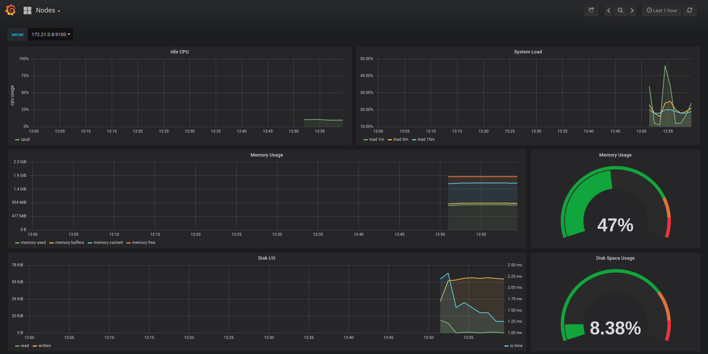
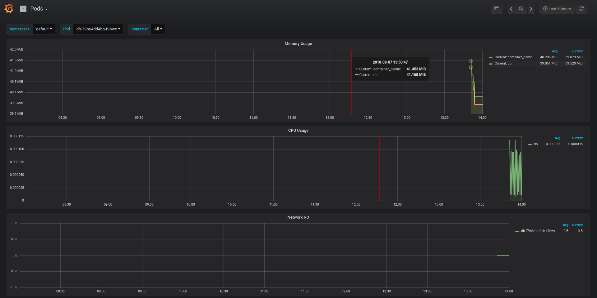
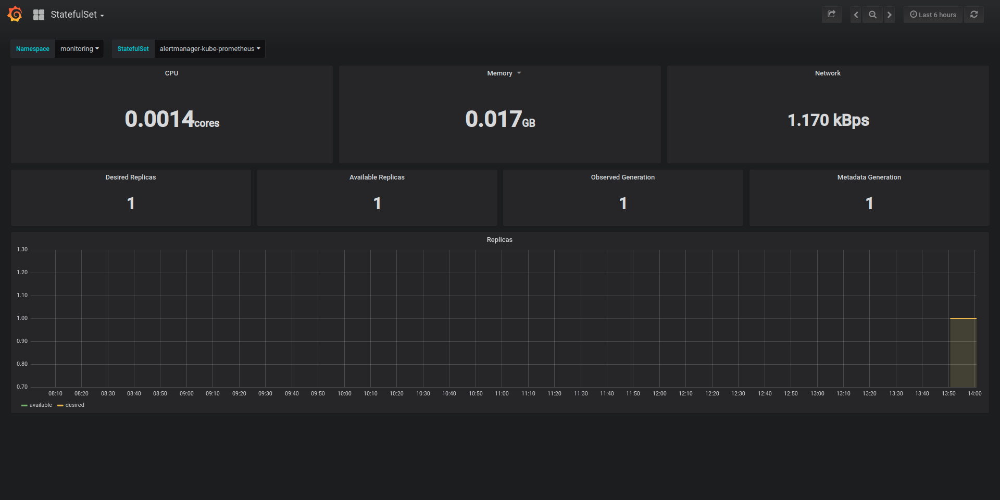

# Kubernetes + Prometheus + Grafana监控平台

平台监控是微服务架构中的重要一环。

例如，一个很常见的场景，某个微服务突然响应变慢，之前都是100毫米内返回，现在需要2秒才能返回结果，导致大量下游服务超时，究竟出了什么问题呢？

可能的原因有很多，举几个常见的例子：
* 物理机出现了问题，被别的任务影响，占用了CPU。
* 微服务的某一个副本出现了Bug，导致死循环，响应变慢
* 微服务出现Full GC，导致响应变慢

可能的原因还有很多，那么，究竟是哪种原因导致的呢？

我们可以通过日志去查找，但查找起来很费时。而且，对于收到物理机影响等部分请款，是无法在日志中体现出来的。

此时，就是监控平台大显身手的时刻了。监控系统会收集系统中的各项性能指标，按照类型及时间进行聚合，并通过图形化界面的方式呈现出来，让我们对系统的基本运行状况一目了然，便于快速发现当前问题、查找历史问题。

对于监控平台，已经有很多优秀的开源解决方案，例如传统的Zabbix、Nagios，但这些系统比较复杂，一般需要较为专业的运维人员才能上手。

本书选用较为轻量级的Prometheus + Grafana实现监控平台。

Prometheus是一款开源的性能监控、预警系统，他的特点有：
* 多维数据源、时间聚合
* 支持高级查询语句
* 支持单击和多级存储，不依赖其他分布式系统
* 数据源、服务器均支持多种配置、自动发现方式

上述特点没有提到可视化部分，是的，你已经猜到了，Prometheus只负责收集、存储、查询数据，并不包含数据可视化的部分。

一般可以通过Grafana实现监控数据的可视化，效果还是非常炫酷的，如下图所示：



上图通过曲线图和仪表盘的方式，展示了k8s集群中，某台物理机的性能状况，CPU、系统负载、内存、网络等状况一目了然。

本节将主要探讨如何将Kuberntes、Prometheus、Grafana整合在一起。

## 前期准备

在整合监控平台前，你首先需要有一个真正的Kubernetes集群，我们假设你已经搭建了一个有两个结点的集群，一台是master，另一台是slave。

如果你不了解如何搭建k8s集群，可以参考[《搭建Kubernets集群》](../devops/k8s-cluster.md)一节。

在本文提供的方案中，Grafana和Prometheus默认都是架设在Kubernetes集群内的，因此，你需要打通本地和集群网络，如果你没有头绪，可以参考[《OpenVPN访问Kubernetes集群内网》](../devops/openvpn-k8s.md)一节。

上述技术准备妥当后，我们来开始搭建监控平台。

## 搭建监控平台

首先，我们要安装helm，这是Kubernetes的包管理系统，类似于Ubuntu中apt的地位。

```shell
wget https://storage.googleapis.com/kubernetes-helm/helm-v2.9.1-linux-amd64.tar.gz
tar -xvf ./helm-v2.9.1-linux-amd64.tar.gz
cd linux-amd64/

```

helm需要初始化才能工作，但在初始化前，先需要在rbac中进行授权, tiller-rbac.yaml：
```yaml
apiVersion: v1
kind: ServiceAccount
metadata:
  name: tiller
  namespace: kube-system
---
apiVersion: rbac.authorization.k8s.io/v1beta1
kind: ClusterRoleBinding
metadata:
  name: tiller
roleRef:
  apiGroup: rbac.authorization.k8s.io
  kind: ClusterRole
  name: cluster-admin
subjects:
  - kind: ServiceAccount
    name: tiller
    namespace: kube-system
```

授权比较简单
```shell

kubectl apply -f ./tiller-rbac.yaml

```

有了权限后，我们进行初始化，并添加一下第三方源
```shell
helm init --service-account tiller
helm repo add coreos https://s3-eu-west-1.amazonaws.com/coreos-charts/stable/
```

上述执行成功后，我们开始创建prometheus：
```shell
helm install coreos/prometheus-operator --name prometheus-operator --namespace monitoring
```

创建成功后，再创建grafana，并配置其和prometheus关联：
```shell
helm install coreos/kube-prometheus --name kube-prometheus --set global.rbacEnable=true --namespace monitoring
```

由于涉及到的Pod比较多，下载镜像的时间比较长，全部下载完成后，状态应该如下所示：
```shell

kubectl get pod -n monitoring

NAME                                                  READY     STATUS    RESTARTS   AGE
alertmanager-kube-prometheus-0                        2/2       Running   0          10m
kube-prometheus-exporter-kube-state-66bccfc84-x4ngb   2/2       Running   0          10m
kube-prometheus-exporter-node-62phq                   1/1       Running   0          10m
kube-prometheus-exporter-node-lt954                   1/1       Running   0          10m
kube-prometheus-grafana-f869c754-44f9k                2/2       Running   0          10m
prometheus-kube-prometheus-0                          3/3       Running   1          10m
prometheus-operator-858c485-fkcjz                     1/1       Running   0          1h

```

对外暴露的Service如下：
```shell
kubectl get service -n monitoring
NAME                                  TYPE        CLUSTER-IP       EXTERNAL-IP   PORT(S)             AGE
alertmanager-operated                 ClusterIP   None             <none>        9093/TCP,6783/TCP   11m
kube-prometheus                       ClusterIP   10.111.94.74     <none>        9090/TCP            11m
kube-prometheus-alertmanager          ClusterIP   10.109.44.85     <none>        9093/TCP            11m
kube-prometheus-exporter-kube-state   ClusterIP   10.105.121.198   <none>        80/TCP              11m
kube-prometheus-exporter-node         ClusterIP   10.96.155.209    <none>        9100/TCP            11m
kube-prometheus-grafana               ClusterIP   10.109.181.200   <none>        80/TCP              11m
prometheus-operated                   ClusterIP   None             <none>        9090/TCP            11m

```

其中，kube-prometheus-grafana的10.109.181.200就是Grafana的Service IP地址。

## 监控系统展示

在打通k8s集群内网后，我们直接打开浏览器访问"10.109.181.200"，即可进入Grafana图形化监控系统。





如上所示，默认会从物理机(node)、容器(pod)、容器合集(statefulset)、k8s集群四个层次展示，点击左上角的按钮可以切换展示级别。点击顶部筛选条可以切换具体的机器、容器等实体。

## 拓展与思考
1. 在本文中，我们实现了对集群中资源、实体的监控，在实际应用中，还想对微服务进行监控，例如REST接口的.99响应、错误码4xx、5xx数量。如何完成这项工作呢？请自行查找资料，并实现这类功能。
1. Prometheus除了收集监控指标外，还支持报警。如果我们想实现物理机内存占用大于90%，自动发邮件(或短信)报警，如何实现呢？请自行查找资料，实现这类功能。
