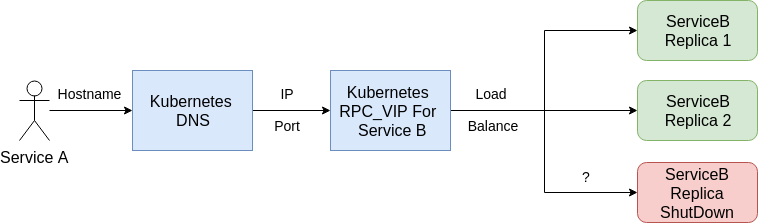

# Spring Boot REST接口

在介绍服务发现和负载均衡时已经提到，我们的架构中，对每个微服务开放两个虚拟IP端口，一个是RPC，另外一个是REST(HTTP)。

在上一节中，我们探讨了Spring Boot中集成Thrift RPC的方案，主要是针对RPC端口。

在本节中，我们首先看一下优雅停机的问题，随后探讨REST服务的发现与负载均衡均衡的问题。

## 优雅停机 

如果你经历过生产环境架构设计的话，一定遇到过"优雅停机"的需求。

优雅停机指的是在服务重启过程中，每个服务节点在不影响任何线上请求的前提下，有计划而平滑的退出。

听起来有些抽象，我们看看下图中的例子：



1. Kubernetes VIP收到请求，假设分发到Service B的Replica 3(最下面的节点)上
1. Replica 3的节点因计划升级，恰好停机，变为红色。
1. 此时，之前分发到Replica 3上的请求没有被处理完，服务就被停机了，于是发生错误。

你可能会说，这种概率非常小。但随着系统越来越庞大、上线节奏越来越快、业务规模越来越大后，出现这种问题的概率也会逐步增大。

实际上，我们在[微服务的自动发现与负载均衡](../ms-discovery/msd.md)中所使用的例子就会有这个问题。

我们来试验一下。首先，我们为镜像新建两个不同的版本0.1和0.2(实际内容是一样的)。

然后登录minikube，执行如下命令：

```shell
while true; do curl -s "http://10.97.42.195:8080/lmsia-abc/api/" > /dev/null || echo "curl fail" ;done
```

上述命令，会curl不间断地通过虚拟IP访问REST服务，如果出错的时候会报警。如果一切正常的话，当你执行上述命令，不会出现"curl fail"的报警。

下面让我们修改一下yaml文件：
```yaml
apiVersion: apps/v1
kind: Deployment
metadata:
  name: lmsia-abc-server-deployment
spec:
  selector:
    matchLabels:
      app: lmsia-abc-server
  replicas: 2
  template:
    metadata:
      labels:
        app: lmsia-abc-server
    spec:
      containers:
      - name: lmsia-abc-server-ct
        # here change from latest to 0.1
        image: coder4/lmsia-abc-server:0.1
        ports:
        - containerPort: 8080
        - containerPort: 3000

```

上面我们修改了镜像的版本到0.1，然后我们新打开一个shell，应用一下
```shell
kubectl apply -f ./lmsia-abc-server-deployment.yaml
```

再切换回刚才执行循环curl的命令行，会发现大量的失败：
```shell
...
curl fail
curl fail
curl fail
curl fail
....
```

这就是说明，在Kubernetes更新Pod的镜像版本的时候，但是还是有部分请求打到了被杀掉的Pod上，从而导致请求失败。或者说，发生了"不优雅"的停机。

为了解决这个问题，我们可以假设一种如下的方案：
1. Replica 3节点需要停机前，以某种方式通知Kubernetes的VIP
1. Kubernetes的VIP收到通知后，摘掉Replica 3
1. Replica 3停机。

上述方案比起"粗鲁"的直接杀掉Replica 3，要"优雅"地多。实际上，这也是大多数系统中，优雅停机方案的原型。

我们来看一下具体的原理，首先看看deployment.yaml：
```shell
apiVersion: apps/v1
kind: Deployment
metadata:
  name: lmsia-abc-server-deployment
spec:
  selector:
    matchLabels:
      app: lmsia-abc-server
  replicas: 2
  template:
    metadata:
      labels:
        app: lmsia-abc-server
    spec:
      containers:
      - name: lmsia-abc-server-ct
        image: coder4/lmsia-abc-server:0.2
        ports:
        - containerPort: 8080
        - containerPort: 3000
        readinessProbe:
          httpGet:
            path: /health
            port: 8081
          initialDelaySeconds: 5
          periodSeconds: 5

```

与之前的deployment定义相比，这里新增了"readinessProbe"一项目。关于它的详细解释可以参考官方文档，这里简单解释下具体的这个例子。
* Kubernetes会每间隔5秒钟，通过HTTP协议请求8081端口下的/health路径。
* 若能成功打开，会认为服务可用，不做任何处理。
* 若不能打开(非200返回值或无法连接)则会将对应的Pod从VIP上摘除，直到恢复为可用。

对应地，在lmsia-abc服务中，我们也应该定义这个8081端口的服务。

在本书架构中，我们使用Spring Boot内置的health indicator，即健康监控机制。

首先是自动配置GracefulShutdownConfiguration：

```java
package com.coder4.lmsia.gracefulshutdown.configuration;

import com.coder4.lmsia.gracefulshutdown.GracefulStatusHealthIndicator;
import org.springframework.beans.factory.DisposableBean;
import org.springframework.beans.factory.annotation.Autowired;
import org.springframework.beans.factory.annotation.Qualifier;
import org.springframework.boot.autoconfigure.condition.ConditionalOnMissingBean;
import org.springframework.context.annotation.Bean;
import org.springframework.context.annotation.Configuration;

/**
 * @author coder4
 */
@Configuration
public class GracefulShutdownConfiguration implements DisposableBean {

    private static final int GRACE_SHUTDOWN_MS = 6000;

    private GracefulStatusHealthIndicator gshIndicator = new GracefulStatusHealthIndicator();

    @Bean
    @ConditionalOnMissingBean(GracefulStatusHealthIndicator.class)
    public GracefulStatusHealthIndicator gracefulStatusHealthIndicator() {
        return gshIndicator;
    }

    @Autowired
    @Qualifier("shutdownThriftServerRunnable")
    private Runnable shutdownThriftServerRunnable;

    @Override
    public void destroy() throws Exception {
        gshIndicator.setReady(false);
        Thread.sleep(GRACE_SHUTDOWN_MS);
        if (shutdownThriftServerRunnable != null) {
            shutdownThriftServerRunnable.run();
        }
    }
}
```

如上所示
* 自动配置会无条件激活。
* 初始状态，新建一个GracefulStatusHealthIndicator，我们稍后会讲解它。
* 销毁时，设置indicator的状态为not ready，睡眠6秒，然后尝试关闭Thrift服务。

为什么这里要睡眠6秒钟呢？我们可以回顾下，刚才设置deployment的时候，Kubernetes是每间隔5秒钟扫描一次。所以这里设置的休眠6秒钟，刚好可以覆盖一个扫描周期。

然后是具体的健康监控GracefulStatusHealthIndicator：
```java
package com.coder4.lmsia.gracefulshutdown;

import org.slf4j.Logger;
import org.slf4j.LoggerFactory;
import org.springframework.boot.actuate.health.Health;
import org.springframework.boot.actuate.health.HealthIndicator;

/**
 * @author coder4
 */
public class GracefulStatusHealthIndicator implements HealthIndicator {

    private static final String GRACEFUL_STATUS_KEY = "graceful_status";

    private Logger LOG = LoggerFactory.getLogger(getClass());

    private Health health;

    public GracefulStatusHealthIndicator() {
        setReady(true);
    }

    public void setReady(boolean ready) {
        synchronized (this) {
            if (ready) {
                health = new Health.Builder().withDetail(GRACEFUL_STATUS_KEY, "graceful_status_up").up().build();
                LOG.info("graceful_status up");
            } else {
                health = new Health.Builder().withDetail(GRACEFUL_STATUS_KEY, "graceful_status_down").down().build();
                LOG.info("graceful_status down");
            }
        }
    }

    @Override
    public Health health() {
        return health;
    }
}
```

上述代码比较简单，就是利用了Spring Boot内置的HealIndicator，当ready = false时，indicator和health都会挂掉(down)，导致对应健康监控服务不可用。

最后，我们如何把健康监控导到8081端口呢？答案是通过application.yaml里的配置：
```
... other config ...
management:
    port: 8081
    security.enabled: false
... other config ...
```

熟悉Spring Boot的朋友清楚，这里如果不做上述定义，那么默认会在8080端口打开上述监控。为什么还要多配置这一步呢？这主要是为了安全性的考量。在实际开发中，可能还会暴露CPU、内存、硬盘等信息，而这些对于安全渗透人员来讲，都是非常危险的内部信息。因此，我们将这些健康信息放在另外的端口8081，并且不配置Nginx的反向代理，让他与外网隔离。

配置好这些后，你可以再执行循环curl的测试，并且升级镜像"coder4/lmsia-abc-server"到0.2，可以发现curl的访问再没有中断过。这就说明，我们的"优雅停机"配置成功了！

## REST(HTTP)服务的发现与负载均衡

如果大家仔细阅读了[Spring Boot整合Thrift RPC](spring-boot-1/sb-thrift.md)，并且认真思考一下后，不难想到，其实REST(HTTP)服务的发现与负载均衡，与RPC服务的负载均衡，并没有什么两样。

服务的发现与负载均衡")

如上图所示
* 在我们的架构中，REST(HTTP)端口直接面向Web、PC、移动客户端暴露，所以在最外层，部署了一层Nginx，作为接入网关的代理。在Nginx上，通过UpStream的方式，指向对应微服务的VIP的Host地址和端口8080。
* 我们的REST(HTTP)服务集成及负载均衡，也采用Kubenetes的Service和虚拟IP来实现，唯一的区别是端口为8080。

需要特别指出的是，之前在讨论RPC的负载据均衡和发现时，我们并没有列出外部用户。实际上，在我们的架构中，RPC服务只面向内部使用，即只能是其他内部微服务调用，而不对外暴露服务能力。这主要是基于安全性的考虑。

有了上述一层隔离后，我们可以采取如下策略：
* 由于微服务的RPC只对内部可用，可以跳过基本的鉴权等安全性检查，从而提高系统性能、降低开发难度。
* 在对外部暴露的REST(HTTP)服务中，再进行鉴权等安全性检查。

由于已经内置了Spring MVC，在Spring Boot中集成REST服务非常简单，我们来看一个例子：
```java
package com.coder4.lmsia.abc.server.rest.controller;

import com.coder4.lmsia.abc.constant.LmsiaAbcConstant;
import com.coder4.lmsia.abc.server.rest.logic.intf.AbcLogic;
import org.springframework.beans.factory.annotation.Autowired;
import org.springframework.web.bind.annotation.GetMapping;
import org.springframework.web.bind.annotation.RequestMapping;
import org.springframework.web.bind.annotation.RestController;

/**
 * @author coder4
 */
@RestController
@RequestMapping(LmsiaAbcConstant.REST_API)
public class AbcController {

    @Autowired
    private AbcLogic abcLogic;

    @GetMapping(value = "/")
    public String hello() {
        return abcLogic.getHello();
    }

}
```

再看下这个常量：
```java
public class LmsiaAbcConstant {

    ...
    public static final String REST_API = "/lmsia-abc/{client:api|iphone|ipad|android|win}";
    ...

}
```

如上所述，我们通过@RestController和RequestMapping，设定了REST服务的路径为："http://host:8080/lmsia-abc/api/，为什么要加上lmsia-abc这一层路径呢？

这是为了配置Nginx的UpStream时方便。加上这一层后，我们可以直接将端口转发过来，而不需要再纠结路径层面的转发。只要微服务的命名规则约定好，就能保证微服务之间的REST服务的路径不会相互冲突。

至此，我们已经完成了RPC服务、REST服务在Spring Boot中的集成，并且都实现了服务发现、负载均衡的这微服务的核心功能。
