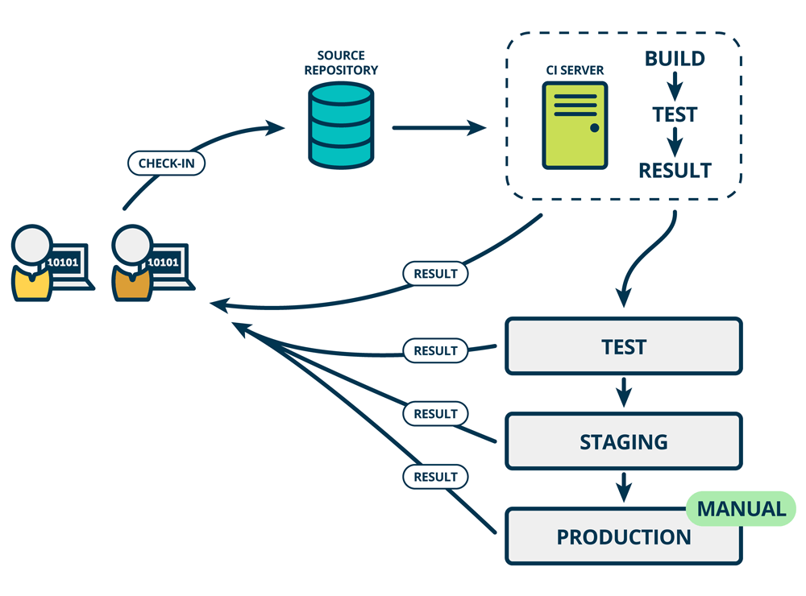
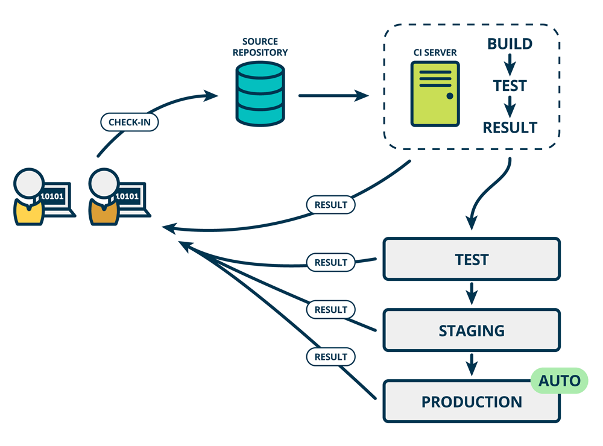

# 持续集成、持续部署、持续交付

标题里的三个“持续”在前几年特别火热，属于技术热词(BuzzWord)。

持续交付(Continuous Delivery)由马丁·福勒（Martin Fowler）于2006年提出。

是的，你没看错，又是马丁·福勒，那位提出微服务的大神。

歪个楼，介绍一些马丁·福勒的代表作：

- 《重构：改善既有代码的设计》

- 《企业应用架构模式》

- 《敏捷软件开发宣言》(联合)

- “微服务”、“持续部署” ....

以上任何一条单独拿出来，都足以封神。

言归正传，我们在一本“微服务”的书中讨论持续交付，仅仅因为它是由大神提出的么？

当然不是，我们将在本文的末尾再讨论这个问题。

[这篇](https://www.mindtheproduct.com/what-the-hell-are-ci-cd-and-devops-a-cheatsheet-for-the-rest-of-us/)文章很好的阐述了三个概念的联系与区别，我们展开讨论。

## 持续集成

小王每次向gitlab提交一个代码，就会触发一次项目的自动构建、运行单元测试，这就是持续集成(Continuous Integration)。如下图所示：

假设小王在提交中引入了一个Bug，借助CI流程(中的集成 or 单元测试)，我们就能在第一时间发现，并尽早修复问题。

管理学大师戴明指出：“问题发现的越早，修复的成本越低”。通过持续集成，我们可以尽早发现问题，从而降低(修复问题带来的)返工成本。

## 持续部署

持续部署(Continuous Deployment)指的是：在持续集成(成功)的基础上，自动将服务部署到"类似于线上"的环境中，如下图所示：

为什么要部署到"类似于线上环境"呢？因为代码只在"集成阶段"通过了一部分"单元测试"，假设单元测试覆盖不全，甚至还需要人工测试，那就可能将隐含的Bug发布到线上，造成生产事故。

图中画的"TEST"(测试环境)、"STAGING"(预发环境)，都是这类"类似线上环境"。当新版本通过最终确认后，再手动(MANUAL)部署到线上。

## 持续交付

持续交付(Continuous Delivery)在持续部署的基础上，更近了一步：成功发布到"类似生产环境"后，会继续自动发布到线上，如下图所示：

显然，这种"自动发布"需要极强的自信和勇气。这可能源于充分的单元测试，清晰的架构，以及对业务能力的自信。

实际上业界只有极少数公司"从容地"实现了上述意义上的"持续交付"。

其余宣称实现了"持续交付"的公司，或者混淆了持续部署的概念，或者对技术故障存在较大容忍度。 (先发布再灰度，难道不是一种容忍?)

这并不是高级黑，如果你认真做过一段时间软件开发，应该能明白“即使100%的单测覆盖率，也不能自动检查出尚未发现的Bug”，更何况绝大多数项目根本无法达到100%单元覆盖率。

我们回到本文开头的问题：为什么要在一本“微服务”的书中，讨论持续部署？

还记得微[服务概述](./micro-service-intro.md)一节中，微服务的缺点么？可靠性陷阱、运维复杂度升高。

- 借助持续集成，能够尽早发现缺陷，提升微服务架构下的可靠性。

- 应用持续部署，可以上线效率，降低运维难度。

由此可见，持续集成、持续部署，能够切实解决微服务中存在的问题。我们将在本书的后续章节，打造自己的持续集成系统，敬请期待。
