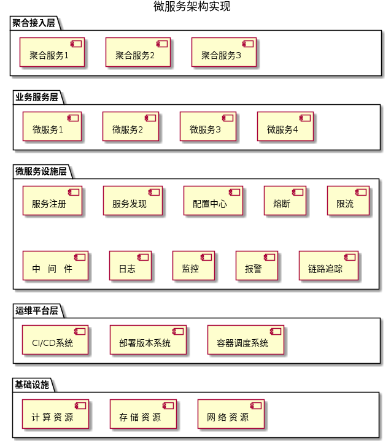

# 微服务架构的一种实现

在上一小节，我们讨论了微服务架构“的的特征、优缺点等话题。

你可能对微服务有了一个模糊的概念，依然感觉不够清晰。

这种感受能够理解。因为，微服务的理论只是提供了一种“架构风格”的建议，并不包含具体的实施方案。

下图展示了一种常见的微服务架构实现：

让我们自底向上、逐层分解：

1. 基础设施层
   
   基础设施层涵盖了服务端运行时，所需要的物理资源。包括：计算资源、存储资源、网络资源等。
   
   针对小型公司，可以直接选用云计算平台的资源(如阿里云、AWS等)；中大型公司出于成本、审计等因素，会自建机房或混合云。
   
   计算资源：CPU、GPU、内存等。除了CPU的核数、内存容量，配比等常见问题，还需要考虑计算资源的弹性伸缩能力，即如何应对“平台大促”等场景带来的流量提升。
   
   存储资源：不仅要考虑磁盘容量，还要考虑磁盘性能([IOPS]([IOPS - 维基百科，自由的百科全书](https://zh.wikipedia.org/wiki/IOPS)))。举个例子：服务端日志主要是顺序写，异步处理 + 大容量机械磁盘就能满足要求；对MySQL等数据库场景，涉及大量随机读，使用SSD可以显著提升性能。
   
   网络资源：外网带宽(峰值)、内网带宽、负载均衡、VPC等。内外网带宽问题较为常见，我们不再讨论。负载均衡：当业务流量规模升高后，接入层的传统软负载解决方案(Nginx、LVS)会显得力不从心。硬件负载均衡(F5)可以提供更高的性能，但做为专用计算的商业产品，其价格在百万以上。这几年，随着Kernel By Pass技术的兴起，基于X86通用硬件 + Linux的的软负载均衡也取得一定的性能突破，感兴趣的话，可以参考这篇[文章]([从Maglev到Vortex，揭秘100G＋线速负载均衡的设计与实现-InfoQ](https://www.infoq.cn/article/Maglev-Vortex/))。

2. 运维平台层
   
   运维平台层是持续交付的重要载体。在[前文](./continuous-x.md)中，我们阐述了“持续交付”对于微服务架构的重要意义。运维平台层，则是持续交付的重要载体，包括：
   
   持续部署系统：集成持续集成、持续部署、并最终实现持续交付。
   
   部署的版本管理系统：管理部署镜像粒度的版本，以支持滚动发布、回滚等部署功能。
   
   容器、容器管理调度平台：容器是一种操作系统级的轻量虚拟化技术。在部署系统中，不仅需要容器技术、还需要容器调度管理系统。这两项技术我们会在后续章节展开讨论。

3. 微服务设施层
   
   本层为微服务的开发和运行提供公用的设施基础。
   
   在这里我们只做基本介绍，在后续章节会详细展开。
   
   服务注册与发现：微服务A调用服务B且后者有3个实例，如何感知这3个实例的IP、端口，以及A要调用哪个实例呢？这就是服务的注册与发现问题，是微服务的核心问题之一。
   
   配置中心：微服务的数量、实例众多，逐一修改配置文件的传统模式，既不经济又容易出错。配置中心是一个中央(但不一定是单机)配置系统，负责配置管理、修改等工作。
   
   熔断：当微服务调链路上，服务不可用或响应时间太长时，触发熔断，快速提前返回。举个例子：家里有用电设备路时电流过大，空气开关会直接跳闸，防止造成进一步的破坏。
   
   限流：为了保护服务不被流量击垮，而提前限制流量。举个例子：经过测算，故宫接待能力是每日1万人。那么当天超过1万后，就触发限流，不让更多游客入园。
   
   日志：如何在众多的微服务实例中，快速定位到某一种出错日志？日志平台实现了微服务实例中的日志收集、存储、检索、分析。
   
   监控系统：通过采集多种指标，实时反馈系统运行状态，保证服务的平稳运行。举个生活中的例子：汽车驾驶位的仪表盘。
   
   报警系统：当监控系统发现异常时，及时将报警发送出来。
   
   链路追踪：当服务A->B->C调用链上发生超时，如何快速定位哪个环节发生了故障？链路追踪解决了分布式、复杂调用链路中的采集、追踪，分析工作。
   
   中间件：帮助微服务方便、稳定的使用数据库、缓存、消息队列等基础设施。

4. 业务服务层

5. 接入网关层
