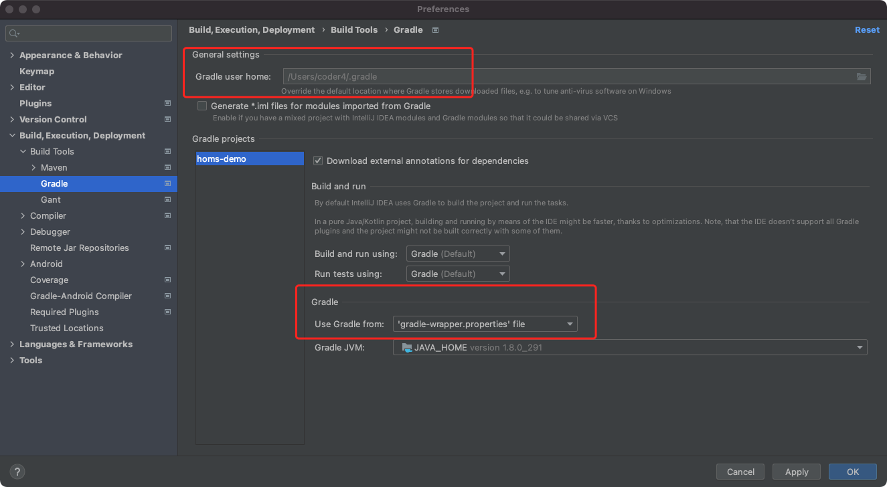

# Gradle构建工具配置

构建工具解决了依赖管理、打包流程、项目结构工程化等问题，是现代软件开发中的必备工具。

Gradle是一款Java开发语言的构建工具，兼容POM以来，使用Groovy作为描述语言，构建速度快、可拓展性强，是大量项目的首选。

在本节中，我们将介绍Gradle的基本用法与配置。

## Gradle的下载与安装

我们使用稳定版7.2，你可以在[官网](https://gradle.org/releases/)下载二进制版本。

解压缩后，需要将二进制目录加入你的PATH路径：

```shell
export PATH=$PATH:HOME/soft/gradle/bin/
```

然后执行gradle，查看是否安装成功

```shell
gradle -v

------------------------------------------------------------
Gradle 7.2
------------------------------------------------------------

Build time:   2021-08-17 09:59:03 UTC
Revision:     a773786b58bb28710e3dc96c4d1a7063628952ad

Kotlin:       1.5.21
Groovy:       3.0.8
Ant:          Apache Ant(TM) version 1.10.9 compiled on September 27 2020
JVM:          1.8.0_291 (Oracle Corporation 25.291-b10)
OS:           Mac OS X 10.16 x86_64
```

## 修改Gradle的Maven仓库镜像

gradle的依赖使用了Maven的仓库。由于众所周知的原因，这些仓库在国内的速度并不稳定，我们需要将仓库切换成国内镜像。

修改~/.gradle/init.gradle文件如下：

```
// project
allprojects{
    repositories {
	mavenLocal()
        maven { url 'https://maven.aliyun.com/repository/public/' }
        maven { url 'https://maven.aliyun.com/repository/jcenter/' }
        maven { url 'https://maven.aliyun.com/repository/google/' }
        maven { url 'https://maven.aliyun.com/repository/gradle-plugin/' }
        maven { url 'https://jitpack.io/' }
    }
}

// plugin
settingsEvaluated { settings ->
    settings.pluginManagement {

        // Clear repositories collection
        repositories.clear()

        // Add my Artifactory mirror
        repositories {
	        mavenLocal()
            maven {
                url "https://maven.aliyun.com/repository/gradle-plugin/"
            }
        }
    }
}
```

解释下文件配置：

- 上半部分：将maven中央仓库、jcenter仓库都修改为国内镜像(阿里云)，并增加了jitpack仓库(后续章节会使用)。

- 下半部分：将gradle插件仓库修改为国内镜像，这部分是必须的，不要忘记。

我们可以通过一个简单的脚本，检查配置是否生效

验证脚本build.gradle

```groovy
task listrepos {
    doLast {
        println "Repositories:"
        project.repositories.each { println "Name: " + it.name + "; url: " + it.url }
   }
}
```

执行验证：

```
gradle listrepos

Repositories:
Name: MavenLocal; url: file:/Users/coder4/.m2/repository/
Name: maven; url: https://maven.aliyun.com/repository/public/
Name: maven2; url: https://maven.aliyun.com/repository/jcenter/
Name: maven3; url: https://maven.aliyun.com/repository/google/
Name: maven4; url: https://maven.aliyun.com/repository/gradle-plugin/
Name: maven5; url: https://jitpack.io/
IntelliJ
```

## gradle-wrapper生成

gradle-wrapper是用于执行gradle的脚本 + 精简版的gradle二进制文件。

既然已经有了gradle，为什么还要单独弄一个wrapper出来么？

- 方便没有安装gradle的环境执行构建(例如打包机)

- 支持多版本gradle的快速切换(实现nvm的效果)

初始化gradle项目时，执行如下命令：

```shell
gradle init
```

gradle会生成如下wrapper相关文件：

```shell
├── gradle
│   └── wrapper
│       ├── gradle-wrapper.jar
│       └── gradle-wrapper.properties
├── gradlew
├── gradlew.bat
└── settings.gradle
```

建议将上述文件一并加入git仓库中，以防出现版本兼容问题。

## IntelliJ IDEA中配置Gradle

IntelliJ IDEA是一款功能强大的IDE，是许多Java程序员的首选。

IDEA默认支持Gradle，请确保配置正确：



上方的Gradle配置文件默认路径，请维持默认配置，使用家目录下默认的。

下方的Gradle版本，推荐使用默认选项(gradle-wrapper.properties)，即使用项目路径下gradle-wrapper.properties指定的版本。


经过上述配置，我们已经搭建了Gradle的构建环境。在下一节，我们会在此基础上集成Spring Boot框架。
