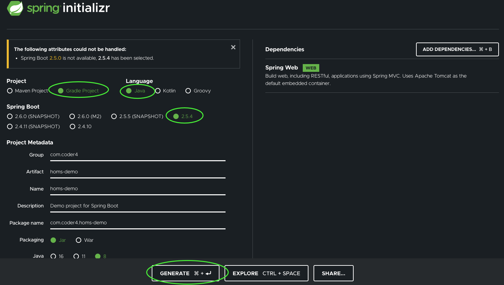

# Sprint Boot项目与Gradle的集成

本节我们将借助Spring Start快速搭建微服务项目。

在此基础上，我们会将工程改造成子项目的组织形式。

## Spring Start快速生成项目

为了降低微服务的开发门槛，社区提供了[Spring initializr](https://start.spring.io/)工具。它可以一键生成微服务项目。如图所示：



我们需要注意几个配置：

- Project(项目)：选择Gradle

- Language(开发语言)：选择Java

- Spring Boot(版本)：选择2.5.4

- 下面的工程名、包名根据自己的需要填写

- Java(版本)：选择8

完成后，点击下方的GENERATE(生成)按钮，即可下载项目的zip包。

解压缩后，目录结构如下：

```shell
.
├── HELP.md
├── build.gradle
├── gradle
│   └── wrapper
│       ├── gradle-wrapper.jar
│       └── gradle-wrapper.properties
├── gradlew
├── gradlew.bat
├── settings.gradle
└── src
    ├── main
    │   ├── java
    │   │   └── com
    │   │       └── coder4
    │   │           └── homsdemo
    │   │               └── HomsDemoApplication.java
    │   └── resources
    │       ├── application.properties
    │       ├── static
    │       └── templates
    └── test
        └── java
            └── com
                └── coder4
                    └── homsdemo
                        └── HomsDemoApplicationTests.java
```

这是一个标准的gradle项目路径：

- gradle*：gradle相关文件，可以参考[Gradle构建工具配置](./gradle.md)一节中的介绍
- src：项目源文件
- test：项目单元测试文件

我们来看一下src目录下唯一的Java源文件，HomsDemoApplication.java：

```
package com.coder4.homsdemo;

import org.springframework.boot.SpringApplication;
import org.springframework.boot.autoconfigure.SpringBootApplication;

@SpringBootApplication
public class HomsDemoApplication {

    public static void main(String[] args) {
        SpringApplication.run(HomsDemoApplication.class, args);
    }

}
```

借助Spring Boot的精简设计，项目只需上述一个源文件即可服务端进程

编译项目：

```shell
gradle build

BUILD SUCCESSFUL in 19s
7 actionable tasks: 7 executed
```

运行项目：

```
java -jar ./build/libs/homs-demo-0.0.1-SNAPSHOT.jar 

  .   ____          _            __ _ _
 /\\ / ___'_ __ _ _(_)_ __  __ _ \ \ \ \
( ( )\___ | '_ | '_| | '_ \/ _` | \ \ \ \
 \\/  ___)| |_)| | | | | || (_| |  ) ) ) )
  '  |____| .__|_| |_|_| |_\__, | / / / /
 =========|_|==============|___/=/_/_/_/
 :: Spring Boot ::                (v2.5.4)

2021-09-08 12:47:51.906  INFO 2806 --- [           main] com.coder4.homsdemo.HomsDemoApplication  : Starting HomsDemoApplication using Java 1.8.0_291 on coder4deMacBook-Pro.local with PID 2806 (/Users/coder4/Downloads/homs-demo/build/libs/homs-demo-0.0.1-SNAPSHOT.jar started by coder4 in /Users/coder4/Downloads/homs-demo)
2021-09-08 12:47:51.909  INFO 2806 --- [           main] com.coder4.homsdemo.HomsDemoApplication  : No active profile set, falling back to default profiles: default
2021-09-08 12:47:52.960  INFO 2806 --- [           main] o.s.b.w.embedded.tomcat.TomcatWebServer  : Tomcat initialized with port(s): 8080 (http)
2021-09-08 12:47:52.975  INFO 2806 --- [           main] o.apache.catalina.core.StandardService   : Starting service [Tomcat]
2021-09-08 12:47:52.975  INFO 2806 --- [           main] org.apache.catalina.core.StandardEngine  : Starting Servlet engine: [Apache Tomcat/9.0.52]
2021-09-08 12:47:53.032  INFO 2806 --- [           main] o.a.c.c.C.[Tomcat].[localhost].[/]       : Initializing Spring embedded WebApplicationContext
2021-09-08 12:47:53.032  INFO 2806 --- [           main] w.s.c.ServletWebServerApplicationContext : Root WebApplicationContext: initialization completed in 1067 ms
2021-09-08 12:47:53.413  INFO 2806 --- [           main] o.s.b.w.embedded.tomcat.TomcatWebServer  : Tomcat started on port(s): 8080 (http) with context path ''
2021-09-08 12:47:53.424  INFO 2806 --- [           main] com.coder4.homsdemo.HomsDemoApplication  : Started HomsDemoApplication in 1.951 seconds (JVM running for 2.388)
```

我们在浏览器打开 http:127.0.0.1:8080 已经可以成功打开了！

在微服务架构中，需要新建大量微服务。而Spring社区提供的Starter工具，降低了微服务的初始化门槛。在实际开发中，我们也可以结合实际情况，定制出适合自己团队的脚手架工具。

## 子项目改造

上述脚手架生成的项目，是独立项目模式：一个目录下，只有一个独立项目。

在实际微服务开发中，一个目录下需要多组相互关联的子项目，例如：

- protobuf和桩文件单独拆成子项目

- 常量提取到单独子项目

在本书的实战中，我们的微服务选用的是server / client 双子项目结构

- client：内置protobuf、桩文件，客户端代码、自动配置代码

- server：专注服务端逻辑开发

将Gradle项目拆分为子项目的功能，网上资料不多，自己摸索需要踩很多坑。

本文提供的也只是一种实现方式，你可以在此基础上，进行改造。

先看下整体目录结构：

```shell
./├── build.gradle
├── gradle
│   └── wrapper
│       ├── gradle-wrapper.jar
│       └── gradle-wrapper.properties
├── gradlew
├── gradlew.bat
├── homs-demo-client
│   ├── build.gradle
│   └── src
│       └── main
│           └── java
│               └── com
│                   └── coder4
│                       └── homs
│                           └── demo
│                               ├── HomsDemo.proto
│                               ├── HomsDemoGrpc.java
│                               ├── HomsDemoProto.java
│                               └── client
│                                   └── HomsDemoClient.java
├── homs-demo-server
│   ├── build.gradle
│   └── src
│       ├── main
│       │   ├── java
│       │   │   └── com
│       │   │       └── coder4
│       │   │           └── homs
│       │   │               └── demo
│       │   │                   └── server
│       │   │                       ├── Application.java
│       │   └── resources
│       │       └── application.yaml
│       └── test
│           └── java
│               └── com
│                   └── coder4
│                       └── homs
│                           └── demo
│                               └── server
│                                   └── Test.java
└── settings.gradle
```

如上图所述，我们在独立项目的基础上，改造如下：

- 新增homs-demo-client / homs-demo-server 两个子项目

- 子项目内，额外添加了build.gradle文件

下面我们来看下gradle的相关配置

首先是根目录下的

settings.gradle

```groovy
rootProject.name = 'homs-demo'
include 'homs-demo-client'
include 'homs-demo-server'
```

如上所述，定义了项目名为"homs-demo"，两个子项目"homs-demo-client" 和 "homs-demo-server"。

接着看一下根目录下的

build.gradle

```groovy
plugins {

  id 'java'
  id 'idea'
  id 'org.springframework.boot' version '2.5.3' apply false
  id 'io.spring.dependency-management' version '1.0.11.RELEASE' apply false

}

subprojects {

  group = 'com.coder4'
  version = '0.0.1-SNAPSHOT'
  sourceCompatibility = '1.8'

}
```

这里的plugin部分，定义了4个插件：

- java：java项目必选

- idea (Intellj IDEA)：生成idea需要的文件

- org.springframework.boot：Spring Boot插件，支持构建可执行的server.jar

- io.spring.dependency-management：Spring Boot相关版本的依赖管理

subprojects部分定义了所以子项目(server / client)的公用参数

- group / version 项目包名和版本

- sourceCompatibility：Java 8的语言版本

我们再来看一下client子项目

homs-demo-client/build.gradle

```groovy
plugins {
    id 'java'
    id 'io.spring.dependency-management'
}

dependencies {
    implementation "org.slf4j:slf4j-api:1.7.32"
}
```

上述是client子项目的gradle配置，不难发现：

- plugins：java、spring依赖

- dependencies：这里的配置等同于maven的pom.xml中的依赖配置，但gradle以冒号分割的语法更加简洁。这里只配置了一个slf4j。

再看下server子项目

```groovy
plugins {
    id 'java'
    id 'org.springframework.boot'
    id 'io.spring.dependency-management'
}

dependencies {
    implementation project(':homs-demo-client')
    implementation 'org.slf4j:slf4j-api:1.7.32'
    implementation 'org.springframework.boot:spring-boot-starter-web'
}
```

server与client有所不同：

- plugins：增加了spring boot插件

- dependencies：首先依赖了客户端子项目，接着依赖Spring Boot的web-starter。

你可能已经注意到了，在server的依赖中，并没有设定spring-boot-starter-web的版本。

Spring相关依赖的版本补全由'dependency-management'插件自动处理。当我们在项目根路径的build.gradle中，声明Spring Boot插件和Dependency Management时，就确定了所有子项目中，Spring依赖的版本。

经过上述改造，我们已经“基本”完成了子项目的改造。

## 实现BOM功能

为什么我们说“基本”完成呢？

因为，子项目改造引入了新的问题：

若在client和server中，各自依赖slf4j但版本不同，会发生什么情况？

没错，这就是经典的“Maven依赖冲突”问题，关于背景和常见解法可以参考[这篇]([Solving Dependency Conflicts in Maven - DZone Java](https://dzone.com/articles/solving-dependency-conflicts-in-maven))文章。

依赖冲突问题的最根本解法是：让大家都依赖于相同的版本。在Maven中可以使用bom清单(bill of material)：将所有公用包的版本都声明在bom文件中，然后其余项目都依赖bom。

Gradle并没有直接实现BOM，但在6.0+支持了platform机制。它可以实现与BOM类似的效果。

我们新建一个独立的项目，bom-homs

settings.gradle 

```groovy
rootProject.name = 'bom-homs'
```

这里声明了bom的名字

build.gradle

```groovy
plugins {
    id 'java-platform'
    id 'maven-publish'
}

group 'com.coder4'
version '1.0'

dependencies {
    constraints {
        api 'org.slf4j:slf4j-api:1.7.32'
    }
}

publishing {
    publications {
        myPlatform(MavenPublication) {
            from components.javaPlatform
        }
    }
}
```

上述配置的解析如下：

- plugins：platform和maven发布插件

- group、version：maven中同等概念，一会用到

- dependencies：公用包的版本声明，这里只又一个slf4j

- publishing：这里借用了Maven的发布方式

下面我们执行发布(到本地)：

```shell
gradle publishToMavenLocal

BUILD SUCCESSFUL in 704ms
3 actionable tasks: 3 executed
```

（这里我们暂时发布到本地，如何发布到远程、私有仓库，将在后续章节再介绍。）

成功发布后，我们回到homs-demo项目中，将server的子项目改造如下：

```groovy
plugins {
    id 'java'
    id 'org.springframework.boot'
    id 'io.spring.dependency-management'
}

dependencies {

    implementation project(':homs-demo-client')
    implementation platform('com.coder4:bom-homs:1.0')

    implementation 'org.slf4j:slf4j-api'
    implementation 'org.springframework.boot:spring-boot-starter-web'
}
```

通过引入platform，我们就无需在项目中指明slf4j的版本了，从而在源头上解决了版本冲突的问题！

针对client子项目，也是类似的修改，这里不做赘述。

至此，我们完成Gradle与Spring Boot的集成、子项目拆分。

关于“Spring Boot + Gradle子项目”的资料，在网上并不多见，希望你能仔细阅读、反复揣摩、举一反三:-)

本文涉及的项目代码，我整理到了[这里](https://github.com/liheyuan/homs-demo)，供大家参考。


