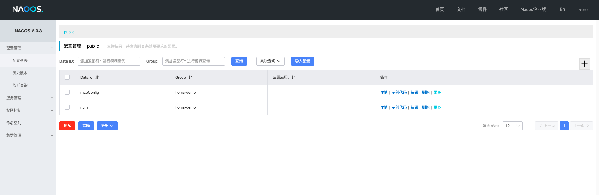

# Nacos配置中心

Nacos不仅提供了服务的注册与发现，也提供了配置管理的功能。

本节，我们继续使用Nacos，基于其配置管理的功能，实现微服务的配置中心。

首先，我们在Nacos上，新建两个配置：



如上图所示：

- Nacos提供了dataId、group两个字段，用于区分不同的配置

- 我们在group字段填充微服务的名称，例如homs-demo

- 我们在dataId字段填写配置的key

- Nacos的支持简单的类型检验，例如json、数值、字符串等，但只限于前端校验，存储后多统一为字符串类型

有了配置后，我们来实现Nacos配置管理的驱动部分：

```java
public interface NacosConfigService {

    Optional<String> getConfig(String serviceName, String key);

    void onChange(String serviceName, String key, Consumer<Optional<String>> consumer);

}
```

```java
package com.coder4.homs.demo.server.service.impl;

import com.alibaba.nacos.api.NacosFactory;
import com.alibaba.nacos.api.config.ConfigService;
import com.alibaba.nacos.api.config.listener.Listener;
import com.alibaba.nacos.api.exception.NacosException;
import com.coder4.homs.demo.server.service.spi.NacosConfigService;
import org.slf4j.Logger;
import org.slf4j.LoggerFactory;
import org.springframework.beans.factory.annotation.Value;
import org.springframework.stereotype.Service;

import javax.annotation.PostConstruct;
import java.util.Optional;
import java.util.concurrent.Executor;
import java.util.function.Consumer;

/**
 * @author coder4
 */
@Service
public class NacosConfigServiceImpl implements NacosConfigService{

    private static final Logger LOG = LoggerFactory.getLogger(NacosConfigServiceImpl.class);

    @Value("${nacos.server}")
    private String nacosServer;

    private ConfigService configService;

    @PostConstruct
    public void postConstruct() throws NacosException {
        configService = NacosFactory
                .createConfigService(nacosServer);
    }

    @Override
    public Optional<String> getConfig(String serviceName, String key) {
        try {
            return Optional.ofNullable(configService.getConfig(key, serviceName, 5000));
        } catch (NacosException e) {
            LOG.error("nacos get config exception for " + serviceName + " " + key, e);
            return Optional.empty();
        }
    }

    @Override
    public void onChange(String serviceName, String key, Consumer<Optional<String>> consumer) {
        try {
            configService.addListener(key, serviceName, new Listener() {
                @Override
                public Executor getExecutor() {
                    return null;
                }

                @Override
                public void receiveConfigInfo(String configInfo) {
                    consumer.accept(Optional.ofNullable(configInfo));
                }
            });
        } catch (NacosException e) {
            LOG.error("nacos add listener exception for " + serviceName + " " + key, e);
            throw new RuntimeException(e);
        }
    }
}
```

上述驱动部分，主要实现了两个功能：

- 通过getConfig方法，同步拉取配置

- 通过onChange方法，添加异步监听器，当配置发生改变时，会执行回调

## 配置的自动注解与更新

我们希望实现一个更加“易用”的配置中心，期望具有如下特性：

- 通过注解的方式，自动将类中的字段"绑定"到远程Nacos配置中心对应字段上，并自动初始化。

- 当Nacos配置更新后，本地同步进行修改。

- 支持类型的自动转换

第一步，我们声明注解：

```java
package com.coder4.homs.demo.server.annotation;

import java.lang.annotation.Documented;
import java.lang.annotation.ElementType;
import java.lang.annotation.Retention;
import java.lang.annotation.RetentionPolicy;
import java.lang.annotation.Target;

@Target({ElementType.FIELD, ElementType.PARAMETER})
@Retention(RetentionPolicy.RUNTIME)
@Documented
public @interface HSConfig {

    String name() default "";

    String serviceName() default "";

}
```

上述关键字段的用途是：

- name，远程fdc指定的配置名称，可选，若未填写则使用注解应用的原始字段名。

- serviceName，远程fdc指定的服务名称，可选，若未填写则使用当前本地服务名。

接着，我们借助BeanPostProcessor，来对打了HSConfig注解的字段，进行值注入。

```java
package com.coder4.homs.demo.server.processor;

import com.alibaba.nacos.common.utils.StringUtils;
import com.coder4.homs.demo.server.HsReflectionUtils;
import com.coder4.homs.demo.server.annotation.HSConfig;
import com.coder4.homs.demo.server.service.spi.NacosConfigService;
import org.slf4j.Logger;
import org.slf4j.LoggerFactory;
import org.springframework.aop.support.AopUtils;
import org.springframework.beans.BeansException;
import org.springframework.beans.factory.config.BeanPostProcessor;
import org.springframework.core.Ordered;
import org.springframework.data.util.ReflectionUtils.AnnotationFieldFilter;
import org.springframework.util.ReflectionUtils;
import org.springframework.util.ReflectionUtils.FieldFilter;

import java.lang.reflect.Field;
import java.util.Optional;

/**
 * @author coder4
 */
public class HsConfigFieldProcessor implements BeanPostProcessor, Ordered {

    private static final Logger LOG = LoggerFactory.getLogger(HsConfigFieldProcessor.class);

    private static final FieldFilter HS_CONFIG_FIELD_FILTER = new AnnotationFieldFilter(HSConfig.class);

    private NacosConfigService nacosConfigService;

    private String serviceName;

    public HsConfigFieldProcessor(NacosConfigService service, String serviceName) {
        this.nacosConfigService = service;
        this.serviceName = serviceName;
    }

    @Override
    public Object postProcessBeforeInitialization(Object bean, String beanName) throws BeansException {
        Class targetClass = AopUtils.getTargetClass(bean);
        ReflectionUtils.doWithFields(
                targetClass, field -> processField(bean, field), HS_CONFIG_FIELD_FILTER);
        return bean;
    }

    private void processField(Object bean, Field field) {
        HSConfig valueAnnotation = field.getDeclaredAnnotation(HSConfig.class);
        // 优先注解，其次本地代码
        String key = StringUtils.defaultIfEmpty(valueAnnotation.name(), field.getName());
        String serviceName = StringUtils.defaultIfEmpty(valueAnnotation.serviceName(), this.serviceName);
        Optional<String> valueOp = nacosConfigService.getConfig(serviceName, key);
        try {
            if (!valueOp.isPresent()) {
                LOG.error("nacos config for serviceName = {} key = {} is empty", serviceName, key);
            }
            HsReflectionUtils.setField(bean, field, valueOp.get());

            // Future Change
            nacosConfigService.onChange(serviceName, key, valueOp2 -> {
                try {
                    HsReflectionUtils.setField(bean, field, valueOp2.get());
                } catch (IllegalAccessException e) {
                    LOG.error("nacos config for serviceName = {} key = {} exception", e);
                }
            });
        } catch (IllegalAccessException e) {
            LOG.error("setField for " + field.getName() + " exception", e);
            throw new RuntimeException(e.getMessage());
        }
    }

    @Override
    public int getOrder() {
        return LOWEST_PRECEDENCE;
    }
}
```

上述代码比较复杂，我们逐步讲解：

- 构造函数传入nacosConfigService用于操作nacos配置管理接口

- 构造函数传入的serviceName做为默认的服务名

- postProcessBeforeInitialization方法，会在Bean构造前执行，通过ReflectionUtils来过滤所有打了@HsConfig注解的字段，逐一处理，流程如下：
  
  - 首先获取要绑定的服务名、字段名，遵循注解优于本地的顺序
  
  - 调用nacosServer拉取当前配置，并通过HsReflectionUtils工具的反射的注入到字段中。
  
  - 添加回调，以便未来更新时，及时修改本地变量。

HsReflectionUtils中涉及类型的自动转换，代码如下：

```java
package com.coder4.homs.demo.server.utils;

import com.fasterxml.jackson.core.JsonProcessingException;
import com.fasterxml.jackson.databind.ObjectMapper;

import java.lang.reflect.Field;

/**
 * @author coder4
 */
public class HsReflectionUtils {

    private static final ObjectMapper OBJECT_MAPPER = new ObjectMapper();

    public static void setField(Object bean, Field field, String valueStr) throws IllegalAccessException {
        field.setAccessible(true);
        Class fieldType = field.getType();
        if (fieldType == Integer.TYPE || fieldType == Integer.class) {
            field.set(bean, Integer.parseInt(valueStr));
        } else if (fieldType == Long.TYPE || fieldType == Long.class) {
            field.set(bean, Long.parseLong(valueStr));
        } else if (fieldType == Short.TYPE || fieldType == Short.class) {
            field.set(bean, Short.parseShort(valueStr));
        } else if (fieldType == Double.TYPE || fieldType == Double.class) {
            field.set(bean, Double.parseDouble(valueStr));
        } else if (fieldType == Float.TYPE || fieldType == Float.class) {
            field.set(bean, Float.parseFloat(valueStr));
        } else if (fieldType == Byte.TYPE || fieldType == Byte.class) {
            field.set(bean, Byte.parseByte(valueStr));
        } else if (fieldType == Boolean.TYPE || fieldType == Boolean.class) {
            field.set(bean, Boolean.parseBoolean(valueStr));
        } else if (fieldType == Character.TYPE || fieldType == Character.class) {
            if (valueStr == null || valueStr.isEmpty()) {
                throw new IllegalArgumentException("can't parse char because value string is empty");
            }
            field.set(bean, valueStr.charAt(0));
        } else if (fieldType.isEnum()) {
            field.set(bean, Enum.valueOf(fieldType, valueStr));
        } else {
            try {
                field.set(bean, OBJECT_MAPPER.readValue(valueStr, fieldType));
            } catch (JsonProcessingException e) {
                throw new IllegalArgumentException("can't parse json because exception");
            }
        }
    }

}
```

上述代码中，针对field的类型逐一判断，针对八大基本类型，直接parse，针对复杂类型，使用json反序列化的方式注入。

## 自动配置的使用

有了上述的基础后，我们还需要添加自动配置类，让其生效：

```java
package com.coder4.homs.demo.server.configuration;

import com.coder4.homs.demo.constant.HomsDemoConstant;
import com.coder4.homs.demo.server.processor.HsConfigFieldProcessor;
import com.coder4.homs.demo.server.service.spi.NacosConfigService;
import org.springframework.beans.factory.annotation.Autowired;
import org.springframework.boot.autoconfigure.condition.ConditionalOnMissingBean;
import org.springframework.context.annotation.Bean;
import org.springframework.context.annotation.Configuration;

/**
 * @author coder4
 */
@Configuration
public class HsConfigProcessorConfiguration {

    @Bean
    @ConditionalOnMissingBean(HsConfigFieldProcessor.class)
    public HsConfigFieldProcessor fieldProcessor(@Autowired NacosConfigService configService) {
        return new HsConfigFieldProcessor(configService, HomsDemoConstant.SERVICE_NAME);
    }

}
```

使用时非常简单：

```java
@Service
public class HomsDemoConfig {

    @HSConfig
    private int num;

    @HSConfig(name = "mapConfig")
    private Map<String, String> map;

    @PostConstruct
    public void postConstruct() {
        System.out.println(num);
        System.out.println(map);
    }

}
```

只需要添加HSConfig注解，即可完成远程配置的自动注入、绑定、更新。
