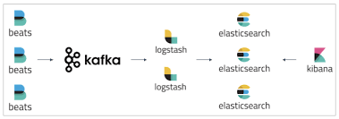
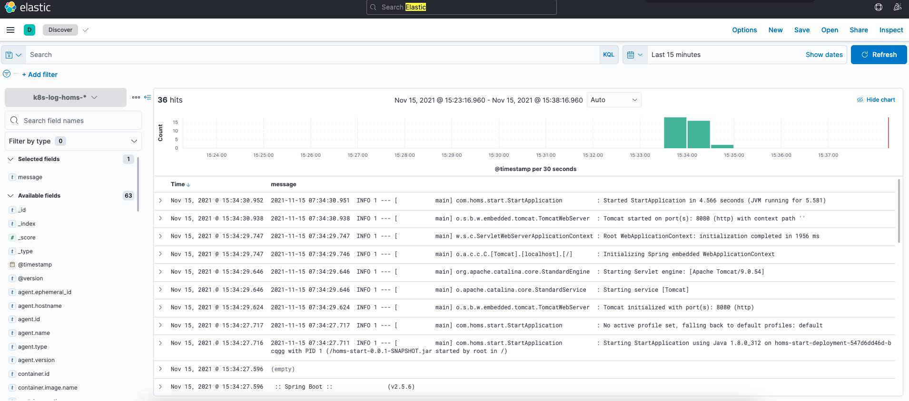

# 基于ELKFK打造日志平台

微服务的实例数众多，需要一个强大的日志日志平台，它应具有以下功能：

- 采集：从服务端进程(k8s的Pod中)，自动收集日志

- 存储：将日志按照时间序列，存储在持久化的介质上，以供未来查找。

- 检索：根据关键词，时间等条件，方便地检索特定日志内容。

我们将基于ELKFK，打造自己的日志平台。

你可能听说过ELK，那么ELK后面加上的FK是什么呢？

F：Filebeat，轻量级的日志采集插件

K：Kafka，用户缓存日志

日志系统的架构图如下所示：



## 搭建Kafka

Kafka消耗的资源较多，一般多采用独立部署的方式。

这里为了演示方便，我们以单机版为例。

首先下载：

```shell
wget https://dlcdn.apache.org/kafka/3.0.0/kafka_2.13-3.0.0.tgz
```

接着，启动zk

```shell
bin/zookeeper-server-start.sh config/zookeeper.properties
```

最后，启动broker

```shell
bin/kafka-server-start.sh config/server.properties
```

我们来创建topic，供后续使用。

```shell
bin/kafka-topics.sh --create --topic k8s-log-homs --partitions 3 --replication-factor 1 --bootstrap-server localhost:9092k8s -> (FileBeat) -> kafka
```

## 部署FileBeat

有了Kafka之后，我们在Kubernets集群上部署FileBeat，自动采集日志并发送到Kafka的队列中，配置如下：

```yaml
---
apiVersion: v1
kind: ConfigMap
metadata:
  name: filebeat-config
  namespace: kube-system
  labels:
    k8s-app: filebeat
data:
  filebeat.yml: |-
    filebeat.inputs:
    - type: container
      paths:
        - /var/log/containers/homs*.log
      fields:
        kafka_topic: k8s-log-homs
      processors:
        - add_kubernetes_metadata:
            host: ${NODE_NAME}
            matchers:
            - logs_path:
                logs_path: "/var/log/containers/"
    processors:
      - add_cloud_metadata:
      - add_host_metadata:

    cloud.id: ${ELASTIC_CLOUD_ID}
    cloud.auth: ${ELASTIC_CLOUD_AUTH}
    output:
      kafka:
        enabled: true
        hosts: ["10.1.172.136:9092"]
        topic: '%{[fields.kafka_topic]}' 
        max_message_bytes: 5242880
        partition.round_robin:
          reachable_only: true
        keep-alive: 120
        required_acks: 1
---
apiVersion: apps/v1
kind: DaemonSet
metadata:
  name: filebeat
  namespace: kube-system
  labels:
    k8s-app: filebeat
spec:
  selector:
    matchLabels:
      k8s-app: filebeat
  template:
    metadata:
      labels:
        k8s-app: filebeat
    spec:
      serviceAccountName: filebeat
      terminationGracePeriodSeconds: 30
      hostNetwork: true
      dnsPolicy: ClusterFirstWithHostNet
      containers:
      - name: filebeat
        image: docker.elastic.co/beats/filebeat:7.15.2
        args: [
          "-c", "/etc/filebeat.yml",
          "-e",
        ]
        env:
        - name: ELASTIC_CLOUD_ID
          value:
        - name: ELASTIC_CLOUD_AUTH
          value:
        - name: NODE_NAME
          valueFrom:
            fieldRef:
              fieldPath: spec.nodeName
        securityContext:
          runAsUser: 0
          # If using Red Hat OpenShift uncomment this:
          #privileged: true
        resources:
          limits:
            memory: 200Mi
          requests:
            cpu: 100m
            memory: 100Mi
        volumeMounts:
        - name: config
          mountPath: /etc/filebeat.yml
          readOnly: true
          subPath: filebeat.yml
        - name: data
          mountPath: /usr/share/filebeat/data
        - name: varlibdockercontainers
          mountPath: /var/lib/docker/containers
          readOnly: true
        - name: varlog
          mountPath: /var/log
          readOnly: true
      volumes:
      - name: config
        configMap:
          defaultMode: 0640
          name: filebeat-config
      - name: varlibdockercontainers
        hostPath:
          path: /var/lib/docker/containers
      - name: varlog
        hostPath:
          path: /var/log
      # data folder stores a registry of read status for all files, so we don't send everything again on a Filebeat pod restart
      - name: data
        hostPath:
          # When filebeat runs as non-root user, this directory needs to be writable by group (g+w).
          path: /var/lib/filebeat-data
          type: DirectoryOrCreate
---
apiVersion: rbac.authorization.k8s.io/v1
kind: ClusterRoleBinding
metadata:
  name: filebeat
subjects:
- kind: ServiceAccount
  name: filebeat
  namespace: kube-system
roleRef:
  kind: ClusterRole
  name: filebeat
  apiGroup: rbac.authorization.k8s.io
---
apiVersion: rbac.authorization.k8s.io/v1
kind: RoleBinding
metadata:
  name: filebeat
  namespace: kube-system
subjects:
  - kind: ServiceAccount
    name: filebeat
    namespace: kube-system
roleRef:
  kind: Role
  name: filebeat
  apiGroup: rbac.authorization.k8s.io
---
apiVersion: rbac.authorization.k8s.io/v1
kind: RoleBinding
metadata:
  name: filebeat-kubeadm-config
  namespace: kube-system
subjects:
  - kind: ServiceAccount
    name: filebeat
    namespace: kube-system
roleRef:
  kind: Role
  name: filebeat-kubeadm-config
  apiGroup: rbac.authorization.k8s.io
---
apiVersion: rbac.authorization.k8s.io/v1
kind: ClusterRole
metadata:
  name: filebeat
  labels:
    k8s-app: filebeat
rules:
- apiGroups: [""] # "" indicates the core API group
  resources:
  - namespaces
  - pods
  - nodes
  verbs:
  - get
  - watch
  - list
- apiGroups: ["apps"]
  resources:
    - replicasets
  verbs: ["get", "list", "watch"]
---
apiVersion: rbac.authorization.k8s.io/v1
kind: Role
metadata:
  name: filebeat
  # should be the namespace where filebeat is running
  namespace: kube-system
  labels:
    k8s-app: filebeat
rules:
  - apiGroups:
      - coordination.k8s.io
    resources:
      - leases
    verbs: ["get", "create", "update"]
---
apiVersion: rbac.authorization.k8s.io/v1
kind: Role
metadata:
  name: filebeat-kubeadm-config
  namespace: kube-system
  labels:
    k8s-app: filebeat
rules:
  - apiGroups: [""]
    resources:
      - configmaps
    resourceNames:
      - kubeadm-config
    verbs: ["get"]
---
apiVersion: v1
kind: ServiceAccount
metadata:
  name: filebeat
  namespace: kube-system
  labels:
    k8s-app: filebeat
---
```

配置较多，我们解释一下：

- 采集/var/log/containers目录下的homs*.log文件名的日志

- 将这些日志送到k8s-log-homs这个Kafka的topic中

- 配置Kafka的服务器地址

- 配置其他所需的权限

实际上，上述配置是在官方[原始文件](wget https://raw.githubusercontent.com/elastic/beats/7.15/deploy/kubernetes/filebeat-kubernetes.yaml)基础上修改的，更多配置可以参考[官方文档]([Configure the Kafka output | Filebeat Reference [7.15] | Elastic](https://www.elastic.co/guide/en/beats/filebeat/current/kafka-output.html))。

应用上述配置：

```shell
kubectl apply -f filebeat.yaml
```

然后我们查看Kafka收到的日志：

```shell
bin/kafka-console-consumer.sh --bootstrap-server 127.0.0.1:9092 --topic k8s-log-homs --from-beginning
```

符合预期：

```shell
...
{"@timestamp":"2021-11-15T03:18:26.487Z","@metadata":{"beat":"filebeat","type":"_doc","version":"7.15.2"},"stream":"stdout","message":"2021-11-15 03:18:26.486  INFO 1 --- [           main] o.s.b.w.embedded.tomcat.TomcatWebServer  : Tomcat initialized with port(s): 8080 (http)","log":{"offset":1491,"file":{"path":"/var/log/containers/homs-start-deployment-6878f48fcc-65vcr_default_homs-start-server-d37b0467d097c00bd203089a97df371cdbacc156493f6b2d995b80395caf516f.log"}},"input":{"type":"container"},"agent":{"type":"filebeat","version":"7.15.2","hostname":"minikube","ephemeral_id":"335988de-a165-4070-88f1-08c3d6be7ba5","id":"850b6889-85e0-41c5-8a83-bce344b8b2ec","name":"minikube"},"ecs":{"version":"1.11.0"},"container":{"image":{"name":"coder4/homs-start:107"},"id":"d37b0467d097c00bd203089a97df371cdbacc156493f6b2d995b80395caf516f","runtime":"docker"},"kubernetes":{"pod":{"ip":"172.17.0.3","name":"homs-start-deployment-6878f48fcc-65vcr","uid":"7d925249-2a77-4c28-a462-001d189cdeaa"},"container":{"name":"homs-start-server"},"node":{"name":"minikube","uid":"faec4c1a-9188-408a-aeec-95b24aa47a88","labels":{"node-role_kubernetes_io/control-plane":"","node_kubernetes_io/exclude-from-external-load-balancers":"","kubernetes_io/hostname":"minikube","kubernetes_io/os":"linux","minikube_k8s_io/commit":"a03fbcf166e6f74ef224d4a63be4277d017bb62e","minikube_k8s_io/name":"minikube","minikube_k8s_io/updated_at":"2021_11_05T12_15_23_0700","node-role_kubernetes_io/master":"","beta_kubernetes_io/arch":"amd64","beta_kubernetes_io/os":"linux","minikube_k8s_io/version":"v1.22.0","kubernetes_io/arch":"amd64"},"hostname":"minikube"},"labels":{"app":"homs-start","pod-template-hash":"6878f48fcc"},"namespace_uid":"b880885d-c94a-4cf2-ba2c-1e4cb0d1a691","namespace_labels":{"kubernetes_io/metadata_name":"default"},"namespace":"default","deployment":{"name":"homs-start-deployment"},"replicaset":{"name":"homs-start-deployment-6878f48fcc"}},"orchestrator":{"cluster":{"url":"control-plane.minikube.internal:8443","name":"mk"}},"host":{"mac":["02:42:d5:27:3f:31","c6:64:9d:f9:89:7b","5a:b1:a0:66:ee:d3","46:41:6e:14:85:14","02:42:c0:a8:31:02"],"hostname":"minikube","architecture":"x86_64","os":{"kernel":"5.10.47-linuxkit","codename":"Core","type":"linux","platform":"centos","version":"7 (Core)","family":"redhat","name":"CentOS Linux"},"id":"1820c6c61258c329e88764d3dc4484f3","name":"minikube","containerized":true,"ip":["172.17.0.1","192.168.49.2"]}}
{"@timestamp":"2021-11-15T03:18:26.573Z","@metadata":{"beat":"filebeat","type":"_doc","version":"7.15.2"},"log":{"offset":2111,"file":{"path":"/var/log/containers/homs-start-deployment-6878f48fcc-65vcr_default_homs-start-server-d37b0467d097c00bd203089a97df371cdbacc156493f6b2d995b80395caf516f.log"}},"stream":"stdout","input":{"type":"container"},"host":{"id":"1820c6c61258c329e88764d3dc4484f3","containerized":true,"ip":["172.17.0.1","192.168.49.2"],"name":"minikube","mac":["02:42:d5:27:3f:31","c6:64:9d:f9:89:7b","5a:b1:a0:66:ee:d3","46:41:6e:14:85:14","02:42:c0:a8:31:02"],"hostname":"minikube","architecture":"x86_64","os":{"family":"redhat","name":"CentOS Linux","kernel":"5.10.47-linuxkit","codename":"Core","type":"linux","platform":"centos","version":"7 (Core)"}},"ecs":{"version":"1.11.0"},"agent":{"version":"7.15.2","hostname":"minikube","ephemeral_id":"335988de-a165-4070-88f1-08c3d6be7ba5","id":"850b6889-85e0-41c5-8a83-bce344b8b2ec","name":"minikube","type":"filebeat"},"message":"2021-11-15 03:18:26.573  INFO 1 --- [           main] o.a.c.c.C.[Tomcat].[localhost].[/]       : Initializing Spring embedded WebApplicationContext","container":{"id":"d37b0467d097c00bd203089a97df371cdbacc156493f6b2d995b80395caf516f","runtime":"docker","image":{"name":"coder4/homs-start:107"}},"kubernetes":{"replicaset":{"name":"homs-start-deployment-6878f48fcc"},"node":{"name":"minikube","uid":"faec4c1a-9188-408a-aeec-95b24aa47a88","labels":{"node-role_kubernetes_io/control-plane":"","minikube_k8s_io/commit":"a03fbcf166e6f74ef224d4a63be4277d017bb62e","kubernetes_io/os":"linux","kubernetes_io/arch":"amd64","node_kubernetes_io/exclude-from-external-load-balancers":"","beta_kubernetes_io/arch":"amd64","beta_kubernetes_io/os":"linux","minikube_k8s_io/updated_at":"2021_11_05T12_15_23_0700","node-role_kubernetes_io/master":"","kubernetes_io/hostname":"minikube","minikube_k8s_io/name":"minikube","minikube_k8s_io/version":"v1.22.0"},"hostname":"minikube"},"namespace_labels":{"kubernetes_io/metadata_name":"default"},"namespace":"default","deployment":{"name":"homs-start-deployment"},"pod":{"ip":"172.17.0.3","name":"homs-start-deployment-6878f48fcc-65vcr","uid":"7d925249-2a77-4c28-a462-001d189cdeaa"},"labels":{"app":"homs-start","pod-template-hash":"6878f48fcc"},"container":{"name":"homs-start-server"},"namespace_uid":"b880885d-c94a-4cf2-ba2c-1e4cb0d1a691"},"orchestrator":{"cluster":{"url":"control-plane.minikube.internal:8443","name":"mk"}}}
{"@timestamp":"2021-11-15T03:18:27.470Z","@metadata":{"beat":"filebeat","type":"_doc","version":"7.15.2"},"input":{"type":"container"},"orchestrator":{"cluster":{"url":"control-plane.minikube.internal:8443","name":"mk"}},"agent":{"type":"filebeat","version":"7.15.2","hostname":"minikube","ephemeral_id":"335988de-a165-4070-88f1-08c3d6be7ba5","id":"850b6889-85e0-41c5-8a83-bce344b8b2ec","name":"minikube"},"stream":"stdout","message":"2021-11-15 03:18:27.470  INFO 1 --- [           main] com.homs.start.StartApplication          : Started StartApplication in 3.268 seconds (JVM running for 3.738)","kubernetes":{"pod":{"name":"homs-start-deployment-6878f48fcc-65vcr","uid":"7d925249-2a77-4c28-a462-001d189cdeaa","ip":"172.17.0.3"},"container":{"name":"homs-start-server"},"labels":{"app":"homs-start","pod-template-hash":"6878f48fcc"},"node":{"labels":{"kubernetes_io/arch":"amd64","node_kubernetes_io/exclude-from-external-load-balancers":"","beta_kubernetes_io/arch":"amd64","kubernetes_io/hostname":"minikube","minikube_k8s_io/name":"minikube","minikube_k8s_io/version":"v1.22.0","kubernetes_io/os":"linux","minikube_k8s_io/commit":"a03fbcf166e6f74ef224d4a63be4277d017bb62e","minikube_k8s_io/updated_at":"2021_11_05T12_15_23_0700","node-role_kubernetes_io/control-plane":"","node-role_kubernetes_io/master":"","beta_kubernetes_io/os":"linux"},"hostname":"minikube","name":"minikube","uid":"faec4c1a-9188-408a-aeec-95b24aa47a88"},"namespace":"default","deployment":{"name":"homs-start-deployment"},"namespace_uid":"b880885d-c94a-4cf2-ba2c-1e4cb0d1a691","namespace_labels":{"kubernetes_io/metadata_name":"default"},"replicaset":{"name":"homs-start-deployment-6878f48fcc"}},"ecs":{"version":"1.11.0"},"host":{"os":{"codename":"Core","type":"linux","platform":"centos","version":"7 (Core)","family":"redhat","name":"CentOS Linux","kernel":"5.10.47-linuxkit"},"id":"1820c6c61258c329e88764d3dc4484f3","containerized":true,"ip":["172.17.0.1","192.168.49.2"],"mac":["02:42:d5:27:3f:31","c6:64:9d:f9:89:7b","5a:b1:a0:66:ee:d3","46:41:6e:14:85:14","02:42:c0:a8:31:02"],"hostname":"minikube","architecture":"x86_64","name":"minikube"},"log":{"offset":2787,"file":{"path":"/var/log/containers/homs-start-deployment-6878f48fcc-65vcr_default_homs-start-server-d37b0467d097c00bd203089a97df371cdbacc156493f6b2d995b80395caf516f.log"}},"container":{"image":{"name":"coder4/homs-start:107"},"id":"d37b0467d097c00bd203089a97df371cdbacc156493f6b2d995b80395caf516f","runtime":"docker"}}
```

重启deployment

```shell
kubectl rollout restart deployment homs-start-deployment
```

启动ElasticSearch

```shell
#!/bin/bash

NAME="elasticsearch"
PUID="1000"
PGID="1000"

VOLUME="$HOME/docker_data/elasticsearch"
mkdir -p $VOLUME 

docker ps -q -a --filter "name=$NAME" | xargs -I {} docker rm -f {}
docker run \
    --hostname $NAME \
    --name $NAME \
    --env discovery.type=single-node \
    -p 9200:9200 \
    -p 9300:9300 \
    --detach \
    --restart always \
    docker.elastic.co/elasticsearch/elasticsearch:7.15.2
```

## 启动ElasticSearch

在配置LogStash前，我们先要启动最终的存储，即ElasticSearch。

为了演示方便，我们使用单机模式启动：

```shell
#!/bin/bash

NAME="elasticsearch"
PUID="1000"
PGID="1000"

VOLUME="$HOME/docker_data/elasticsearch"
mkdir -p $VOLUME 

docker ps -q -a --filter "name=$NAME" | xargs -I {} docker rm -f {}
docker run \
    --hostname $NAME \
    --name $NAME \
    --env discovery.type=single-node \
    -p 9200:9200 \
    -p 9300:9300 \
    --detach \
    --restart always \
    docker.elastic.co/elasticsearch/elasticsearch:7.15.2
```

你可以通过curl命令，检查启动是否成功：

```shell
curl 127.0.0.1:9200 

{
  "name" : "elasticsearch",
  "cluster_name" : "docker-cluster",
  "cluster_uuid" : "yxLELfOmT9OXPXxjh7g7Nw",
  "version" : {
    "number" : "7.15.2",
    "build_flavor" : "default",
    "build_type" : "docker",
    "build_hash" : "93d5a7f6192e8a1a12e154a2b81bf6fa7309da0c",
    "build_date" : "2021-11-04T14:04:42.515624022Z",
    "build_snapshot" : false,
    "lucene_version" : "8.9.0",
    "minimum_wire_compatibility_version" : "6.8.0",
    "minimum_index_compatibility_version" : "6.0.0-beta1"
  },
  "tagline" : "You Know, for Search"
```

温馨提示：默认情况是没有用户名、密码的，用于生产环境时请务必开启。

## 启动Logstash

首先，配置logstash.conf，将其放到pipeline子目录下：

```ini
input {
  kafka {
    bootstrap_servers => ["10.1.172.136:9092"]
    group_id => "k8s-log-homs-logstash"
    topics => ["k8s-log-homs"] 
    codec => json
 }
}
filter {
  if [message] =~ "\tat" {
    grok {
      match => ["message", "^(\tat)"]
      add_tag => ["stacktrace"]
    }
  }

  grok {
    match => [ "message",
               "%{TIMESTAMP_ISO8601:logtime}%{SPACE}%{LOGLEVEL:level}%{SPACE}(?<logmessage>.*)"
             ]
  }

  date {
    match => [ "logtime" , "yyyy-MM-dd HH:mm:ss.SSS" ]
  }

  #mutate {
  #  remove_field => ["message"]
  #}
}

output {
  elasticsearch {
    hosts => "http://10.1.172.136:9200"
    user =>"elastic"
    password =>""
    index => "k8s-log-homs-%{+YYYY.MM.dd}"
 }
}
```

这里，我们使用了grok来拆分message字段，你可以在使用[在线工具]([Test grok patterns](https://grokconstructor.appspot.com/do/match))验证规则。

接着，我们启动logstash

```shell
#!/bin/bash

NAME="logstash"
PUID="1000"
PGID="1000"

VOLUME="$(pwd)/pipeline"

docker ps -q -a --filter "name=$NAME" | xargs -I {} docker rm -f {}
docker run \
    --hostname $NAME \
    --name $NAME \
    --volume "$VOLUME":/usr/share/logstash/pipeline \
    --detach \
    --restart always \
    docker.elastic.co/logstash/logstash:7.15.2
```

上述直接挂载了前面配置的pipeline目录。

## Kibana

最后，我们启动kibana：

```shell
#!/bin/bash

NAME="kibana"
PUID="1000"
PGID="1000"

docker ps -q -a --filter "name=$NAME" | xargs -I {} docker rm -f {}
docker run \
    --hostname $NAME \
    --name $NAME \
    --env "ELASTICSEARCH_HOSTS=http://10.1.172.136:9200" \
    -p 5601:5601 \
    --detach \
    --restart always \
    docker.elastic.co/kibana/kibana:7.15.2
```

如果一切顺利，你会看到如图所示的日志：



至此，我们已经成功搭建了自己的日志平台。
