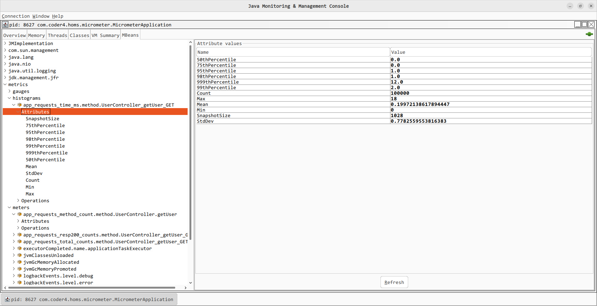

# 基于MicroMeter实现应用监控指标

提到“监控”(Moniter)，你的第一反应是什么？

是老传统监控软件Zabbix、Nagios？还是近几年火爆IT圈的Promethos？

别急着比较系统，这篇文章，我们先聊聊应用监控指标。 

顾名思义，“应用监指标”就是根据监控需求，在我们的应用系统中预设埋点，并支持与监控系统对接。

典型的监控项如：接口请求次数、接口响应时间、接口报错次数....

我们将介绍MicroMeter开源项目，并使用它实现Spring MVC的应用监控指标。

## MicroMeter简介

Micrometer是社区最流行的监控项项目之一，它提供了一个抽象、强大、易用的抽象门面接口，可以轻松的对接包括Prometheus、JMX等在内的近20种监控系统。它的作用和Slf4j类似，只不过它关注的不是日志，而是应用指标(application metrics）。

## 自定义应用监控项初探

下面，我们来开始micrometer之旅。

由于网上关于micrometer对接Prometheus的文章已经很多了，这里我特意选择了JMX。

通过JMX Bean暴露的监控项，你可以轻松的对接Zabbix等老牌监控系统。

这里提醒的是JMX不支持类似Prometheus的层级结构，而只支持一级结构(tag会被打平)，具体可以参见[官方文档](https://micrometer.io/docs/registry/jmx)。当然，这在代码实现上是完全透明的。

首先，我们新建一个简单的Spring Boot项目，并引入pom文件：

```xml
        <dependency>
            <groupId>org.springframework.boot</groupId>
            <artifactId>spring-boot-starter-web</artifactId>
        </dependency>

        <dependency>
            <groupId>org.springframework.boot</groupId>
            <artifactId>spring-boot-starter-actuator</artifactId>
        </dependency>

        <dependency>
            <groupId>io.micrometer</groupId>
            <artifactId>micrometer-registry-jmx</artifactId>
            <version>1.8.7</version>
        </dependency>
```

然后开发如下的Spring MVC接口：

```java
package com.coder4.homs.micrometer.web;


import com.coder4.homs.micrometer.web.data.UserVO;
import io.micrometer.core.instrument.Counter;
import io.micrometer.core.instrument.MeterRegistry;
import org.springframework.beans.factory.annotation.Autowired;
import org.springframework.web.bind.annotation.GetMapping;
import org.springframework.web.bind.annotation.PathVariable;
import org.springframework.web.bind.annotation.RestController;

import javax.annotation.PostConstruct;

@RestController
public class UserController {

    @Autowired
    private MeterRegistry meterRegistry;

    private Counter COUNTER_GET_USER;

    @PostConstruct
    public void init() {
        COUNTER_GET_USER = meterRegistry.counter("app_requests_method_count", "method", "UserController.getUser");
    }

    @GetMapping(path = "/users/{id}")
    public UserVO getUser(@PathVariable int id) {
        UserVO user = new UserVO();
        user.setId(id);
        user.setName(String.format("user_%d", id));

        COUNTER_GET_USER.increment();
        return user;
    }

}
```

在上面的代码中：

1. 我们实现了UserController这个REST接口，他之中的/users/{id}可以获取用户。

2. UserController注册了一个Counter，Counter由名字和tag组成，用过Prometheus的应该很熟悉这种套路了。

3. 每次请求时，会将上述Counter加一操作。

我们来测试一下，执行2次

```shell
curl "127.0.0.1:8080/users/1"
{"id":1,"name":"user_1"}
```

然后打开本地的jconsole，可以发现JMX Bean暴露出了了metrics、gauge等分类，我们打开"metrics/app_requests_method_..."这个指标，点击进去，可以发现具体的值也就是2。

## 借助拦截器批量统计监控项目

上述代码可以实现功能，但是你应该发现了，实现起来很繁琐，如果我们有10个接口，那岂不是要写很多无用代码？

相信你已经想到了，可以用类似AOP (切面编程)的思路，解决问题。

不过针对Spring MVC这个场景，使用AOP有点“大炮打蚊子”的感觉，我们可以使用拦截器实现。

首先自定义拦截器的自动装配：

```java
package com.coder4.homs.micrometer.configure;

import org.springframework.context.annotation.Bean;
import org.springframework.context.annotation.Configuration;
import org.springframework.web.servlet.config.annotation.InterceptorRegistry;
import org.springframework.web.servlet.config.annotation.WebMvcConfigurer;

@Configuration
public class MeterConfig implements WebMvcConfigurer {

    @Bean
    public MeterInterceptor getMeterInterceptor() {
        return new MeterInterceptor();
    }

    @Override
    public void addInterceptors(InterceptorRegistry registry){
        registry.addInterceptor(getMeterInterceptor())
                .addPathPatterns("/**")
                .excludePathPatterns("/error")
                .excludePathPatterns("/static/*");
    }
}
```

上面代码很简单，就是新增了新的拦截器MeterInterceptor。

我们看下拦截器做了什么：

```java
package com.coder4.homs.micrometer.configure;

import io.micrometer.core.instrument.Counter;
import io.micrometer.core.instrument.DistributionSummary;
import io.micrometer.core.instrument.MeterRegistry;
import org.springframework.beans.factory.annotation.Autowired;
import org.springframework.web.method.HandlerMethod;
import org.springframework.web.servlet.HandlerInterceptor;

import javax.servlet.http.HttpServletRequest;
import javax.servlet.http.HttpServletResponse;
import java.util.Optional;

public class MeterInterceptor implements HandlerInterceptor {

    @Autowired
    private MeterRegistry meterRegistry;

    private ThreadLocal<Long> tlTimer = new ThreadLocal<>();

    private static Optional<String> getMethod(HttpServletRequest request, Object handler) {
        if (handler instanceof HandlerMethod) {
            return Optional.of(String.format("%s_%s_%s", ((HandlerMethod) handler).getBeanType().getSimpleName(),
                    ((HandlerMethod) handler).getMethod().getName(), request.getMethod()));
        } else {
            return Optional.empty();
        }
    }

    private void recordTimeDistribution(HttpServletRequest request, Object handler, long ms) {
        Optional<String> methodOp = getMethod(request, handler);
        if (methodOp.isPresent()) {
            DistributionSummary.builder("app_requests_time_ms")
                    .tag("method", methodOp.get())
                    .publishPercentileHistogram()
                    .register(meterRegistry)
                    .record(ms);
        }
    }

    public Optional<Counter> getCounterOfTotalCounts(HttpServletRequest request, Object handler) {
        Optional<String> methodOp = getMethod(request, handler);
        if (methodOp.isPresent()) {
            return Optional.of(meterRegistry.counter("app_requests_total_counts", "method",
                    methodOp.get()));
        } else {
            return Optional.empty();
        }
    }

    public Optional<Counter> getCounterOfExceptionCounts(HttpServletRequest request, Object handler) {
        Optional<String> methodOp = getMethod(request, handler);
        if (methodOp.isPresent()) {
            return Optional.of(meterRegistry.counter("app_requests_exption_counts", "method",
                    methodOp.get()));
        } else {
            return Optional.empty();
        }
    }

    public Optional<Counter> getCounterOfRespCodeCounts(HttpServletRequest request, HttpServletResponse response,
                                                        Object handler) {
        Optional<String> methodOp = getMethod(request, handler);
        if (methodOp.isPresent()) {
            return Optional.of(meterRegistry.counter(String.format("app_requests_resp%d_counts", response.getStatus()),
                    "method", methodOp.get()));
        } else {
            return Optional.empty();
        }
    }

    @Override
    public boolean preHandle(HttpServletRequest request, HttpServletResponse response, Object handler) throws Exception {
        tlTimer.set(System.currentTimeMillis());
        return true;
    }

    @Override
    public void afterCompletion(HttpServletRequest request, HttpServletResponse response, Object handler, Exception ex) throws Exception {
        // record time
        recordTimeDistribution(request, handler, System.currentTimeMillis() - tlTimer.get());
        tlTimer.remove();

        // total counts
        getCounterOfTotalCounts(request, handler).ifPresent(counter -> counter.increment());
        // different response code count
        getCounterOfRespCodeCounts(request, response, handler).ifPresent(counter -> counter.increment());
        if (ex != null) {
            // exception counts
            getCounterOfExceptionCounts(request, handler).ifPresent(counter -> counter.increment());
        }
    }

}
```

代码有点长，解释一下：

1. 自动注入MeterRegistry，老套路了

2. getCounterOfXXX几个方法，通过request、handler来生成具体的监控项名称和标签，形如：app_requests_method_count.method.UserController.getUser。

3. preHandle中预设了ThreadLocal的定时器

4. recordTimeDistribution使用了Distribution，这是一个可以统计百分位的MicroMeter组件，类似Prometheus的histogram功能的你应该能秒懂。

5. afterCompletion根据前面定时器，计算本次请求时间，并记录到Distributon中。

6. afterCompletion记录总请求数、分resp.code的请求数、出错请求数。

我们打开jconsole看下：



在之前meters的基础上，新增了histogram分类，里面会详细记录请求时间，比如我这里做了一些本地压测后，.99时间是12ms，.95时间是1ms。

在上面的基础上稍做修改，就可以投入使用了。

感兴趣的话，你可以探索如何对Dubbo、gRPC等RPC接口进行应用程序监控项。

本篇文章的代码，我放到了[homs-micrometer这个github项目](https://github.com/liheyuan/homs-micrometer)中，感兴趣的话可以查阅。
