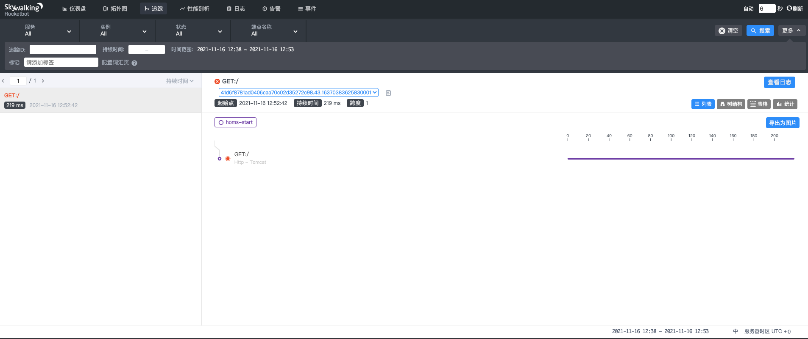
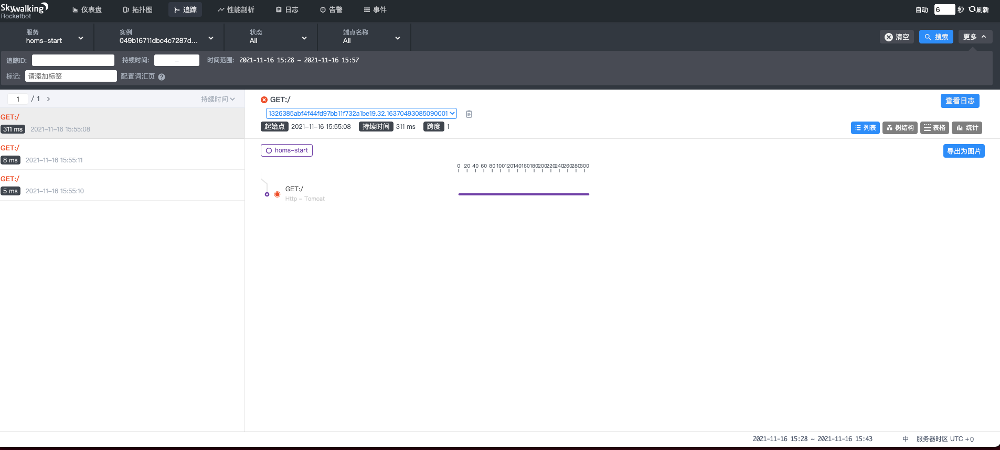

# 基于SkyWalking的链路追踪系统

链路追踪提供了分布式调用链路的还原、统计、分析等功能，是提升微服务诊断效率的重要环节。

本节，我们将基于[SkyWalking](https://skywalking.apache.org/)搭建链路追踪系统。

SkyWalking是一款开源的APM(Application Performance Monitor)工具，以Java Agent + 插件化的方式运行。2019年其从孵化器毕业，正式成为Apache的顶级项目。

## 单机实验

我们首先跑通单机版的链路追踪。

SkyWalking支持多种后台存储，这里我们选用ElasticSearch：

```shell
#!/bin/bash

NAME="elasticsearch"
PUID="1000"
PGID="1000"

VOLUME="$HOME/docker_data/elasticsearch"
mkdir -p $VOLUME 

docker ps -q -a --filter "name=$NAME" | xargs -I {} docker rm -f {}
docker run \
    --hostname $NAME \
    --name $NAME \
    --env discovery.type=single-node \
    --volume "$VOLUME:/usr/share/elasticsearch/data" \
    -p 9200:9200 \
    -p 9300:9300 \
    --detach \
    --restart always \
    docker.elastic.co/elasticsearch/elasticsearch:7.15.2
```

接着，我们启动SkyWalking的后台服务：

```shell
#!/bin/bash

NAME="skywalking"
PUID="1000"
PGID="1000"

docker ps -q -a --filter "name=$NAME" | xargs -I {} docker rm -f {}
docker run \
    --hostname $NAME \
    --name $NAME \
    -e SW_STORAGE=elasticsearch7 \
    -e SW_STORAGE_ES_CLUSTER_NODES="10.1.172.136:9200" \
    -p 12800:12800 \
    -p 11800:11800 \
    --detach \
    --restart always \
    apache/skywalking-oap-server:8.7.0-es7
```

最后，启动SkyWalking的UI服务：

```shell
#!/bin/bash

NAME="skywalkingui"
PUID="1000"
PGID="1000"

docker ps -q -a --filter "name=$NAME" | xargs -I {} docker rm -f {}
docker run \
    --hostname $NAME \
    --name $NAME \
    -e SW_OAP_ADDRESS="http://10.1.172.136:12800" \
    -p 8080:8080 \
    --detach \
    --restart always \
    apache/skywalking-ui:8.7.0
```

上述，我们让容器直接使用了Host Net：10.1.172.136。

下一步，我们下载最新版的[Java Agent](https://dlcdn.apache.org/skywalking/java-agent/8.8.0/apache-skywalking-java-agent-8.8.0.tgz)，其支持的框架可以在[这里]([Tracing and Tracing based Metrics Analyze Plugins | Apache SkyWalking](https://skywalking.apache.org/docs/skywalking-java/latest/en/setup/service-agent/java-agent/supported-list/))查看。

解压后，我们直接使用java命令行运行：

```shell
java -javaagent:./skywalking-agent/skywalking-agent.jar -Dskywalking.agent.service_name=homs-start -Dskywalking.collector.backend_service=10.1.172.136:11800 -jar ./homs-start-0.0.1-SNAPSHOT.jar
```

如上所示：

- 服务名字：homs-start

- SkyWalking后台服务地址：10.1.172.136:11800

启动成功后，我们尝试访问端口：

```shell
curl "127.0.0.1:8080"
```

查看SkyWalking的UI，可以发现，已经统计到了链路追踪！



## Kubernets中部署SkyWalking

在Kubernets环境中，我们倾向只部署无状态服务，以便拓展。

而对于SkyWaling Server这种服务，会占用较大性能，且没有太多需要扩展的场景，因此我们维持其外部部署方式，不上k8s。

回顾下之前的内容，我们的homs-start是通过Docker镜像的方式启动的Pod和Deployment。

我们需要对其进行改造，添加initContainer，注入Java Agent：

```yaml
apiVersion: apps/v1
kind: Deployment
metadata:
  name: homs-start-deployment
  labels:
    app: homs-start
spec:
  selector:
    matchLabels:
      app: homs-start
  replicas: 1
  strategy:
    type: RollingUpdate
  template:
    metadata:
      labels:
        app: homs-start
    spec:
      volumes:
        - name: skywalking-agent
          emptyDir: {}
      containers:
        - name: homs-start-server
          image: coder4/homs-start:107
          ports:
            - containerPort: 8080
          volumeMounts:
            - name: skywalking-agent
              mountPath: /skywalking
          env:
            - name: JAVA_TOOL_OPTIONS
              value: -javaagent:/skywalking/agent/skywalking-agent.jar
            - name: SW_AGENT_NAME
              value: homs-start
            - name: SW_AGENT_COLLECTOR_BACKEND_SERVICES
              value: 10.1.172.136:11800
          resources:
            requests:
              memory: 500Mi
      initContainers:
        - name: agent-container
          image: apache/skywalking-java-agent:8.8.0-java8
          volumeMounts:
            - name: skywalking-agent
              mountPath: /agent
          command: [ "/bin/sh" ]
          args: [ "-c", "cp -R /skywalking/agent /agent/" ]
```

如上所示：

- 这里我们没有额外制作agent的镜像，而是使用了[官方的最新版](https://hub.docker.com/r/apache/skywalking-java-agent)

- 我们添加了全局的临时Volume：skywalking-agent

- 添加了initContainer：agent-container，主要负责启动时拷贝agent的jar包

- 在启动homs-start-server时需要设定一些环境变量参数

启动成功后，我们尝试登录minikube访问服务：

```shell
minikube ssh                                                                                         
Last login: Tue Nov 16 07:54:28 2021 from 192.168.49.1
docker@minikube:~$ curl "172.17.0.3:8080"
{"timestamp":"2021-11-16T07:55:08.669+00:00","status":404,"error":"Not Found","path":"/"}
```

然后查看SkyWalking的UI，也能成功记录到最新追踪请求！



至此，我们已经搭建了最基本的链路追踪系统，其还有很大的优化空间：

- 官方agent镜像中包含了全量插件，你应当根据实际需要剪裁

- 微服务中会有某些缺乏Agent插件的场景，需要自行定制插件

- 不仅agent，服务的jar包其实也是可以通过initContainer来拷贝的，这可以进一步压缩镜像体积。

上述优化，做为课后作业，留给喜欢挑战的你吧：-）
