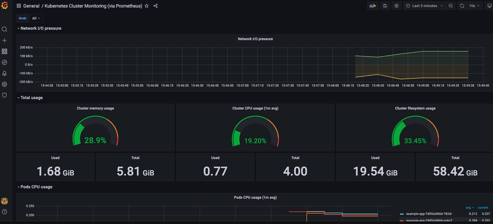

# 基于VictoriaMetrics构造监控系统

监控(Monitor)与度量(Metrics)是可观测性的重要环节。

在本节中，我们将使用VirtorialMetrics构建自己的监控系统。

提到监控系统的工具，你可能会想到老牌的Zabbix、Nagios，也可能听说过新星的Prometheus。

Prometheus是一个开源的监控系统，凭借开放的生态环境、云原生等特性，逐步成为了微服务架构下的事实标准。

然而，由于Prometheus设计初期并没有考虑存储扩展性，因此当监控的metrics升高到每秒百万级别后，会出现较为明显的性能瓶颈。

[VictoriaMetrics](https://github.com/VictoriaMetrics/VictoriaMetrics)是进来快速崛起的开源监控项目，其在设计之处就支持水平拓展，并且兼容了Prometheus的协议，可以应对日益增长的metrics需求。

Grafana是一款开源的可视化分析工具，通过丰富的仪表盘，让用户能够更直观的理解Metrics。

本节，我们将基于Victoria-Metrics + Grafana搭建监控系统。

## 安装VictoriaMetrics

在下面的章节，我们将演示搭建vm的single版本，由于VM出色的性能，single已经足以应对中小企业的监控需求。你可以根据实际的需要，[部署集群版本]([HA monitoring setup in Kubernetes via VictoriaMetrics Cluster · VictoriaMetrics](https://docs.victoriametrics.com/guides/k8s-ha-monitoring-via-vm-cluster.html))。

首先添加helm源

```shell
helm repo add vm https://victoriametrics.github.io/helm-charts/
helm repo update
```

```shell
helm search repo vm/


NAME                             CHART VERSION    APP VERSION    DESCRIPTION                                       
vm/victoria-metrics-agent        0.7.34           v1.69.0        Victoria Metrics Agent - collects metrics from ...
vm/victoria-metrics-alert        0.4.14           v1.69.0        Victoria Metrics Alert - executes a list of giv...
vm/victoria-metrics-auth         0.2.33           1.69.0         Victoria Metrics Auth - is a simple auth proxy ...
vm/victoria-metrics-cluster      0.9.12           1.69.0         Victoria Metrics Cluster version - high-perform...
vm/victoria-metrics-k8s-stack    0.5.9            1.69.0         Kubernetes monitoring on VictoriaMetrics stack....
vm/victoria-metrics-operator     0.4.2            0.20.3         Victoria Metrics Operator                         
vm/victoria-metrics-single       0.8.12           1.69.0         Victoria Metrics Single version - high-performa...
```

我们查看所有可配置的参数选项：

```shell
helm show values vm/victoria-metrics-single > values.yaml
```

将其修改为如下设置：

```yaml
server:
  persistentVolume:
    enabled: false 
    accessModes:
      - ReadWriteOnce
    annotations: {}
    storageClass: ""
    existingClaim: ""
    matchLabels: {}
    mountPath: /storage
    subPath: ""
    size: 16Gi

  scrape:
    enabled: true
    configMap: ""
    config:
      global:
        scrape_interval: 15s
      scrape_configs:
        - job_name: victoriametrics
          static_configs:
            - targets: [ "localhost:8428" ]
        - job_name: "kubernetes-apiservers"
          kubernetes_sd_configs:
            - role: endpoints
          scheme: https
          tls_config:
            ca_file: /var/run/secrets/kubernetes.io/serviceaccount/ca.crt
            insecure_skip_verify: true
          bearer_token_file: /var/run/secrets/kubernetes.io/serviceaccount/token
          relabel_configs:
            - source_labels:
                [
                    __meta_kubernetes_namespace,
                    __meta_kubernetes_service_name,
                    __meta_kubernetes_endpoint_port_name,
                ]
              action: keep
              regex: default;kubernetes;https
        - job_name: "kubernetes-nodes"
          scheme: https
          tls_config:
            ca_file: /var/run/secrets/kubernetes.io/serviceaccount/ca.crt
            insecure_skip_verify: true
          bearer_token_file: /var/run/secrets/kubernetes.io/serviceaccount/token
          kubernetes_sd_configs:
            - role: node
          relabel_configs:
            - action: labelmap
              regex: __meta_kubernetes_node_label_(.+)
            - target_label: __address__
              replacement: kubernetes.default.svc:443
            - source_labels: [ __meta_kubernetes_node_name ]
              regex: (.+)
              target_label: __metrics_path__
              replacement: /api/v1/nodes/$1/proxy/metrics
        - job_name: "kubernetes-nodes-cadvisor"
          scheme: https
          tls_config:
            ca_file: /var/run/secrets/kubernetes.io/serviceaccount/ca.crt
            insecure_skip_verify: true
          bearer_token_file: /var/run/secrets/kubernetes.io/serviceaccount/token
          kubernetes_sd_configs:
            - role: node
          relabel_configs:
            - action: labelmap
              regex: __meta_kubernetes_node_label_(.+)
            - target_label: __address__
              replacement: kubernetes.default.svc:443
            - source_labels: [ __meta_kubernetes_node_name ]
              regex: (.+)
              target_label: __metrics_path__
              replacement: /api/v1/nodes/$1/proxy/metrics/cadvisor
          metric_relabel_configs:
            - action: replace
              source_labels: [pod]
              regex: '(.+)'
              target_label: pod_name
              replacement: '${1}'
            - action: replace
              source_labels: [container]
              regex: '(.+)'
              target_label: container_name
              replacement: '${1}'
            - action: replace
              target_label: name
              replacement: k8s_stub
            - action: replace
              source_labels: [id]
              regex: '^/system\.slice/(.+)\.service$'
              target_label: systemd_service_name
              replacement: '${1}'
```

如上所述：

- 我们禁用了PV，这将默认使用local的emptydir。建议你在生产环境，根据需要自行配置可自动装配的存储插件。

- 从Kubernetes集群抓取信息，并做了一些label上的转化。

- 如果你熟悉Prometheus的话，会发现上述配置和Prometheus基本是兼容的。

安装vmsingle：

```shell
helm install vmsingle vm/victoria-metrics-single -f ./values.yaml -n vm
W1117 14:46:54.020279   26203 warnings.go:70] policy/v1beta1 PodSecurityPolicy is deprecated in v1.21+, unavailable in v1.25+
W1117 14:46:54.066766   26203 warnings.go:70] policy/v1beta1 PodSecurityPolicy is deprecated in v1.21+, unavailable in v1.25+
NAME: vmsingle
LAST DEPLOYED: Wed Nov 17 14:46:53 2021
NAMESPACE: vm
STATUS: deployed
REVISION: 1
TEST SUITE: None
NOTES:
The VictoriaMetrics write api can be accessed via port 8428 on the following DNS name from within your cluster:
    vmsingle-victoria-metrics-single-server.vm.svc.cluster.local


Metrics Ingestion:
  Get the Victoria Metrics service URL by running these commands in the same shell:
    export POD_NAME=$(kubectl get pods --namespace vm -l "app=server" -o jsonpath="{.items[0].metadata.name}")
    kubectl --namespace vm port-forward $POD_NAME 8428

  Write url inside the kubernetes cluster:
    http://vmsingle-victoria-metrics-single-server.vm.svc.cluster.local:8428/api/v1/write

Read Data:
  The following url can be used as the datasource url in Grafana::
    http://vmsingle-victoria-metrics-single-server.vm.svc.cluster.local:8428
```

上述的Read Data地址，后续需要用的，请复制、保存好。
部署成功后，我们查看下Pod，运行成功：

```shell
kubectl get pods
default       vmsingle-victoria-metrics-single-server-0   1/1     Running            0          59s
```

## 安装Grafana

首先，依然是添加helm源：

```shell
helm repo add grafana https://grafana.github.io/helm-charts
helm repo update
```

接下来，自定义参数并安装：

```shell
cat <<EOF | helm install my-grafana grafana/grafana -f -
  datasources:
    datasources.yaml:
      apiVersion: 1
      datasources:
        - name: victoriametrics
          type: prometheus
          orgId: 1
          url: http://vmsingle-victoria-metrics-single-server.default.svc.cluster.local:8428
          access: proxy
          isDefault: true
          updateIntervalSeconds: 10
          editable: true

  dashboardProviders:
   dashboardproviders.yaml:
     apiVersion: 1
     providers:
     - name: 'default'
       orgId: 1
       folder: ''
       type: file
       disableDeletion: true
       editable: true
       options:
         path: /var/lib/grafana/dashboards/default

  dashboards:
    default:
      victoriametrics:
        gnetId: 10229
        revision: 21
        datasource: victoriametrics
      kubernetes:
        gnetId: 14205
        revision: 1
        datasource: victoriametrics
EOF
```

在上述配置中，我们添加了默认的数据源，使用前面创建好的VM地址。

接着，我们获取Grafana的密码：

```shell
kubectl get secret --namespace default my-grafana -o jsonpath="{.data.admin-password}" | base64 --decode ; echo

SOnFX4CdrlyG5JACyBedk9mJk7btMz8cXjk7ZiOZ
```

然后代理端口到本地

```shell
export POD_NAME=$(kubectl get pods --namespace default -l "app.kubernetes.io/name=grafana,app.kubernetes.io/instance=my-grafana" -o jsonpath="{.items[0].metadata.name}")
```

```shell
kubectl --namespace default port-forward $POD_NAME 3000
```

访问http://127.0.0.1:3000，使用admin / 前面的密码。

如果一切顺利，会发现已经有Kubernetes集群的数据了：



至此，我们搭建了基础的监控系统，你还可以做的更好：

- 添加PV，让数据可以真正持久化

- 部署分布式的版本

- 在微服务中，暴露一些自定义监控指标，并将其抓取到VM的存储中
