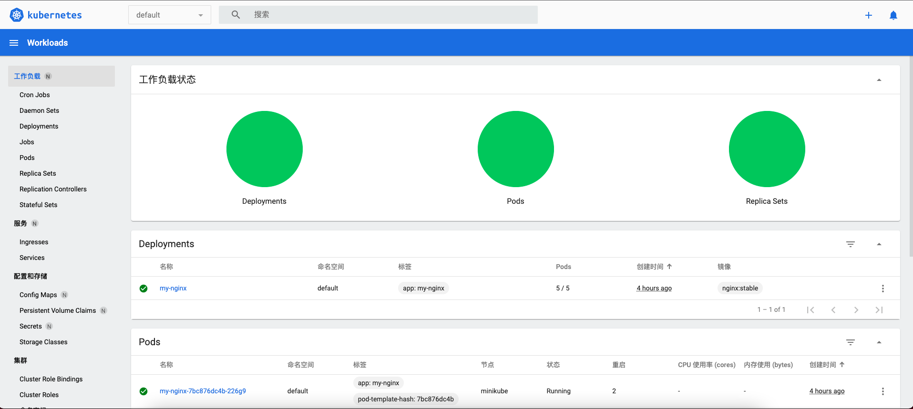

# 快速入门Kubernetes

## 安装篇

我们以Ubuntu为例，介绍Kubernetes基础工具的安装，若你使用其他操作系统，可以参考[官方文档](https://kubernetes.io/docs/tasks/tools/)。

首先安装kubectl：

```shell
sudo apt-get update
sudo apt-get install -y apt-transport-https ca-certificates curl
sudo curl -fsSLo /usr/share/keyrings/kubernetes-archive-keyring.gpg https://packages.cloud.google.com/apt/doc/apt-key.gpg
echo "deb [signed-by=/usr/share/keyrings/kubernetes-archive-keyring.gpg] https://apt.kubernetes.io/ kubernetes-xenial main" | sudo tee /etc/apt/sources.list.d/kubernetes.list
sudo apt-get update
sudo apt-get install -y kubectl
```

接着，我们安装minikube，这是一个用于本地学习和测试的kubernetes集群：

```shell
curl -LO https://storage.googleapis.com/minikube/releases/latest/minikube_latest_amd64.deb
sudo dpkg -i minikube_latest_amd64.deb
```

## 启动minikube

第一次启动Minikube，需要下载虚拟机、对应镜像，时间回稍长一些。

```bash
minikube start
```

成功后，我们看下状态：

```shell
minikube
type: Control Plane
host: Running
kubelet: Running
apiserver: Running
kubeconfig: Configured
```

如果需要关机，可以暂停 / 恢复minikube集群

```shell
minikube pause
minikube resume
```

如果想重置minikube集群，可以使用删除后重新启动

```shell
minikube delete
```

## 部署你的第一个服务

我们在minikube上部署一台nginx

```shell
kubectl create deployment my-nginx --image=nginx:stable
```

稍等片刻后，我们看下，已经创建成功：

```shell
kubectl get pod                               
NAME                        READY   STATUS    RESTARTS   AGE
my-nginx-7bc876dc4b-r5zqr   1/1     Running   0          22s
```

我们查看下pod的信息，特别是IP

```shell
kubectl describe pod my-nginx-7bc876dc4b-r5zqr | grep IP
IP:           172.17.0.3
```

我们尝试访问一下，发现无法成功：

```bash
curl "http://172.17.0.3"
```

这是因为，minikube的网络环境，与我们本机是相互隔离的，我们需要先登录到minikube内，然后再尝试：

```bash
minikube ssh

curl "http://172.17.0.3"
  % Total    % Received % Xferd  Average Speed   Time    Time     Time  Current
                                 Dload  Upload   Total   Spent    Left  Speed
100   612  100   612    0     0   597k      0 --:--:-- --:--:-- --:--:--  597k
```

成功！

下面，我们退出minikube集群环境，尝试对nginx部署扩容：

```bash
kubectl scale deployment my-nginx --replicas=5
deployment.apps/my-nginx scaled
```

稍等片刻后，我们查看，发现扩容成功：

```bash
kubectl get pod                               
NAME                        READY   STATUS    RESTARTS   AGE
my-nginx-7bc876dc4b-226g9   1/1     Running   0          60s
my-nginx-7bc876dc4b-872v2   1/1     Running   0          60s
my-nginx-7bc876dc4b-fvnwf   1/1     Running   0          60s
my-nginx-7bc876dc4b-fzr8s   1/1     Running   0          60s
my-nginx-7bc876dc4b-r5zqr   1/1     Running   1          5m36s
```

如何在mini集群外(例如我们本地)访问nginx呢？

可以为上述deployment，暴露外部的LoadBalancer：

```bash
kubectl expose deployment my-nginx --type=LoadBalancer --port=80
```

我们看一下状态，会发现外部的IP是"pending"

```shell
kubectl get services
NAME         TYPE           CLUSTER-IP    EXTERNAL-IP   PORT(S)        AGE
kubernetes   ClusterIP      10.96.0.1     <none>        443/TCP        67m
my-nginx     LoadBalancer   10.104.5.62   <pending>     80:30229/TCP   37s  8m18s
```

需要启用minikube的隧道，来分配"外部IP"，这里的外部是相对于minikube而言的，实际上是我们本机网络的IP。

```bash
minikube tunnel
kubectl get services                                            
NAME         TYPE           CLUSTER-IP    EXTERNAL-IP   PORT(S)        AGE
kubernetes   ClusterIP      10.96.0.1     <none>        443/TCP        67m
my-nginx     LoadBalancer   10.104.5.62   127.0.0.1     80:30229/TCP   24s
 9m25s
```

启动隧道后，发现暴露到了127.0.0.1的80端口上，我们试一下：

```bash
curl "http://127.0.0.1:80"  
<!DOCTYPE html>
<html>
<head>
<title>Welcome to nginx!</title>
<style>
    body {
        width: 35em;
        margin: 0 auto;
        font-family: Tahoma, Verdana, Arial, sans-serif;
    }
</style>
</head>
<body>
<h1>Welcome to nginx!</h1>
<p>If you see this page, the nginx web server is successfully installed and
working. Further configuration is required.</p>

<p>For online documentation and support please refer to
<a href="http://nginx.org/">nginx.org</a>.<br/>
Commercial support is available at
<a href="http://nginx.com/">nginx.com</a>.</p>

<p><em>Thank you for using nginx.</em></p>
</body>
</html>
```

minikube也提供了可视化的Dashboard：

```shell
minikube dashboard --url
http://127.0.0.1:59352/api/v1/namespaces/kubernetes-dashboard/services/http:kubernetes-dashboard:/proxy/
```

在浏览器中打开上述连接，可以进入Web版的Dashboard，如下图所示：



至此，你已经通过在minikube上的实战演练，掌握了kubernetes的基本用法。

在实际生产环境中，建议你搭建真实的分布式集群，不要使用minikube，我将在后续章节，介绍高可用k8s集群的部署。
