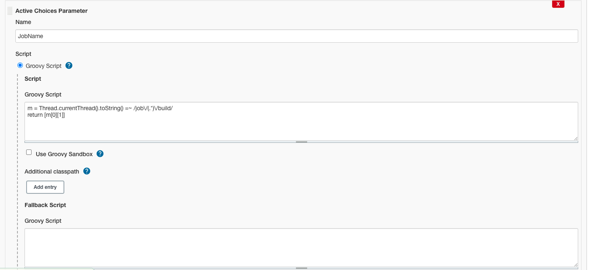
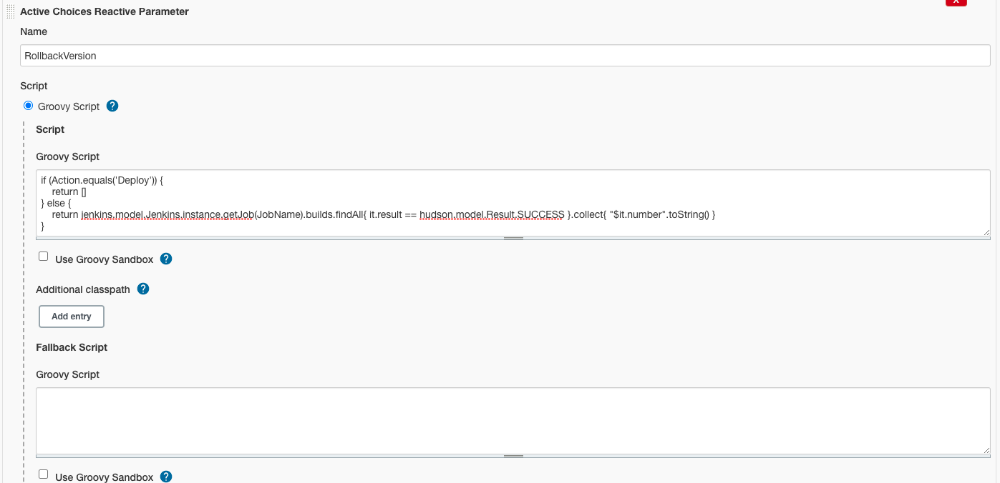
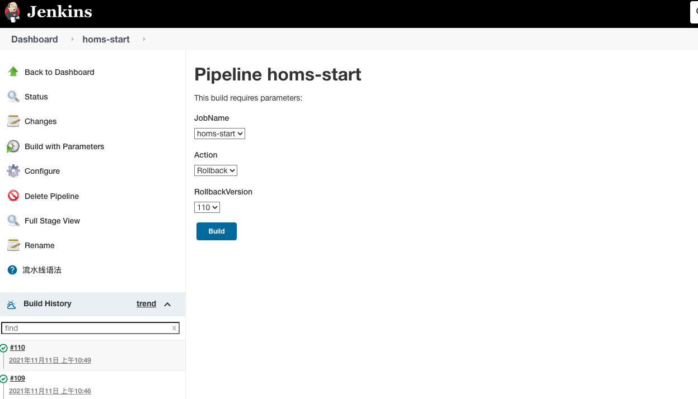

# Jenkins优化Kubernetes部署流水线

在上一节，我们实现了全链路的部署流水线。

本节，我们将继续完善、优化部署水线。


## Gradle加速

首先，在之前的定制Agent中，我们使用了Gradle(Maven)的默认仓库。

由于众所周知的原因，默认仓库的速度很慢、不稳定。

这回严重降低打包流水线的速度，我们对这一问题进行优化。

修改Agent的Dockerfile如下，增加Gradle仓库配置：

```shell
FROM jenkins/inbound-agent:latest-jdk8

ENV GRADLE_VERSION=7.2
ENV K8S_VERSION=v1.22.3
ENV DOCKER_CHANNEL stable
ENV DOCKER_VERSION 18.06.3-ce 

# tool
USER root
RUN apt-get update && \
    apt-get install -y curl unzip sudo && \
    apt-get clean

# docker
RUN curl -fsSL "https://download.docker.com/linux/static/${DOCKER_CHANNEL}/x86_64/docker-${DOCKER_VERSION}.tgz" \
  | tar -xzC /usr/local/bin --strip=1 docker/docker

# gradle
RUN curl -skL -o /tmp/gradle-bin.zip https://services.gradle.org/distributions/gradle-$GRADLE_VERSION-bin.zip && \
    mkdir -p /opt/gradle && \
    unzip -q /tmp/gradle-bin.zip -d /opt/gradle && \
    ln -sf /opt/gradle/gradle-$GRADLE_VERSION/bin/gradle /usr/local/bin/gradle

RUN chown -R 1001:0 /opt/gradle && \
    chmod -R g+rw /opt/gradle

# kubectl
RUN curl -LO https://storage.googleapis.com/kubernetes-release/release/$K8S_VERSION/bin/linux/amd64/kubectl
RUN chmod +x ./kubectl
RUN mv ./kubectl /usr/local/bin


# add jenkins user to sudoer without password 
RUN usermod -aG sudo jenkins 
RUN echo '%sudo ALL=(ALL) NOPASSWD:ALL' >> /etc/sudoers

# jenkins
USER jenkins

# gradle mirror
ENV GRADLE_CONFIG_DIR=/home/jenkins/.gradle 
RUN mkdir ${GRADLE_CONFIG_DIR}
RUN echo "Ly8gcHJvamVjdAphbGxwcm9qZWN0c3sKICAgIHJlcG9zaXRvcmllcyB7CgltYXZlbkxvY2FsKCkKICAgICAgICBtYXZlbiB7IHVybCAnaHR0cHM6Ly9tYXZlbi5hbGl5dW4uY29tL3JlcG9zaXRvcnkvcHVibGljLycgfQogICAgICAgIG1hdmVuIHsgdXJsICdodHRwczovL21hdmVuLmFsaXl1bi5jb20vcmVwb3NpdG9yeS9qY2VudGVyLycgfQogICAgICAgIG1hdmVuIHsgdXJsICdodHRwczovL21hdmVuLmFsaXl1bi5jb20vcmVwb3NpdG9yeS9nb29nbGUvJyB9CiAgICAgICAgbWF2ZW4geyB1cmwgJ2h0dHBzOi8vbWF2ZW4uYWxpeXVuLmNvbS9yZXBvc2l0b3J5L2dyYWRsZS1wbHVnaW4vJyB9CiAgICAgICAgbWF2ZW4geyB1cmwgJ2h0dHBzOi8vaml0cGFjay5pby8nIH0KICAgIH0KfQoKLy8gcGx1Z2luCnNldHRpbmdzRXZhbHVhdGVkIHsgc2V0dGluZ3MgLT4KICAgIHNldHRpbmdzLnBsdWdpbk1hbmFnZW1lbnQgewogICAgICAgIC8vIFByaW50IHJlcG9zaXRvcmllcyBjb2xsZWN0aW9uCiAgICAgICAgLy8gcHJpbnRsbiAiUmVwb3NpdG9yaWVzIG5hbWVzOiAiICsgcmVwb3NpdG9yaWVzLmdldE5hbWVzKCkKCiAgICAgICAgLy8gQ2xlYXIgcmVwb3NpdG9yaWVzIGNvbGxlY3Rpb24KICAgICAgICByZXBvc2l0b3JpZXMuY2xlYXIoKQoKICAgICAgICAvLyBBZGQgbXkgQXJ0aWZhY3RvcnkgbWlycm9yCiAgICAgICAgcmVwb3NpdG9yaWVzIHsKCSAgICBtYXZlbkxvY2FsKCkKICAgICAgICAgICAgbWF2ZW4gewogICAgICAgICAgICAgICAgdXJsICJodHRwczovL21hdmVuLmFsaXl1bi5jb20vcmVwb3NpdG9yeS9ncmFkbGUtcGx1Z2luLyIKICAgICAgICAgICAgfQogICAgICAgIH0KICAgIH0KfQo=" | base64 --decode > ${GRADLE_CONFIG_DIR}/init.gradle
```

如上所示，在打包的最后环节：

- 添加.gradle目录

- 创建init.gradle脚本

- 由于Dockerfile的语法格式限制，我们将配置文件编码为Base64再写入

配置文件的原文如下：

```groovy
// project
allprojects{
    repositories {
	mavenLocal()
        maven { url 'https://maven.aliyun.com/repository/public/' }
        maven { url 'https://maven.aliyun.com/repository/jcenter/' }
        maven { url 'https://maven.aliyun.com/repository/google/' }
        maven { url 'https://maven.aliyun.com/repository/gradle-plugin/' }
        maven { url 'https://jitpack.io/' }
    }
}

// plugin
settingsEvaluated { settings ->
    settings.pluginManagement {
        // Print repositories collection
        // println "Repositories names: " + repositories.getNames()

        // Clear repositories collection
        repositories.clear()

        // Add my Artifactory mirror
        repositories {
	    mavenLocal()
            maven {
                url "https://maven.aliyun.com/repository/gradle-plugin/"
            }
        }
    }
}
```

我们使用新镜像重启Agent，会发现编译环节由1分钟缩短到10秒内。

- ## 滚动升级

在之前构建的版本中，我们只考虑了部署，没有考虑升级情况。

可以修改JenkinsFile，采用"yaml + kubectl apply"的方式，让部署支持滚动升级。

```groovy
pipeline {
    agent any

    environment {
        project = "coder4/homs-start"
    }

    stages {
        stage('git') {
            steps {
                git credentialsId: 'GITEE', url: 'git@gitee.com:/'+ project + '.git', branch: 'master'
            }
        }

        stage('gradle') {
            steps {
                sh "gradle build"
            }    
        }

        stage('docker image build') {
            steps {
                sh '''
                # get right jar
                jarPath=$(du -a ./build/libs/* | sort -n -r | head -n 1 | cut -f2-)
                jarFile=$( echo ${jarPath##*/} )

                # make Dockerfile
cat <<EOF > Dockerfile
FROM openjdk:8
COPY $jarPath $jarFile
ENTRYPOINT ["java","-jar","/$jarFile"]
EOF
                # build Docker image
                sudo docker build -t coder4/${JOB_NAME}:${BUILD_NUMBER} .

                # push to docker hub
                sudo docker push coder4/${JOB_NAME}:${BUILD_NUMBER}
                '''
            }
        }

        stage('k8s') { 
            steps {
                withKubeConfig([credentialsId: "60a8e9d2-0212-4ff4-aa98-f46fced97121",serverUrl: "https://kubernetes:6443"]) {
                    sh """
                    # prepare deployment yaml
cat <<EOF  | kubectl apply -f -
apiVersion: apps/v1
kind: Deployment
metadata:
  name: ${JOB_NAME}-deployment
  labels:
    app: ${JOB_NAME}
spec:
  selector:
    matchLabels:
      app: ${JOB_NAME}
  replicas: 1
  strategy:
    type: RollingUpdate
  template:
    metadata:
      labels:
        app: ${JOB_NAME}
    spec:
      containers:
        - name: ${JOB_NAME}-server
          image: coder4/${JOB_NAME}:${BUILD_NUMBER}
          ports:
            - containerPort: 8080
                    """
                }
            }
        }
    }
}
```

经过上述改造后，我们可以随时滚动升级新版本了。

## 支持回滚操作

在新版本发布后，可能会遇到故障，需要回滚的情况，这也需要流水线支持这一功能。

我们采用"Parameterized Project"的方式，来设定参数。

首先，修改当前项目的配置，勾选"This project is parameterized"。

接着，安装插件“Active Choice”，以便开启Groovy脚本的“动态参数”。

加下来，我们添加3个参数

1. Active Choices Parameter，参数名"JobName"

代码、截图如下：

```groovy
m = Thread.currentThread().toString() =~ /job\/(.*)\/build/
return [m[0][1]]
```



2. Choose Parameter，参数名"Action"，固定两个选项：Deploy、Rollback

代码和截图如下：


3. Active Choices Reactive Parameter，参数名"RollbackVersion"

需要配置Referenced parameters为"Action,JobName"

代码和截图如下：

```groovy
if (Action.equals('Deploy')) {
    return []
} else {
    return jenkins.model.Jenkins.instance.getJob(JobName).builds.findAll{ it.result == hudson.model.Result.SUCCESS }.collect{ "$it.number".toString() }
}
```



经过上述设置，我们的项目拥有了3个可输入参数，如下图所示：



其中：

JobName：项目名

Action：决定了是部署 or 回滚

RollbackVersion：仅当回滚时生效，决定了要回滚到哪个版本

除此之外，我们还需要对JenkinsFile进行改造，如下：

```groovy
pipeline {
    agent any

    stages {
        stage('git') {
            steps {
                script {
                    if (params.Action.equals("Rollback")) {
                        echo "Skip in Rollback"
                    } else {
                        git credentialsId: 'GITEE', url: 'git@gitee.com:/coder4/'+ env.JOB_NAME + '.git', branch: 'master'
                    }
                }
            }
        }

        stage('gradle') {
            steps {
                script {
                    if (params.Action.equals("Rollback")) {
                        echo "Skip in Rollback"
                    } else {
                        sh "gradle build"
                    }
                }
            }    
        }

        stage('docker image build') {
            steps {
                script {
                    if (params.Action.equals("Rollback")) {
                        echo "Skip in Rollback"
                    } else {
                        sh '''
                # get right jar
                jarPath=$(du -a ./build/libs/* | sort -n -r | head -n 1 | cut -f2-)
                jarFile=$( echo ${jarPath##*/} )

                # make Dockerfile
cat <<EOF > Dockerfile
FROM openjdk:8
COPY $jarPath $jarFile
ENTRYPOINT ["java","-jar","/$jarFile"]
EOF
                # build Docker image
                sudo docker build -t coder4/${JOB_NAME}:${BUILD_NUMBER} .

                # push to docker hub
                sudo docker push coder4/${JOB_NAME}:${BUILD_NUMBER}
                '''
                    }
                }
            }
        }

        stage('k8s') { 
            steps {
                script {
                    env.DEPLOY_VERSION = params.Action.equals("Rollback") ? params.RollbackVersion : env.BUILD_NUMBER
                    
                    
                    withKubeConfig([credentialsId: "60a8e9d2-0212-4ff4-aa98-f46fced97121",serverUrl: "https://kubernetes:6443"]) {
                        sh """
                        
echo "Kubernetes Deploy $JOB_NAME Version $DEPLOY_VERSION"
                        
# prepare deployment yaml
cat <<EOF  | kubectl apply -f -
apiVersion: apps/v1
kind: Deployment
metadata:
  name: ${JOB_NAME}-deployment
  labels:
    app: ${JOB_NAME}
spec:
  selector:
    matchLabels:
      app: ${JOB_NAME}
  replicas: 1
  strategy:
    type: RollingUpdate
  template:
    metadata:
      labels:
        app: ${JOB_NAME}
    spec:
      containers:
        - name: ${JOB_NAME}-server
          image: coder4/${JOB_NAME}:${DEPLOY_VERSION}
          ports:
            - containerPort: 8080
                    """
                    }
                }
            }
        }
    }
}
```

我们来试验一下成果，首先，执行新部署：执行成功，版本号111，耗时21s

```shell
kubectl describe pod homs-start-deployment-644677f984-bksl9
Name:         homs-start-deployment-644677f984-bksl9
Namespace:    default
Priority:     0
Node:         minikube/192.168.49.2
Start Time:   Thu, 11 Nov 2021 19:06:25 +0800
Labels:       app=homs-start
              pod-template-hash=644677f984
Annotations:  <none>
Status:       Running
IP:           172.17.0.4
IPs:
  IP:           172.17.0.4
Controlled By:  ReplicaSet/homs-start-deployment-644677f984
Containers:
  homs-start-server:
    Container ID:   docker://279e11005931dfd8aa876134bb2441294a768766261aeb0bb88b5004047f5060
    Image:          coder4/homs-start:111
    Image ID:       docker-pullable://coder4/homs-start@sha256:526640caca84a10254e42ad12dd617eaf45c75c17b4ebb7731fe623509938e5c
    Port:           8080/TCP
    Host Port:      0/TCP
    State:          Running
      Started:      Thu, 11 Nov 2021 19:06:31 +0800
    Ready:          True
    Restart Count:  0
    Environment:    <none>
    Mounts:
      /var/run/secrets/kubernetes.io/serviceaccount from kube-api-access-gkpv7 (ro)
Conditions:
  Type              Status
  Initialized       True 
  Ready             True 
  ContainersReady   True 
  PodScheduled      True 
Volumes:
  kube-api-access-gkpv7:
    Type:                    Projected (a volume that contains injected data from multiple sources)
    TokenExpirationSeconds:  3607
    ConfigMapName:           kube-root-ca.crt
    ConfigMapOptional:       <nil>
    DownwardAPI:             true
QoS Class:                   BestEffort
Node-Selectors:              <none>
Tolerations:                 node.kubernetes.io/not-ready:NoExecute op=Exists for 300s
                             node.kubernetes.io/unreachable:NoExecute op=Exists for 300s
Events:
  Type    Reason     Age   From               Message
  ----    ------     ----  ----               -------
  Normal  Scheduled  37s   default-scheduler  Successfully assigned default/homs-start-deployment-644677f984-bksl9 to minikube
  Normal  Pulling    37s   kubelet            Pulling image "coder4/homs-start:111"
  Normal  Pulled     31s   kubelet            Successfully pulled image "coder4/homs-start:111" in 5.781019732s
  Normal  Created    31s   kubelet            Created container homs-start-server
  Normal  Started    31s   kubelet            Started container homs-start-server
```

接下来，我们回滚到107版本，由于机器上有镜像，因此只耗时1s。

```shell
kubectl describe pod homs-start-deployment-5bf947768c-dt8w2
Name:         homs-start-deployment-5bf947768c-dt8w2
Namespace:    default
Priority:     0
Node:         minikube/192.168.49.2
Start Time:   Thu, 11 Nov 2021 18:49:22 +0800
Labels:       app=homs-start
              pod-template-hash=5bf947768c
Annotations:  <none>
Status:       Running
IP:           172.17.0.5
IPs:
  IP:           172.17.0.5
Controlled By:  ReplicaSet/homs-start-deployment-5bf947768c
Containers:
  homs-start-server:
    Container ID:   docker://bc626494af343b6d56b707258e03a85ae668abb21dcc3ca2b72d6239e3b56b3d
    Image:          coder4/homs-start:107
    Image ID:       docker-pullable://coder4/homs-start@sha256:526640caca84a10254e42ad12dd617eaf45c75c17b4ebb7731fe623509938e5c
    Port:           8080/TCP
    Host Port:      0/TCP
    State:          Running
      Started:      Thu, 11 Nov 2021 18:49:27 +0800
    Ready:          True
    Restart Count:  0
    Environment:    <none>
    Mounts:
      /var/run/secrets/kubernetes.io/serviceaccount from kube-api-access-dt7g2 (ro)
Conditions:
  Type              Status
  Initialized       True 
  Ready             True 
  ContainersReady   True 
  PodScheduled      True 
Volumes:
  kube-api-access-dt7g2:
    Type:                    Projected (a volume that contains injected data from multiple sources)
    TokenExpirationSeconds:  3607
    ConfigMapName:           kube-root-ca.crt
    ConfigMapOptional:       <nil>
    DownwardAPI:             true
QoS Class:                   BestEffort
Node-Selectors:              <none>
Tolerations:                 node.kubernetes.io/not-ready:NoExecute op=Exists for 300s
                             node.kubernetes.io/unreachable:NoExecute op=Exists for 300s
Events:
  Type    Reason     Age   From               Message
  ----    ------     ----  ----               -------
  Normal  Scheduled  16m   default-scheduler  Successfully assigned default/homs-start-deployment-5bf947768c-dt8w2 to minikube
  Normal  Pulling    16m   kubelet            Pulling image "coder4/homs-start:107"
  Normal  Pulled     16m   kubelet            Successfully pulled image "coder4/homs-start:107" in 3.365201023s
  Normal  Created    16m   kubelet            Created container homs-start-server
  Normal  Started    16m   kubelet            Started container homs-start-server
```

在本文中，我们围绕编译、镜像进行了优化，但这还远没有达到"完美"的程度。

我提一些思路，供大家参考：

1. docker镜像瘦身：打Dokcer镜像时，其实无需将jdk+ jar包一起打，可以只打jar包。在生成Deployment时，通过Pod的init container模式，将jar包拷贝进jdk的运行容器中，从而完成启动。

2. 回滚版本选择优化：在前面的实现中，我们筛选了所有成功部署过的版本，将其做为可回滚的版本，但这其中的一部分，实际是通过"回滚"的方式部署成功的，在镜像仓库中，并没有与之对应的镜像版本。我们可以拉取镜像仓库中可用的版本，来实现回滚。

3. 镜像版本优化：目前采用的是Job的"Build Version"做为镜像版本，可以再此基础上，追加Git版本号，以便区分代码拉取。

4. 支持多分之：当前，我们默认用的是master分之，应当可以通过参数的方式，支持不同分之的修改。

5. JenkinsFile共享：目前的JenkinsFile是直接配置在项目中的，如果微服务项目很多，逐一配置势必很麻烦，可以通过 “Jenkins Shared Library”的方式，在多项目间共享脚本配置。
