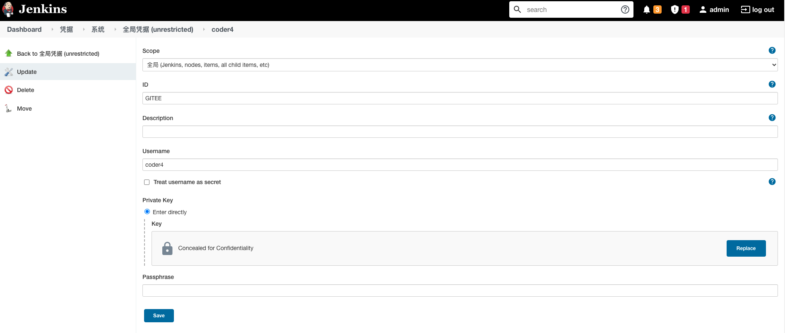

# Jenkins实现Kubernetes部署流水线

在Agent定制环境准备好后，我们将构建完整的部署流水线。

根据我们选用的技术栈，部署流水线划分为如下阶段：

1. checkout代码

2. gradle编译

3. 构建Docker镜像、推送到镜像服务器

4. 发布到Kubernetes中

在开始构建流水线前，我们还需要做一些准备工作。

## 准备工作

首先，我们需要创建一个新的Spring Boot项目homs-start，用于流水线的演示。

这里使用Sping Boot Starter直接生成的，代码放到了Gitee托管，参考[这里](https://gitee.com/coder4/homs-start)。

第二步，我们需要修改Jenskin的项目名，从test修改为homs-start。

接下来，我们需要在Jenkins上配置Gitee的ssh key凭据。

1. 先确认已在Gitee上配置了公钥，并且保留了对应的私钥，参考[这篇教程](https://gitee.com/help/articles/4181)。

2. 在Jenkins上配置Gitee的凭据，路径是：Jenkins -> Manage Jenkins -> Manage Credentials -> Global

3. SSH Username with private key，填入gitee的用户名和对应私钥，命名为GITEE



在流水线的步骤3中，我们需要打包一个新的镜像。

如果你还记得前两节的内容，应该知道我们的Agent实际是运行在Docker中的。

因此，我们的Agent需要具有"Docker Inside Docker"的能力，一般常见的有三种方法，可以参考[这篇文章]([如何在Docker容器中运行Docker [3种方法] - 云+社区 - 腾讯云](https://cloud.tencent.com/developer/article/1697053))。

本文中，我们选用socks挂载的模式，对Agent的镜像做一些改造，如下：

```shell
FROM jenkins/inbound-agent:latest-jdk8

ENV GRADLE_VERSION=7.2
ENV K8S_VERSION=v1.22.3
ENV DOCKER_CHANNEL stable
ENV DOCKER_VERSION 18.06.3-ce 

# tool
USER root
RUN apt-get update && \
    apt-get install -y curl unzip sudo && \
    apt-get clean

# docker
RUN curl -fsSL "https://download.docker.com/linux/static/${DOCKER_CHANNEL}/x86_64/docker-${DOCKER_VERSION}.tgz" \
  | tar -xzC /usr/local/bin --strip=1 docker/docker

# gradle
RUN curl -skL -o /tmp/gradle-bin.zip https://services.gradle.org/distributions/gradle-$GRADLE_VERSION-bin.zip && \
    mkdir -p /opt/gradle && \
    unzip -q /tmp/gradle-bin.zip -d /opt/gradle && \
    ln -sf /opt/gradle/gradle-$GRADLE_VERSION/bin/gradle /usr/local/bin/gradle

RUN chown -R 1001:0 /opt/gradle && \
    chmod -R g+rw /opt/gradle

# kubectl
RUN curl -LO https://storage.googleapis.com/kubernetes-release/release/$K8S_VERSION/bin/linux/amd64/kubectl
RUN chmod +x ./kubectl
RUN mv ./kubectl /usr/local/bin

# add jenkins user to sudoer without password 
RUN usermod -aG sudo jenkins 
RUN echo '%sudo ALL=(ALL) NOPASSWD:ALL' >> /etc/sudoers

USER jenkins
```

如上所述，我们对构建镜像的改动如下：

- 增加了docker二进制文件

- 对用户jenkins添加了sudo免密权限

运行脚本也需要做一些改造：

```shell
#!/bin/bash

NAME="jenkins_e1"
PUID="1000"
PGID="1000"

docker ps -q -a --filter "name=$NAME" | xargs -I {} docker rm -f {}
docker run \
    --name $NAME \
    --env PUID=$PUID \
    --env PGID=$PGID \
    --add-host kubernetes:10.1.172.136 \
    --volume /var/run/docker.sock:/var/run/docker.sock \
    --detach \
    --init coder4/jenkins-my-agent \
    -workDir=/home/jenkins/agent \
    -url http://10.1.172.136:8080 \
    b057970bf978f53a8f945d470ac644e44c945e4b7259b216f703dedb95d0cac9 \
    e1
```

运行脚本的主要是，挂载了/var/run/docker.sock到容器内。

运行后，我们以默认用户登录到容器内，查看docker是否可以正常使用：

```shell
jenkins@936e27b3c460:~$ sudo docker ps
CONTAINER ID        IMAGE                                                                 COMMAND                  CREATED             STATUS              PORTS                                                                                                                                  NAMES
936e27b3c460        coder4/jenkins-my-agent                                               "/usr/local/bin/jenk…"   6 seconds ago       Up 4 seconds                                                                                                                                               jenkins_e1
577db2106c7d        jenkins/jenkins:lts-jdk11                                             "/sbin/tini -- /usr/…"   4 days ago          Up About an hour    0.0.0.0:8080->8080/tcp, :::8080->8080/tcp, 0.0.0.0:50000->50000/tcp, :::50000->50000/tcp                                               jenkins
d44c3e421fb7        registry.cn-hangzhou.aliyuncs.com/google_containers/kicbase:v0.0.25   "/usr/local/bin/entr…"   5 days ago          Up About an hour    127.0.0.1:50437->22/tcp, 127.0.0.1:50440->2376/tcp, 127.0.0.1:50442->5000/tcp, 127.0.0.1:50443->8443/tcp, 127.0.0.1:50441->32443/tcp   minikube
```

注意，因为挂载的socks默认是root权限，这里需要使用sudo。

## 构建脚本

下面，我们按照流水线的步骤，构建脚本如下：

```groovy
pipeline {
    agent any

    environment {
        project = "coder4/homs-start"
    }

    stages {
        stage('git') {
            steps {
                git credentialsId: 'GITEE', url: 'git@gitee.com:/'+ project + '.git', branch: 'master'
            }
        }

        stage('gradle') {
            steps {
                sh "gradle build"
            }    
        }

        stage('docker image build') {
            steps {
                sh '''
                # get right jar
                jarPath=$(du -a ./build/libs/* | sort -n -r | head -n 1 | cut -f2-)
                jarFile=$( echo ${jarPath##*/} )

                # make Dockerfile
cat <<EOF > Dockerfile
FROM openjdk:8
COPY $jarPath $jarFile
ENTRYPOINT ["java","-jar","/$jarFile"]
EOF
                # build Docker image
                sudo docker build -t coder4/${JOB_NAME}:${BUILD_NUMBER} .

                # push to docker hub
                sudo docker push coder4/${JOB_NAME}:${BUILD_NUMBER}
                '''
            }
        }

        stage('k8s') { 
            steps {
                withKubeConfig([credentialsId: "60a8e9d2-0212-4ff4-aa98-f46fced97121",serverUrl: "https://kubernetes:6443"]) {
                    sh "kubectl create deployment my-nginx --image=coder4/${JOB_NAME}:${BUILD_NUMBER}"
                }
            }
        }
    }
}
```

脚本比较长，我们分步解析：

1. git拉代码
   
   1. 这里直接使用的gitee的公开仓库，可以根据实际情况，替换为公司内的gitlab等私有仓库
   
   2. GITEE的凭据，就是在准备工作中配置的那个

2. gradle编译
   
   1. 这里直接使用gradle build命令
   
   2. 编译好后，会在build/libs目录下，生成jar包

3. 打包Docker镜像，上传镜像
   
   1. 首先选择build/libs下尺寸最大的jar包(一般是fat jar，可独立运行的那个)
   
   2. 基于openjdk8的基础镜像，添加打好的jar包，并设定启动为jar包
   
   3. 构建好镜像后，将其推送到镜像仓库。这里选用了Docker Hub共有仓库，你可以换用Harbor等私有仓库。
   
   4. 这里默认使用项目名做为镜像名，构建版本做为镜像版本号

4. 在Kubernetes上部署
   
   1. 使用上面的镜像，创建一个deployment

保存上述JenkinsFile脚本后，点击部署，如果一切顺利，会部署成功，我们看一下部署结果：

```shell
kubectl get pods
NAME                        READY   STATUS              RESTARTS   AGE
homs-start795f967dd6-7szxp   1/1     Running   0          57s
```

查看日志：

```shell
kubectl logs -f my-nginx-795f967dd6-7szxp

  .   ____          _            __ _ _
 /\\ / ___'_ __ _ _(_)_ __  __ _ \ \ \ \
( ( )\___ | '_ | '_| | '_ \/ _` | \ \ \ \
 \\/  ___)| |_)| | | | | || (_| |  ) ) ) )
  '  |____| .__|_| |_|_| |_\__, | / / / /
 =========|_|==============|___/=/_/_/_/
 :: Spring Boot ::                (v2.5.6)

2021-11-10 02:49:45.469  INFO 1 --- [           main] com.homs.start.StartApplication          : Starting StartApplication using Java 1.8.0_312 on my-nginx-795f967dd6-7szxp with PID 1 (/homs-start-0.0.1-SNAPSHOT.jar started by root in /)
2021-11-10 02:49:45.473  INFO 1 --- [           main] com.homs.start.StartApplication          : No active profile set, falling back to default profiles: default
2021-11-10 02:49:46.866  INFO 1 --- [           main] o.s.b.w.embedded.tomcat.TomcatWebServer  : Tomcat initialized with port(s): 8080 (http)
2021-11-10 02:49:46.887  INFO 1 --- [           main] o.apache.catalina.core.StandardService   : Starting service [Tomcat]
2021-11-10 02:49:46.887  INFO 1 --- [           main] org.apache.catalina.core.StandardEngine  : Starting Servlet engine: [Apache Tomcat/9.0.54]
2021-11-10 02:49:46.999  INFO 1 --- [           main] o.a.c.c.C.[Tomcat].[localhost].[/]       : Initializing Spring embedded WebApplicationContext
2021-11-10 02:49:47.000  INFO 1 --- [           main] w.s.c.ServletWebServerApplicationContext : Root WebApplicationContext: initialization completed in 1450 ms
2021-11-10 02:49:47.964  INFO 1 --- [           main] o.s.b.w.embedded.tomcat.TomcatWebServer  : Tomcat started on port(s): 8080 (http) with context path ''
2021-11-10 02:49:47.974  INFO 1 --- [           main] com.homs.start.StartApplication          : Started StartApplication in 3.119 seconds (JVM running for 5.216)
```

如上所示，Pod中的Spring Boot进程已成功启动！

至此，我们已经完整地实现了全链路的部署流水线开发。

同时，上述流水线还有很大的改进空间，我们将在下一节继续优化流水线。
