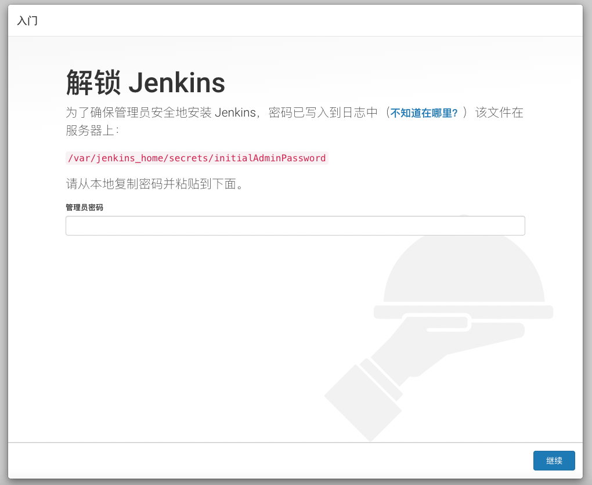
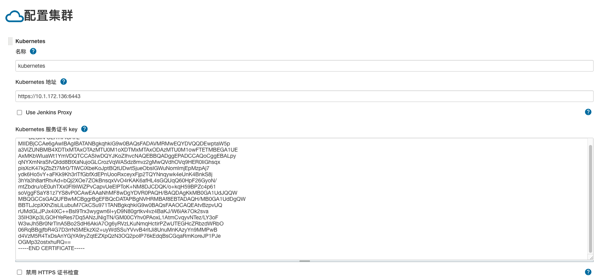
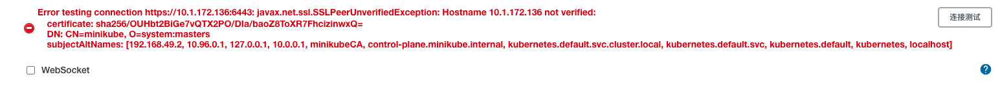

## Jenkins搭建入门

Jenkins是一款开源、强大的持续集成工具，其前身是Hudson(商用软件)。

本节将介绍Jenkins的搭建。从架构上理解，Jenklins由两类角色组成：

- Master：主控节点，负责管理、配置工作。

- Slave：执行具体作业的工作节点

严格来说，Master节点也可以执行具体作业，但是处于安全性考虑，不建议这样做。

## Jeknins的启动与初始配置

首先启动Master节点：

```bash
#!/bin/bash

NAME="jenkins"
PUID="1000"
PGID="1000"

VOLUME="$HOME/docker_data/jenkins"
mkdir -p $VOLUME 

docker ps -q -a --filter "name=$NAME" | xargs -I {} docker rm -f {}
docker run \
    --hostname $NAME \
    --name $NAME \
    -v $VOLUME:/var/jenkins_home \
    -p 8080:8080 \
    -p 50000:50000 \
    --detach \
    --restart always \
    jenkins/jenkins:lts-jdk11
```

如上所示，我们启动了jenkins的主控节点，并对外暴露了8080、5000两个端口。

我们在浏览器中打开如下链接：http://127.0.0.1:8080/



第一次启动会进行初始化，要求输入密码，我们使用如下命令查看：

```shell
docker logs -f jenkins

....

*************************************************************
*************************************************************
*************************************************************

Jenkins initial setup is required. An admin user has been created and a password generated.
Please use the following password to proceed to installation:

9169c97282d64545b36bc96cf7c1aaab

This may also be found at: /var/jenkins_home/secrets/initialAdminPassword

*************************************************************
*************************************************************
*************************************************************

2021-11-04 03:15:53.502+0000 [id=49]	INFO	h.m.DownloadService$Downloadable#load: Obtained the updated data file for hudson.tasks.Maven.MavenInstaller
2021-11-04 03:15:53.502+0000 [id=49]	INFO	hudson.util.Retrier#start: Performed the action check updates server successfully at the attempt #1
2021-11-04 03:15:53.517+0000 [id=49]	INFO	hudson.model.AsyncPeriodicWork#lambda$doRun$0: Finished Download metadata. 36,815 ms码
```

如上中间部分，即初始密码。

输入初始密码后，会要求安装创建，建议至少安装下述插件：

- Gradle：用于Java项目的打包和编译

- Pipeline：用户开发流水线作业

- Git：用于代码拉取

- SSH Build Agents

- Kubernetes：用于在Kubernetes集群上启动Slave节点

- Kubernetes CLI：用于执行远程Kubernetes的二进制文件

安装完插件后，需要创建初始管理员账号。

## Jeknins的Slave节点配置

启动Master节点后，我们着手配置Slave节点，这里也有多种选项：

- 启动固定数量的Slave节点

- 按需启动，用完释放

- 上述两种方案的混合

考虑到并发性、资源利用率，我们选用方案2：在Kubernetes集群上，按需启动Slave容器，执行完毕后销毁。

首先，我们需要登录到Kubernetes集群的Master节点上，查看已有的证书信息。

```shell
cd ~/.kube/config

apiVersion: v1
clusters:
- cluster:
    certificate-authority: /Users/coder4/.minikube/ca.crt
    extensions:
    - extension:
        last-update: Thu, 04 Nov 2021 11:23:17 CST
        provider: minikube.sigs.k8s.io
        version: v1.22.0
      name: cluster_info
    server: https://127.0.0.1:52058
  name: minikube
contexts:
- context:
    cluster: minikube
    extensions:
    - extension:
        last-update: Thu, 04 Nov 2021 11:23:17 CST
        provider: minikube.sigs.k8s.io
        version: v1.22.0
      name: context_info
    namespace: default
    user: minikube
  name: minikube
current-context: minikube
kind: Config
preferences: {}
users:
- name: minikube
  user:
    client-certificate: /Users/coder4/.minikube/profiles/minikube/client.crt
    client-key: /Users/coder4/.minikube/profiles/minikube/client.key
```

如上，共包含了3个证书/密钥：ca.crt、client.crt、client.key。

我们使用他们创建新的凭据，供Jenkins使用：

```shell
openssl pkcs12 -export -out ./kube-jenkins.pfx -inkey ./client.key -in ./client.crt -certfile ./ca.crt
```

上述创建过程会要求输入密码，请记牢后续会用到。

此外，上述文件中的ca.crt后面会再次用到。

在Jenkins上配置Kubernetes集群之前，我们假设以下信息：

- 10.1.172.136：Jenkins所在的物理机节点

- https://127.0.0.1:52058：Kubernetes集群的api server地址

由于我当前使用的minikube，不难发现，minikube的api server只在本地开了端口，并没有监听到物理机上，因此网段是不通的，所以我们先使用socat进行端口映射。

```shell
socat TCP4-LISTEN:6443,fork TCP4:127.0.0.1:52058
```

如上，经过映射后，所有打到本机的公网IP(10.1.172.136)、端口6443上的流量，会被自动转发到52058上。

接下来，我们着手在Jenkins上添加Kubernetes的集群配置。

 Manage Jenkins -> Manage Nodes and Clouds -> Configure Clouds -> Add a new cloud -> Kubernetes

截图如下：



其中核心配置如下：

- 名称：自选必填，这里选了kubernetes

- Kuberenetes地址：https://10.1.172.136:6443

- Kubernetes 服务证书 key：输入上文中ca.crt中的信息，注意换行问题。

- 凭据：上传上述生成的kube-jenkins.pfx，同时输入密码

- Jenkins地址：http://10.1.172.136:8080

上述天禧后，点击"连接测试"，如果一切正常，你会发现如下报错：



这是因为我们经过转发后，host与证书中的并不匹配。

我们修改下Jenkins的docker启动脚本，添加hosts参数：

```shell
--add-host kubernetes:10.1.172.136
```

重启Jenkins后，将上述位置的"Kuberenetes地址"修改为"https://kubernetes:6443"，再次重试连接，一切会成功。

记得保存所有配置。

## 测试任务

我们配置一个测试任务：

新建任务 -> 流水线

代码如下：

```groovy
podTemplate {
    node(POD_LABEL) {
        stage('Run shell') {
            sh 'echo hello world'
        }
    }
}
```

保存后，点击"立即构建"，运行结果如下：

```shell
Started by user admin
[Pipeline] Start of Pipeline
[Pipeline] podTemplate
[Pipeline] {
[Pipeline] node
Created Pod: kubernetes default/test-4-xsc01-4292c-4rkrz
[Normal][default/test-4-xsc01-4292c-4rkrz][Scheduled] Successfully assigned default/test-4-xsc01-4292c-4rkrz to minikube
[Normal][default/test-4-xsc01-4292c-4rkrz][Pulled] Container image "jenkins/inbound-agent:4.3-4-jdk11" already present on machine
[Normal][default/test-4-xsc01-4292c-4rkrz][Created] Created container jnlp
[Normal][default/test-4-xsc01-4292c-4rkrz][Started] Started container jnlp
Agent test-4-xsc01-4292c-4rkrz is provisioned from template test_4-xsc01-4292c
---
apiVersion: "v1"
kind: "Pod"
metadata:
  annotations:
    buildUrl: "http://10.1.172.136:8080/job/test/4/"
    runUrl: "job/test/4/"
  labels:
    jenkins: "slave"
    jenkins/label-digest: "802a637918cdcb746f1931e3fa50c8f991b59203"
    jenkins/label: "test_4-xsc01"
  name: "test-4-xsc01-4292c-4rkrz"
spec:
  containers:
  - env:
    - name: "JENKINS_SECRET"
      value: "********"
    - name: "JENKINS_AGENT_NAME"
      value: "test-4-xsc01-4292c-4rkrz"
    - name: "JENKINS_NAME"
      value: "test-4-xsc01-4292c-4rkrz"
    - name: "JENKINS_AGENT_WORKDIR"
      value: "/home/jenkins/agent"
    - name: "JENKINS_URL"
      value: "http://10.1.172.136:8080/"
    image: "jenkins/inbound-agent:4.3-4-jdk11"
    name: "jnlp"
    resources:
      limits: {}
      requests:
        memory: "256Mi"
        cpu: "100m"
    volumeMounts:
    - mountPath: "/home/jenkins/agent"
      name: "workspace-volume"
      readOnly: false
  nodeSelector:
    kubernetes.io/os: "linux"
  restartPolicy: "Never"
  volumes:
  - emptyDir:
      medium: ""
    name: "workspace-volume"

Running on test-4-xsc01-4292c-4rkrz in /home/jenkins/agent/workspace/test
[Pipeline] {
[Pipeline] stage
[Pipeline] { (Run shell)
[Pipeline] sh
+ echo hello world
hello world
[Pipeline] }
[Pipeline] // stage
[Pipeline] }
[Pipeline] // node
[Pipeline] }
[Pipeline] // podTemplate
[Pipeline] End of Pipeline
Finished: SUCCESS
```

至此，我们已经成功配置了基础的Jenkins，并成功在Kubernetes集群上执行了一次构建任务。
