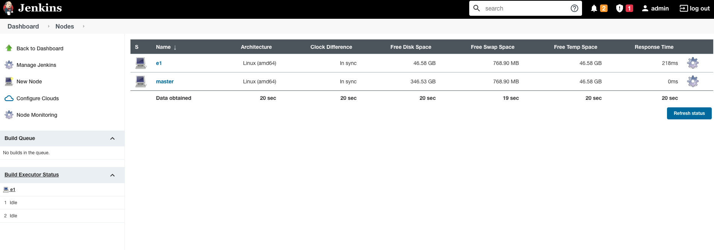

# Jenkins定制Executor

上一节，我们实现了最简单的打包任务，在这一节，我们将定制所需的打包环境，为CD流水线做准备。

## 手动连接Agent

在上一节，我们使用了Kubernetes集群启动新的Slave节点，你可以沿着这条路，继续集成所需的环境，不再展开。

在本节，我们将切换另一种思路，使用手动启动&连接的方式。

首先，在Jenkins中添加一个Agent，路径是：Manage Jenkins -> Manage Nodes and Clouds -> New Node。

关键参数如下：

name：自选，这里e1

Number of executors：在这台机器上的并发执行任务数，这里选默认的2

Remote root directory：默认执行目录，这里选/home/jenkins/ateng

Labels：自选，这里executor，可以用它对Executor分组(如测试、线上等)

Launch method：Launch agent by connecting it to the master，即我们手动连接

保存后，点击进去后，能看到如下提示：

```shell
Run from agent command line:

java -jar agent.jar -jnlpUrl http://127.0.0.1:8080/computer/e1/jenkins-agent.jnlp -secret b057970bf978f53a8f945d470ac644e44c945e4b7259b216f703dedb95d0cac9 -workDir "/home/jenkins/agent"
Run from agent command line, with the secret stored in a file:

echo b057970bf978f53a8f945d470ac644e44c945e4b7259b216f703dedb95d0cac9 > secret-file
java -jar agent.jar -jnlpUrl http://127.0.0.1:8080/computer/e1/jenkins-agent.jnlp -secret @secret-file -workDir "/home/jenkins/agent"
```

如上所示，我们需要用上述的Secret来连接Controller(主控)节点。

我们通过Docker启动Executor节点，如下：

```shell
#!/bin/bash

NAME="jenkins_e1"
PUID="1000"
PGID="1000"

docker ps -q -a --filter "name=$NAME" | xargs -I {} docker rm -f {}
docker run \
    --name $NAME \
    --env PUID=$PUID \
    --env PGID=$PGID \
    --detach \
    --init jenkins/inbound-agent \
    -workDir=/home/jenkins/agent \
    -url http://10.1.172.136:8080 \
    b057970bf978f53a8f945d470ac644e44c945e4b7259b216f703dedb95d0cac9 \
    e1
```

温馨提示：上述的workDir需要与Jenkins中的配置保持一致。

当启动成功后，能看到节点上线了，如下图所示：



为了不调度到Controller节点，我们可以将其上的执行数量设置为0。

随后，我们尝试修改任务，如下所示：

```groovy
pipeline {
    agent any 
    stages {
        stage('Test') { 
            steps {
                sh 'echo hello world'
            }
        }
    }
}
```

如果一起顺利，其会成功地在e1完成执行！

## 定制Executor的环境

从上述例子中，不难理解：真正的打包任务，是在Executor中执行的。

如果我们的打包流程需要用到git、Java、Gradle、Kubernetes的话，我们也需要将这些集成到Executor中。

我们基于Jenkins的官方基础镜像进行定制，Dockerfile如下：

```shell
FROM jenkins/inbound-agent:latest-jdk8

ENV GRADLE_VERSION=7.2
ENV K8S_VERSION=v1.22.3

# tool
USER root
RUN apt-get update && \
    apt-get install -y curl unzip && \
    apt-get clean

# gradle
RUN curl -skL -o /tmp/gradle-bin.zip https://services.gradle.org/distributions/gradle-$GRADLE_VERSION-bin.zip && \
    mkdir -p /opt/gradle && \
    unzip -q /tmp/gradle-bin.zip -d /opt/gradle && \
    ln -sf /opt/gradle/gradle-$GRADLE_VERSION/bin/gradle /usr/local/bin/gradle

RUN chown -R 1001:0 /opt/gradle && \
    chmod -R g+rw /opt/gradle

# kubectl
RUN curl -LO https://storage.googleapis.com/kubernetes-release/release/$K8S_VERSION/bin/linux/amd64/kubectl
RUN chmod +x ./kubectl
RUN mv ./kubectl /usr/local/bin

USER jenkins
```

如上所示：

- 我们基于inbound-agent进行定制，这是官方的默认的Agent基础镜像
- 随后，我们使用apt安装curl、unzip等基础工具
- 接着，我们安装gradle、kubectl等二进制文件
- 最后恢复默认的运行环境


制作镜像

```shell
docker build -t "coder4/jenkins-my-agent" .
```

运行


```groovy
pipeline {
    agent {label 'executor'} 
    stages {
        stage('git') {
            steps {
                sh "echo todo"
            }
        }
        
        stage('gradle') {
            steps {
                sh "gradle -v"
            }    
        }
        
        stage('k8s') { 
            steps {
                withKubeConfig([credentialsId: "60a8e9d2-0212-4ff4-aa98-f46fced97121",serverUrl: "https://kubernetes:6443"]) {
                    sh "kubectl get nodes"
                }
            }
        }
    }
}
```


运行结果

```shell
Started by user admin
[Pipeline] Start of Pipeline
[Pipeline] node
Running on e1 in /home/jenkins/agent/workspace/test
[Pipeline] {
[Pipeline] stage
[Pipeline] { (git)
[Pipeline] sh
+ git version
git version 2.30.2
[Pipeline] }
[Pipeline] // stage
[Pipeline] stage
[Pipeline] { (gradle)
[Pipeline] sh
+ gradle -v

Welcome to Gradle 7.2!

Here are the highlights of this release:
 - Toolchain support for Scala
 - More cache hits when Java source files have platform-specific line endings
 - More resilient remote HTTP build cache behavior

For more details see https://docs.gradle.org/7.2/release-notes.html


------------------------------------------------------------
Gradle 7.2
------------------------------------------------------------

Build time:   2021-08-17 09:59:03 UTC
Revision:     a773786b58bb28710e3dc96c4d1a7063628952ad

Kotlin:       1.5.21
Groovy:       3.0.8
Ant:          Apache Ant(TM) version 1.10.9 compiled on September 27 2020
JVM:          1.8.0_302 (Temurin 25.302-b08)
OS:           Linux 5.10.47-linuxkit amd64

[Pipeline] }
[Pipeline] // stage
[Pipeline] stage
[Pipeline] { (k8s)
[Pipeline] withKubeConfig
[Pipeline] {
[Pipeline] sh
+ kubectl get nodes
NAME       STATUS   ROLES                  AGE     VERSION
minikube   Ready    control-plane,master   6h58m   v1.21.2
[Pipeline] }
[kubernetes-cli] kubectl configuration cleaned up
[Pipeline] // withKubeConfig
[Pipeline] }
[Pipeline] // stage
[Pipeline] }
[Pipeline] // node
[Pipeline] End of Pipeline
Finished: SUCCESS
```


