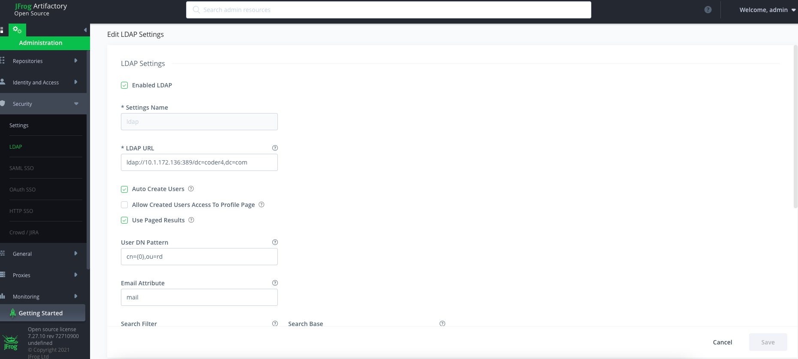
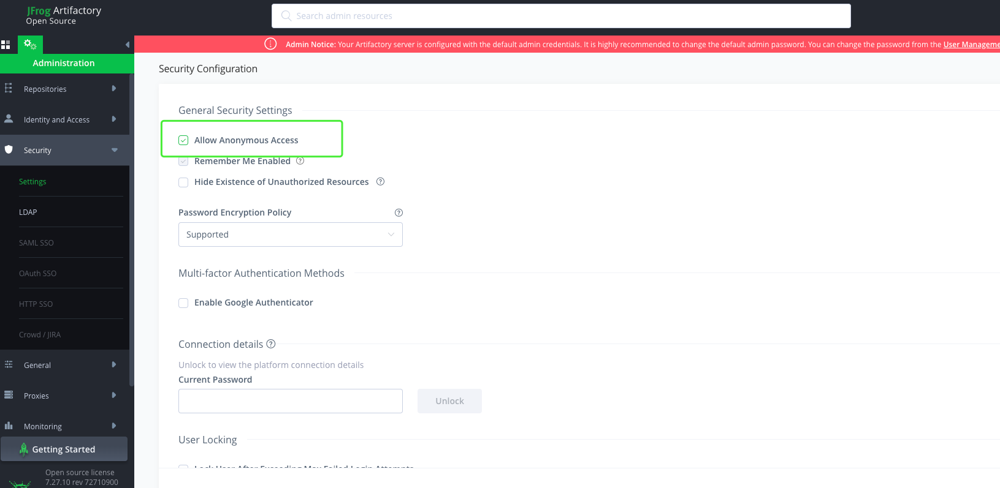

# JFrog Artifactory搭建Maven私有仓库

在本书技术架构中，我们选用了Gradle做为Java的依赖管理工具。

实际上，Gradle只提供了构建的前端，实际使用的还是Maven仓库。

出于安全性、速度等因素的考量，我们需要配置私有的Maven仓库。

本节，我们将基于JFrog Artifactory，搭建私有的Maven仓库。

## 运行

启动脚本如下：

```shell
#!/bin/bash

NAME="artifactory"
PUID="1000"
PGID="1000"

VOLUME="$HOME/docker_data/artifactory"
mkdir -p $VOLUME 

docker ps -q -a --filter "name=$NAME" | xargs -I {} docker rm -f {}
docker run \
    --hostname $NAME \
    --name $NAME \
    --volume $VOLUME:/var/opt/jfrog/artifactory \
    --env PUID=$PUID \
    --env PGID=$PGID \
    -p 8081:8081 \
    -p 8082:8082 \
    --detach \
    --restart always \
    releases-docker.jfrog.io/jfrog/artifactory-oss:latest
```

启动的时间会略长，可以访问 http://127.0.0.1:8082/ui/ 登录，默认的用户名是admin，密码是password。

## 配置

我们首先设置ldap关联，打开如下菜单：Administration -> Security -> LDAP -> Add Setting

- LDAP URL：ldap://10.1.172.136:389/dc=coder4,dc=com

- User DN Pattern：cn={0},ou=rd

- Manager DN：cn=readonly,dc=coder4,dc=com

- Manager Password：readonly123

如下图所示：



接着，我们打开匿名访问权限(默认是关闭的)，位于：

Administration -> Security -> Security onfiguration  
选中Allow Anonymous Access，然后点击保存。如下图所示



最后，我们新建一个仓库：

Repositories -> Add Repositories -> Local Repositories

- Key：homs-release / homs-snapshot

- Package Type：Gradle

- Repository Key：homs

- Handle Releases / Handle Snapshots

同时，需要给用户配置权限：

- Application -> Regisigrition -> Artifacts

至此，仓库侧的配置已经完成。

## 使用私有Maven仓库

首先，添加本地全局配置：

修改文件：~/.gradle/gradle.properties

```groovy
mavenReleaseRepo=http://127.0.0.1:8082/artifactory/homs-release/
mavenSnapshotRepo=http://127.0.0.1:8082/artifactory/homs-snapshot/
mavenUsername=zhangsan
mavenPassword=123456
```

上述配置了私有仓库地址，测试和发布是分开的

接下来，我们在项目中修改

homs-demo/build.gradle：

```groovy
plugins {

  id 'java'
  id 'idea'
  id 'org.springframework.boot' version '2.5.3' apply false
  id 'io.spring.dependency-management' version '1.0.11.RELEASE' apply false
  id "io.freefair.lombok" version "6.1.0" apply false

}

subprojects {

  group = 'com.coder4'
  version = '0.0.1-SNAPSHOT'
  sourceCompatibility = '1.8'

  apply plugin: 'java'
  apply plugin: 'maven-publish'

  publishing {
    publications {
      "$project.name"(MavenPublication) {
        groupId project.group
        artifactId project.name
        version project.version
        from components.java
      }
    }

    repositories {
      maven {
        credentials {
          username mavenUsername 
          password mavenPassword
        }
        url = version.endsWith('SNAPSHOT') ? mavenSnapshotRepo : mavenReleaseRepo
      }
    }
  }

}
```

如上所示，我们修改了主项目中的配置

- publising会为每个子项目添加发布任务

- repositoreis指定了发布的私有仓库地址

在子项目中，我们需要略作修改，如下：

homs-client/build.gradle

```groovy
plugins {
    id 'java'
    // id 'io.spring.dependency-management'
}

dependencies {
    implementation platform('com.coder4:bom-homs:1.0')
    implementation platform('org.springframework.boot:spring-boot-dependencies:2.5.3')

    implementation 'com.google.protobuf:protobuf-java'
    implementation "io.grpc:grpc-stub"
    implementation "io.grpc:grpc-protobuf"
    implementation 'io.grpc:grpc-netty-shaded'

    implementation "org.slf4j:slf4j-api"

    implementation 'com.alibaba.nacos:nacos-client:2.0.3'
    implementation 'org.springframework.boot:spring-boot-autoconfigure:2.2.0.RELEASE'

}
```

上述修改，去掉了spring dependency这个插件，转而使用platform模式。

这是一个spring + maven-publish插件共同使用导致的bug，建议都用platform来解决。

最后，我们尝试发布：

```shell
gradle publish

> Task :publishHoms-demo-clientPublicationToMaven2Repository
Cannot upload checksum for snapshot-maven-metadata.xml because the remote repository doesn't support SHA-512. This will not fail the build.
Cannot upload checksum for module-maven-metadata.xml because the remote repository doesn't support SHA-512. This will not fail the build.

> Task :publishHoms-demo-serverPublicationToMaven2Repository
Cannot upload checksum for snapshot-maven-metadata.xml because the remote repository doesn't support SHA-512. This will not fail the build.
Cannot upload checksum for module-maven-metadata.xml because the remote repository doesn't support SHA-512. This will not fail the build.

BUILD SUCCESSFUL in 2s
4 actionable tasks: 4 executed
```

成功！

## 引入依赖

首先配置全局依赖：

～/.gradle/init.gradle

```groovy
// project
allprojects{
    repositories {
    mavenLocal()
        maven { url mavenSnapshotRepo }
        maven { url mavenReleaseRepo }
        maven { url 'https://maven.aliyun.com/repository/public/' }
        maven { url 'https://maven.aliyun.com/repository/jcenter/' }
        maven { url 'https://maven.aliyun.com/repository/google/' }
        maven { url 'https://maven.aliyun.com/repository/gradle-plugin/' }
        maven { url 'https://jitpack.io/' }
    }
}

// plugin
settingsEvaluated { settings ->
    settings.pluginManagement {
        // Print repositories collection
        // println "Repositories names: " + repositories.getNames()

        // Clear repositories collection
        repositories.clear()

        // Add my Artifactory mirror
        repositories {
        mavenLocal()
            maven {
                url "https://maven.aliyun.com/repository/gradle-plugin/"
            }
        }
    }
}
```

在下游中修改homs-start中添加依赖，和往常一样：

```groovy
plugins {
    id 'org.springframework.boot' version '2.5.6'
    id 'io.spring.dependency-management' version '1.0.11.RELEASE'
    id 'java'
    id 'maven-publish'
}

group = 'com.homs'
version = '0.0.1-SNAPSHOT'
sourceCompatibility = '1.8'

repositories {
    mavenCentral()
}

dependencies {
    implementation 'org.springframework.boot:spring-boot-starter-web'
    testImplementation 'org.springframework.boot:spring-boot-starter-test'
    implementation 'com.coder4:homs-demo-client:0.0.1-SNAPSHOT'
}

test {
    useJUnitPlatform()
}
```

尝试构建，成功！

```shell
gradle build             

BUILD SUCCESSFUL in 7s
```

至此，我们成功引入了基于私有Maven仓库。
