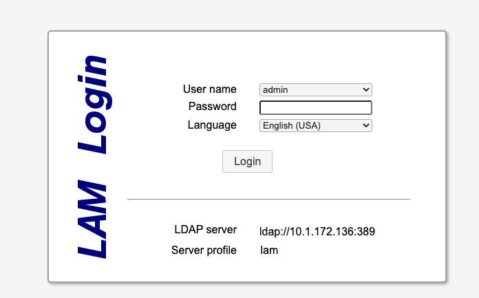
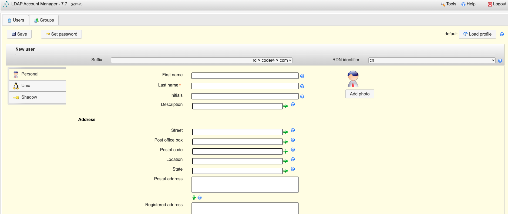
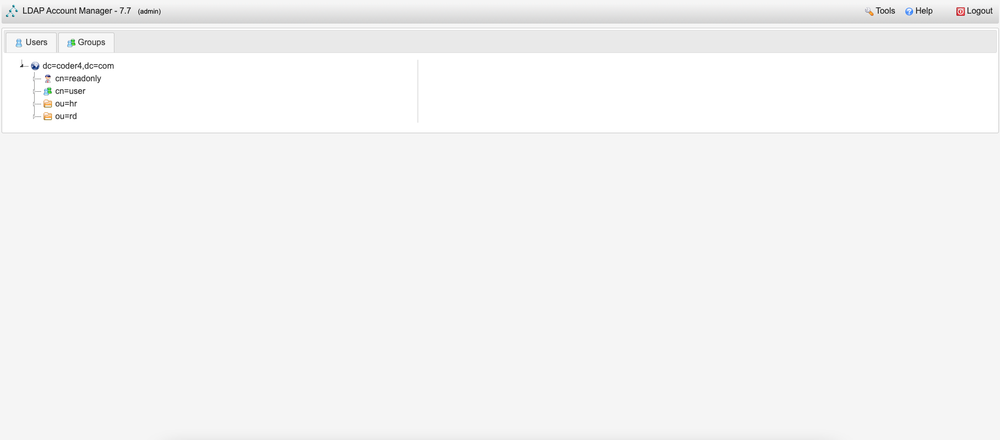

# 基于LDAP的内网统一认证

对于任何公司而言，一套“内部通用”的统一认证系统是必不可少的。

请注意两个关键字：内部、通用。

- 内部：认证系统只在公司内部关联的系统使用，并且需要关联具体的员工信息，如：工号、用户名、邮箱等。

- 通用：这套系统不是只提供验证，还要和其他系统共享认证，例如：项目管理系统、版本控制系统、发布系统等等。

在本书中，我们选取LDAP(Lightweight Directory Access Protocol)做为统一认证工具。

LDAP是一个开放的，中立的，工业标准的应用协议，通过IP协议提供访问控制和维护分布式信息的目录信息。

由于LDAP出现的年代比较久远(1993)，也并非专门为公司认证设计的，因此其易用性较差。我们选用[LDAP Account Manager](https://www.ldap-account-manager.org/)做为辅助管理工具。

## 部署open-ldap服务

我们选用开源的open-ldap做为服务端，进行部署：

```shell
#!/bin/bash

NAME="openldap"
PUID="1000"
PGID="1000"

VOLUME="$HOME/docker_data/openldap/"
mkdir -p $VOLUME 

docker ps -q -a --filter "name=$NAME" | xargs -I {} docker rm -f {}
docker run \
    --hostname $NAME \
    --name $NAME \
    --volume "$VOLUME:/data/openldap/" \
    -e PUID=$PUID \
    -e PGID=$PGID \
    -e LDAP_TLS=false \
    -e LDAP_DOMAIN=coder4.com \
    -e LDAP_ADMIN_PASSWORD=admin123 \
    -e LDAP_CONFIG_PASSWORD=config123 \
    -e LDAP_READONLY_USER=true \
    -e LDAP_READONLY_USER_USERNAME=readonly \
    -e LDAP_READONLY_USER_PASSWORD=readonly123 \
    -p 389:389 \
    -p 636:636 \
    --detach \
    --restart always \
    osixia/openldap:1.5.0
```

如上所示：

- 关闭了TLS加密，在生产环境中，建议配置证书并打开它

- 域名：coder4.com，可以根据需要自行更改，会影响用户的后缀

- 管理员密码：admin123，请根据需要自行更改

- 配置用户密码：config123，请根据需要自行更改

- 只读用户：readonly/readlony123，可自行更改

启动成功后，我们校验下初始化的几个用户：

首先是admin，你会发现用户是通过逗号分割、分组的，你要适用ldap的这种表示方法。

```shell
ldapwhoami -h 127.0.0.1 -p 389 -D "cn=admin,dc=coder4,dc=com" -w admin123
dn:cn=admin,dc=coder4,dc=com
```

接下来是readonly

```shell
ldapwhoami -h 127.0.0.1 -p 389 -D "cn=readonly,dc=coder4,dc=com" -w readonly123 
dn:cn=readonly,dc=coder4,dc=com
```

最后，我们添加两个组织结构，研发部rd和人力资源部hr：

```shell
version: 1

# rd org
dn: ou=rd,dc=coder4,dc=com
objectClass: top
objectClass: organizationalUnit
ou: rd

# hr org
dn: ou=hr,dc=coder4,dc=com
objectClass: top
objectClass: organizationalUnit
ou: hr
```

执行添加动作：

```shell
ldapadd -c -h 127.0.0.1 -p 389 -w admin123 -D "cn=admin,dc=coder4,dc=com" -f ./org.ldif
```

## 启用Ldap Account Manager

我们通过Docker运行LAM，如下：

```shell
#!/bin/bash

NAME="lam"
PUID="1000"
PGID="1000"

docker ps -q -a --filter "name=$NAME" | xargs -I {} docker rm -f {}
docker run \
    --hostname $NAME \
    --name $NAME \
    -e PUID=$PUID \
    -e PGID=$PGID \
    -e LDAP_DOMAIN=coder4.com \
    -e LDAP_SERVER=ldap://10.1.172.136:389 \
    -e LDAP_USER=cn=admin,dc=coder4,dc=com \
    -e LAM_PASSWORD=lam123 \
    -p 8080:80 \
    --detach \
    --restart always \
    ldapaccountmanager/lam:7.7
```

解释下上述配置：

- 域名：与前面openldap服务的配置相关联

- ldap服务器：前面ldap服务的地址

- user：管理员用户名，不用输入密码

- LAM密码：是部分管理功能所需要的密码，请根据需要自行修改

启动成功后，我们访问http://127.0.0.1:8080，出现如下登录界面：



输入前面admin的密码，即可完成登录。

进入后，可以发现氛围User / Group两个主要的Tab。

- User：用户的增删改

- Group：用户组的增删改

我们首先修改下User功能默认的配置。打开右上角Tools -> Profile Editor -> User，这里设置为：

- LDAP suffix：rd > coder4 > com

- Automatically add this extension: false

接着，我们需要添加一个Posix组，Groups -> New Group -> Unix Group

- Suffix：coder4 > com

- Group name：user

最后，我们尝试添加一个用户，Users -> New User，在如下界面中填写：



- Last name: zhangsan

- Suffix：rd > coder4 > com

- RDN identifier：cn

- Password：123456

- Unix Primary Group：user

点击Save保存后，我们验证一下：

```shell
ldapwhoami -h 127.0.0.1 -p 389 -D "cn=zhangsan,ou=rd,dc=coder4,dc=com" -w 123456
dn:cn=zhangsan,ou=rd,dc=coder4,dc=com
```

成功！

如果你想看组织的全貌，可以进入：Tools -> TreeView：



至此，我们已经成功搭建了基于ldap的内网统一验证。然而，本节只是一个起点，在后续搭建的系统中，我们都会接入ldap认证系统。
