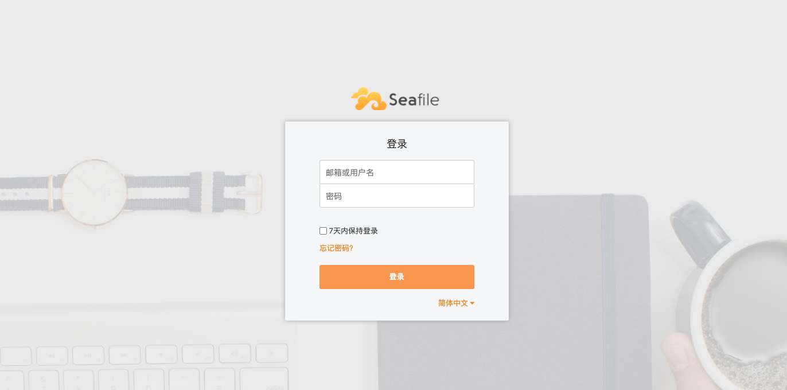

# 搭建Seafile共享云盘

在企业内部，文件的共享，交换是十分重要的需求。

本节，我们将搭建基于Seafile的共享云盘。

## 安装

首先，确保你的机器上已经安装了docker-compose。

接着，下载最新docker-compose，见[地址]([Seafile Server](https://download.seafile.com/d/320e8adf90fa43ad8fee/files/?p=/docker/docker-compose.yml))

我们需要略做修改：

```yaml
version: '2.0'
services:
  db:
    image: mariadb:10.5
    container_name: seafile-mysql
    environment:
      - MYSQL_ROOT_PASSWORD=seafile123  # Requested, set the root's password of MySQL service.
      - MYSQL_LOG_CONSOLE=true
    volumes:
      - /Users/coder4/docker_data/seafile-mysql/db:/var/lib/mysql  # Requested, specifies the path to MySQL data persistent store.
    networks:
      - seafile-net

  memcached:
    image: memcached:1.5.6
    container_name: seafile-memcached
    entrypoint: memcached -m 256
    networks:
      - seafile-net

  seafile:
    image: seafileltd/seafile-mc:latest
    container_name: seafile
    ports:
      - "80:80"
      - "443:443"  # If https is enabled, cancel the comment.
    volumes:
      - /Users/coder4/docker_data/seafile-data:/shared   # Requested, specifies the path to Seafile data persistent store.
    environment:
      - DB_HOST=db
      - DB_ROOT_PASSWD=seafile123  # Requested, the value shuold be root's password of MySQL service.
      - TIME_ZONE=Etc/UTC  # Optional, default is UTC. Should be uncomment and set to your local time zone.
      - SEAFILE_ADMIN_EMAIL=me@example.com # Specifies Seafile admin user, default is 'me@example.com'.
      - SEAFILE_ADMIN_PASSWORD=123456     # Specifies Seafile admin password, default is 'asecret'.
      - SEAFILE_SERVER_LETSENCRYPT=true   # Whether to use https or not.
      - SEAFILE_SERVER_HOSTNAME=seafile.coder4.com # Specifies your host name if https is enabled.
    depends_on:
      - db
      - memcached
    networks:
      - seafile-net

networks:
  seafile-net:
```

如上：

- 修改了数据库的默认密码

- 修改了volume的路径到本地~/docker_data下

- 修改seafile的管理员密码

- 并开启https和域名，要求域名必须公网可见

最后，我们创建所需的本地volume目录，并重启：

```shell
mkdir /Users/coder4/docker_data/seafile-mysql/
mkdir /Users/coder4/docker_data/seafile-data  
```

```shell
docker-compose up -d
```

浏览器 打开 地址 https://seafile.coder4.com 应该能出现如下登录界面了：



## 配置ldap

接下来，我们配置ldap

打开文件~/docker_data/seafile-data/seafile/conf/ccnet.conf，添加如下内容：

```shell
[LDAP]
HOST = ldap://10.1.172.136:389/
BASE = dc=coder4,dc=com
USER_DN = cn=readonly,dc=coder4,dc=com
PASSWORD = readonly123
LOGIN_ATTR = cn 
```

重启服务

```shell
docker-compose
```

使用zhangsan / 123546登录，成功！

下面，你可以尝试上传文件、共享群组了，这里不再赘述。
