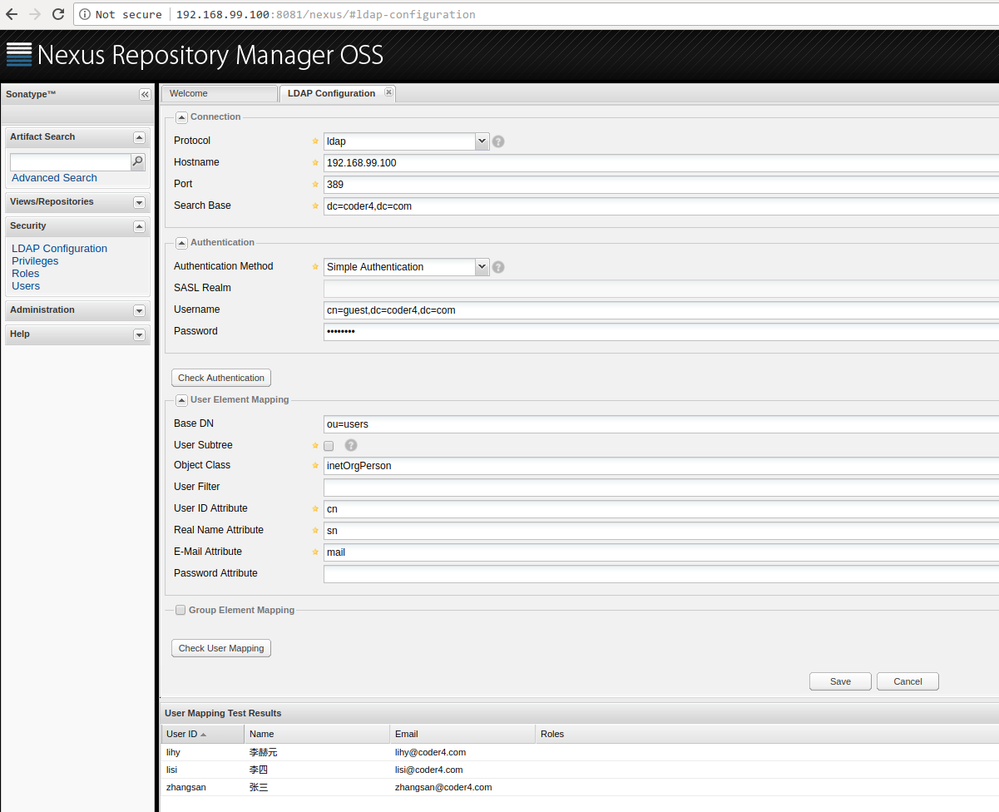
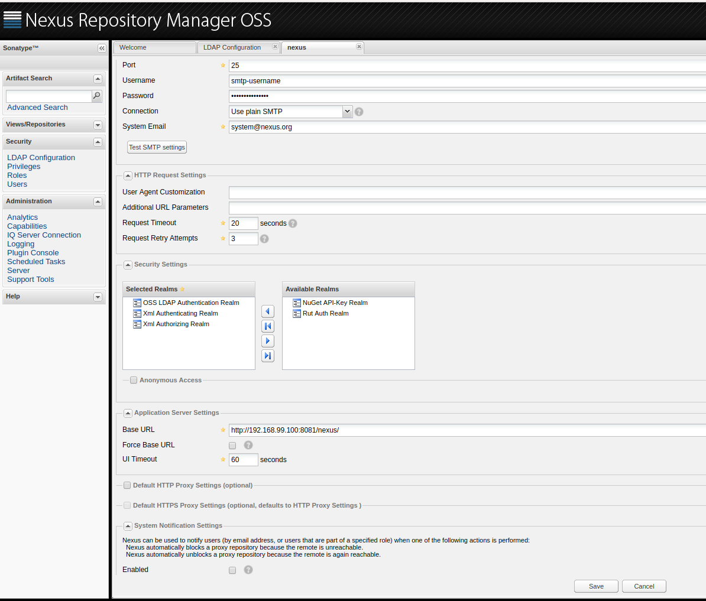
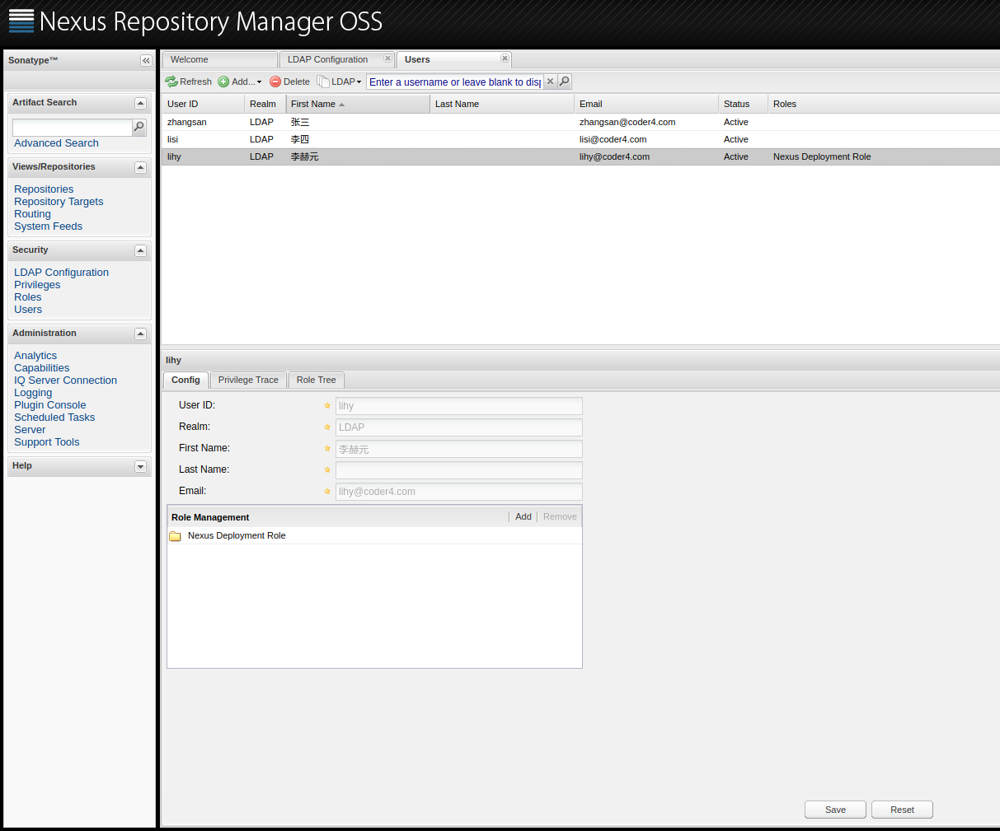

# Nexus 私有maven仓库

依赖管理是技术栈的重要一环，几乎所有的现代编程语言都拥有自己的依赖管理系统。

如果你在很久以前就从事了Java开发，或者参与过一些"不太正规"的项目，一定经历有过"jar包随便拷、jar包满天飞"的经历。在这种情况下，每次上线发布、升级jar包都是非常痛苦的事情。

大概从2003年开始，构建工具逐渐走入Java开发者的视野，Maven是构建工具中应用最为广泛的工具之一，它在提供构建功能的同时，也自带了强大的依赖管理功能。采用maven后，我们只需要定义xml就可以自动下载依赖的jar包，而不需要"手动将jar包拷来拷去"。

近几年来，作为一种更高效的构建工具 - Gradle - 逐渐崛起，在一些开发领域(如Android)，Gradle已经完全取代了Maven成为事实上的构建标准。

尽管从构建工具的角度而言，Maven的地位有所下降，但它在Java依赖管理子领域的地位却不容撼动。Gradle默认也是直接采取Maven的依赖管理框架(只不过换为更简便的描述语言)。

在[架构概览](architecture/README.md)一章中，我们已经说明：在选型上，我们使用Gradle作为构建工具，但依然采用Maven来管理依赖。

在Maven的依赖管理方面，我们将使用Nexus搭建私有Maven服务器。为什么要搭建私服呢？

这和为什么搭建私有Git服务器却不用GitHub公开仓库是一个道理：没有公司愿意将自己的代码暴露给全世界:-)

## Nexus仓库的基本配置

与前两节类似，我们首先在Kubernetes上部署Nexus服务。

创建之前，先在物理机上创建Volume挂载点:
```shell
minikube ssh

$sudo mkdir /data/nexus
$sudo chmod -R 777 /data/nexus/
```

这里因为nexus需要有一个文件锁，默认权限是不够的，我们给了777权限，如果你觉得过于宽松，可以自行更改Kubernetes的启动用户，并设定相应权限。

看一下部署文件, nexus-deployment.yaml:
```yaml
apiVersion: apps/v1
kind: Deployment
metadata:
  name: nexus-deployment
spec:
  selector:
    matchLabels:
      app: nexus
  replicas: 1
  template:
    metadata:
      labels:
        app: nexus
    spec:
      restartPolicy: Always 
      nodeSelector:
        kubernetes.io/hostname: minikube 
      containers:
      - name: nexus-ct
        image: sonatype/nexus:2.14.8
        ports:
        - containerPort: 8081
          hostPort: 8081 
        volumeMounts:
        - mountPath: "/sonatype-work"
          name: volume 
      volumes:
      - name: volume 
        hostPath:
          path: /data/nexus/
```

部署一下:
```shell
kubectl apply -f ./nexus-deployment.yaml
```

一切顺利的话，稍等一会访问"http://192.168.99.100:8081/nexus"，部署成功，如下图所示:


## Nexus接入LDAP帐号

服务虽然好了，但还没有接入LDAP帐号系统，Nexus中接入LDAP帐号较为繁琐，请耐心操作完。

首先，设置一下LDAP的连接配置。

1. 使用默认管理员帐号登录，用户名admin，密码admin123
1. 点击左侧菜单"Security" -> "LDAP Configuration"
1. 设置LDAP配置如下
 1. Protocol: ldap
 1. Hostname: 192.168.99.100
 1. SearchBase: dc=coder4,dc=com
 1. Authentication Method: Simple Authentication
 1. Username: cn=guest,dc=coder4,dc=com
 1. Password: guest123
 1. Base DN: ou=users
 1. Object Class: inetOrgPerson
 1. User ID Attribute: cn
 1. Real Name Attribute: sn
 1. E-Mail Attribute: mail
 1. Group Element Mapping: 不选中

上述配置稍显繁琐，请耐心完成。都配置完成后，点击"Save"。

此外，点击底部的"Check User Mapping"，如果一切配置正确，可以展示所有的列表，如下图所示。



第二步，下面我们来更改默认认证方式为LDAP。

点击左侧菜单"Administration" -> "Server"，进行如下配置:
1. 在Security Settings中，将右侧的"OSS LDAP Authentication Realm"加入到左边，并将其拖动到最顶部。
1. 取消勾选"Anoymous Access"。



配置可以参考上图，设置好后，点击"Save"。

最后，我们需要对所有用户配置权限，注意，每次LDAP新接入用户后，都要执行下述操作。

点击左侧菜单"Security" -> "Users" ，执行下述操作:
1. 点击"All Configured Users"旁边的小箭头，选择"LDAP"
1. 点击"Refresh"，此时就能拿到所有LDAP中的用户了。
1. 选中一个要操作的用户，例如"lihy"，选择底部的"Config"，然后"Role Management"。
1. 一般用户给"Nexus Deployment Role"就可以了，管理员可以给"Nexus Administrator Role"。
1. 设置好后点击"Save"



一个配置好的结果如上图所示。

至此，我们已经成功接入了LDAP，试着用配置好的用户登录下，发现可以登录成功。

## 配置Nexus中央仓库的缓存

Maven依赖仓库也是分布式，我们最长用的，是"Maven Central"这个中央仓库。

我们建议将中央仓库的索引缓存到Nexus私服上，这大约需要20GB的空间。

使用管理员帐号登录后，点击左侧菜单"View/Repositories":
1. 选择"Repositories"
1. 在右侧选择"Central"这个仓库
1. 底部"Configuration"配置
 1. Remote Storage Location: http://maven.aliyun.com/nexus/content/repositories/central/ (这里我们使用了阿里云的国内镜像以加快速度) 
 1. Download Remote Indexes: True
1. 最后点击底部的"Save"


缓存的时间比较长，在我的虚拟机上，花费了20分钟。进度可以在这里查看，左侧菜单"Administration" -> "Logging" 选择Log, 可以看到目前还在缓存:
```shell
2018-05-28 08:40:19,792+0000 INFO  [pxpool-1-thread-1] admin org.sonatype.nexus.index.DefaultIndexerManager - Trying to get remote index for repository "Central" [id=central]
```

等缓存成功后，在本地仓库的"Browse Index中"，应当能看到与中央仓库一样的目录结构，如下图所示：


至此，我们成功架设了基于Nexus的Maven私有仓库，集成了LDAP登录，并缓存了Maven中央仓库。

## 如何在Gradle中应用私有仓库

在配置了私有仓库后，我们还需要在微服务项目中启用这个私有仓库。

这大致需要2步
1. 配置maven私有仓库用户名和密码
1. build.gradle中配置

下面我们分别看一下

## 配置Maven私有仓库用户名和米按摩

```shell
vim ~/.m2/settings.xml

# 新增如下内容
<settings>
    <servers>
        <server>
            <id>nexus_coder4</id>
            <username>lihy</username>
            <password>pass</password>
        </server>
    </servers>
    <mirrors>
        <mirror>
            <!--This sends everything else to /public -->
            <id>nexus_coder4</id>
            <mirrorOf>central</mirrorOf>
            <url>http://192.168.99.100:8081/content/groups/public</url>
        </mirror>
    </mirrors>
    <profiles>
        <profile>
            <id>nexus_coder4</id>
            <!--Enable snapshots for the built in central repo to direct -->
            <repositories>
                <repository>
                    <id>central</id>
                    <url>http://192.168.99.100:8081/content/groups/public</url>
                    <releases><enabled>true</enabled></releases>
                    <snapshots><enabled>true</enabled></snapshots>
                </repository>
            </repositories>
            <pluginRepositories>
                <pluginRepository>
                    <id>central</id>
                    <url>http://192.168.99.100:8081/content/groups/public</url>
                    <releases><enabled>true</enabled></releases>
                    <snapshots><enabled>true</enabled></snapshots>
                </pluginRepository>
            </pluginRepositories>
        </profile>
    </profiles>
    <activeProfiles>
        <activeProfile>nexus_coder4</activeProfile>
    </activeProfiles>
</settings>

```
如上，我们新增了私有仓库的地址、用户配置，如果你觉得在文件中直接"裸写"密码不安全，可以参考[maven密码加密方法](https://maven.apache.org/guides/mini/guide-encryption.html#How_to_encrypt_server_passwords)。

下面，我们在build.gradle中配置：
```build.gradle
buildscript {

    repositories {
        maven { url 'http://maven.aliyun.com/nexus/content/groups/public' }
        maven { url 'https://jitpack.io' }
    }

    dependencies {
        // version just for plugin, not important
        classpath("org.springframework.boot:spring-boot-gradle-plugin:1.5.6.RELEASE")
    }
}

subprojects {

    apply plugin: 'java'
    apply plugin: 'idea'
    apply plugin: 'maven'
    apply plugin: 'org.springframework.boot'

    sourceCompatibility = 1.8
    targetCompatibility = 1.8

    group = 'com.coder4.lmsia'
    version = '0.0.1'

    repositories {
        maven {
            credentials {
                username "$mavenUser"
                password "$mavenPass"
            }
            url 'http://192.168.99.100:8081/nexus/content/groups/public'
        }
        mavenLocal()
    }

    // maven deploy config start
    configurations {
        deployerJars
    }

    uploadArchives {
        repositories.mavenDeployer {
            configuration = configurations.deployerJars
            repository(url: "http://192.168.99.100:8081/nexus/content/repositories/releases/") {
                authentication(userName: "$mavenUser", password: "$mavenPass")
            }
            snapshotRepository(url: "http://192.168.99.100:8081/nexus/content/repositories/snapshots/") {
                authentication(userName: "$mavenUser", password: "$mavenPass")
            }
        }
    }

    // maven deploy config end

}
```

如上，build.gradle主要进行如下配置:
* 子项目的仓库，采用私有仓库
* 子项目发布包时，也发布到私有仓库上

至此，我们成功地将maven私有仓库应用到了gradle的微服务上。
