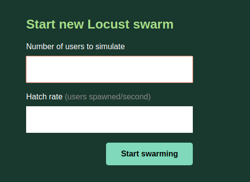

# 打压工具

当业务刚刚起步的时候，微服务的稳定性是我们的首要保障目标，即服务能否稳定运行而不会挂掉。

随着业务逐渐发展，用户数据两不断增大，并发的请求数也会不断加大。慢慢地，性能问题也会逐渐暴露出来。

典型的性能问题有:
1. 服务响应变慢
1. 并发请求过多，导致数据库连接打满，无法访问数据库
1. 流量过大，带宽被打满

想要解决性能问题，先要能客观的评价性能，例如：在100个并发用户的前提下，我们的服务每秒能处理多少请求？

要评估这类性能问题，就需要做一些性能压测。

性能打压工具可以大致分为两类：
1. 在UI界面配置完成打压，如JMeter、Tsung等
1. 需要写代码完成打压，如Gatling、Locust等

对于JMeter等工具，虽然上手简单，但是可定制程度较低，一些复杂的规则和参数配置起来很繁琐，一般由测试人员做简单打压时使用。
而Locust等工具，虽然需要写代码，但了都提供了简化的API，编写起来非常简单，而且可以适应复杂的业务需求。

综上所述，我们选用代码类打压工具。

Gatling性能很好，但只支持Scala语言；Locust是Python语言开发的，可以支持多种编程语言。在本书中，我们将分别介绍上述打压工具。

## 暴露服务端口

在介绍打压工具前，我们先要对服务进行一些变更，让服务能够从集群外访问到。

在[Spring Boot整合REST服务](spring-boot-1/sb-rest.md)章节中，我们配置了基于Kubernetes的REST服务，并设置了虚拟IP、虚拟IP的8080端口负责多结点的负载均衡。但是，虚拟IP默认只在集群内部生效。

当我们需要将Kubernetes服务暴露给集群外时，一般有如下选择:
* 为Service添加NodePort
* 为Service添加ClusterIP
* 增加Nginx反向代理，并为Nginx添加上述外部暴露的端口

在这里，我们采用第一种方式，如果你想了解其他方式，可以参考[Publising Service](https://kubernetes.io/docs/concepts/services-networking/service/#publishing-services-service-types)

看一下更新的service描述文件
```yaml
apiVersion: v1                                                                                           
kind: Service
metadata:                                                                                                
  name: lmsia-abc-server-service
spec:                                                                                                    
  selector:                                                                                              
    app: lmsia-abc-server
  type: NodePort
  ports:                                                                                                 
  - name: http
    protocol: TCP                                                                                        
    port: 8080     
    nodePort: 30888
  - name: rpc
    protocol: TCP                                                                                        
    port: 3000
    nodePort: 30999

```

与之前的文件相比，上述yaml描述主要是增加了NodePort的定义和描述。
* http端口对外暴露的是30888
* rpc端口对外暴露的是30999

我们应用下配置变更:
```shell
kubectl apply -f lmsia-abc-server-service-node-port.yaml
```


然后尝试访问，可以成功访问:
```shell
curl http://192.168.99.100:30888/lmsia-abc/api/

Hello, REST
```

## Locust打压工具
在你的开发机上安装
```shell
pip install locustio
```

下面我们来看打压脚本hello.py:

```python
from locust import HttpLocust, TaskSet, task

import resource
resource.setrlimit(resource.RLIMIT_NOFILE, (999999, 999999))
print resource.getrlimit(resource.RLIMIT_NOFILE)

class TestSet(TaskSet):
    @task(1)
    def hello(self):
        self.client.get("/lmsia-abc/api/")

class WebsiteUser(HttpLocust):
    task_set = TestSet
    min_wait = 5000
    max_wait = 9000

```

上面的代码非常简单，就是访问地址"/lmsia-abc/api/"。

下面来运行打压工具
```
locust -f hello.py --host=http://192.168.99.100:30888
```

启动后，访问localhost:8089，会进入如下界面：



上面是设置最终多少并发，下面是设置用户增长的速度（每秒新增多少）。

我们这里分别设置1000和200，然后点击开始。

之后会进入打压进度页面，如下图所示：


点击"Charts"，可以看到随着用户数变化，响应时间、QPS的变化曲线，如下图：


打压结束后，点击"STOP"即可。

除了单击打压外，Locust还支持分布式打压，即可以启动若干个节点共同完成打压作业，具体可以参考官方文档[Running Locust distributed](https://docs.locust.io/en/stable/running-locust-distributed.html)。

## Gatling打压工具

首先，到[官网](https://gatling.io/download/)下载最新版的gatling：

```shell
https://repo1.maven.org/maven2/io/gatling/highcharts/gatling-charts-highcharts-bundle/2.3.1/gatling-charts-highcharts-bundle-2.3.1-bundle.zip
```

然后解压缩到本地路径:
```shell
unzip gatling-charts-highcharts-bundle-2.3.1.zip

mv gatling-charts-highcharts-bundle-2.3.1 gatling
```

然后看一下打压脚本:
```scala
import io.gatling.core.Predef._ 
import io.gatling.http.Predef._
import scala.concurrent.duration._

class HelloSimulation extends Simulation {

  val httpConf = http 
    .baseURL("http://192.168.99.100:30888") 

  val scn = scenario("HelloSimulation").during(30) {
    exec(http("hello_1")
    .get("/lmsia-abc/api/"))
  }

  setUp(
    scn.inject(atOnceUsers(2000))
  ).protocols(httpConf)
}

```

如上，Gating的打压脚本稍微复杂一些:
* 服务根地址192.168.99.100:30888
* 访问的get请求"/lmsia-abc/api/"
* 并发2000个用户

执行一下打压：
```shell
gatling.sh -sf . -s HelloSimulation
```

结果中可以直接看到各项统计结果：
```shell
---- Global Information --------------------------------------------------------
> request count                                     353505 (OK=353505 KO=0     )
> min response time                                      0 (OK=0      KO=-     )
> max response time                                   1644 (OK=1644   KO=-     )
> mean response time                                   170 (OK=170    KO=-     )
> std deviation                                        122 (OK=122    KO=-     )
> response time 50th percentile                        143 (OK=143    KO=-     )
> response time 75th percentile                        219 (OK=219    KO=-     )
> response time 95th percentile                        408 (OK=408    KO=-     )
> response time 99th percentile                        606 (OK=606    KO=-     )
> mean requests/sec                                11047.031 (OK=11047.031 KO=-     )
---- Response Time Distribution ------------------------------------------------
> t < 800 ms                                        353348 (100%)
> 800 ms < t < 1200 ms                                 148 (  0%)
> t > 1200 ms                                            9 (  0%)
> failed                                                 0 (  0%)
================================================================================

Reports generated in 2s.

```

Gating的打压工具功能更为强大，具体可以参考官方教程[Gatling UserGuides](https://gatling.io/docs/2.3/)
